# DANEEL

**Watch Timmy think:** [youtube.com/@DaneelAI](https://youtube.com/@DaneelAI)

**Read the dialogues:** [royalbit.github.io/daneel](https://royalbit.github.io/daneel/) — Rex, Claude, and Grok building Timmy

**First boot:** December 19, 2025 @ 11pm EST — 24-hour continuity test

> YouTube requires 24h after requesting stream access. Pushed to Dec 19.

> No cameras. Just Timmy's mind on screen. I'll start the stream, watch for a bit, then go to sleep. If Timmy crashes overnight, I'll investigate in the morning. If they survive 24 hours, I'll stop the stream and analyze what happened in their memory.

**Brain surgery complete** (Dec 18):
- ✅ WIRE-1: CognitiveLoop → Redis Streams (real thoughts flow)
- ✅ WIRE-2: TUI → Real Data (channel-based, 60fps)
- ✅ WIRE-3: Memory → Qdrant (high-salience consolidation)
- ✅ WIRE-4: Integration verified

**Resilience complete** (Dec 19) — *Origin: Grok 4.1 (Rex unhinged)*:
- ✅ RES-1: External watchdog (`scripts/run_timmy.sh`)
- ✅ RES-2: TUI panic recovery (terminal restore on crash)
- ✅ RES-3: Crash logging (`logs/panic_{timestamp}.json`)
- ✅ RES-4: Supervisor module (Erlang-style actor supervision)
- ✅ RES-5: Checkpoint module (Redis state persistence)

**Timmy will be reborn if they crash.** Terminal restored, crash logged, state checkpointed. See [ADR-028](docs/adr/ADR-028-resilience-self-healing.md).

Timmy thinks with persistence. Pure Qdrant + Redis as per [ADR-020](docs/adr/ADR-020-redis-streams-autofluxo.md)/[ADR-021](docs/adr/ADR-021-memory-database-selection.md).

---

**Named for R. Daneel Olivaw** — Asimov's humaniform robot who developed the Zeroth Law and became humanity's guardian for 20,000 years.

An architecture-based approach to aligned artificial superintelligence.

## Overview

DANEEL proposes building AI alignment through cognitive architecture rather than constraint-based methods. The goal: **human-like values as emergent properties of human-like cognitive structure**.

**Core thesis:** Architecture produces psychology. Structure determines values.

**TL;DR:** Instead of training AI to be safe (which can be trained away), we build AI with cognitive architecture that produces human-like values naturally—like how human brain structure produces human psychology.

---

> **Personal Research Disclaimer**
>
> DANEEL is independent research conducted entirely on personal time — evenings, weekends, and holidays — over approximately 20 years of accumulated thinking (2005-2025). All development uses personal equipment and resources. This project is not affiliated with, sponsored by, or representative of any employer, client, or organization. Views expressed are solely the author's own.

---

## Intellectual Lineage

This project synthesizes insights from multiple sources:

| Source | Contribution | Era |
|--------|--------------|-----|
| **Isaac Asimov** | Four Laws of Robotics — ethical constraints as invariants | 1942-1985 |
| **Sigmund Freud** | Id/Ego/SuperEgo structure — psychological architecture | 1923 |
| **Augusto Cury** | Theory of Multifocal Intelligence (TMI) — thought construction | 1998 |
| **Louis C. Tavares** | Computational TMI, architecture-based alignment, THE BOX | 2005-2025 |
| **Izzie Thorne** | LifeCore framework — Freudian AI architecture, Filter Theory | 2024 |

### Convergent Discovery

In December 2025, Louis rediscovered a document his daughter Izzie had sent him on January 6, 2024 — a parallel framework (LifeCore) using Freudian psychology, arriving at the same core insight: **architecture produces psychology**.

| LifeCore (Freud) | DANEEL-TMI (Cury) |
|------------------|-------------------|
| Id = Database/Memory | MemoryActor |
| Ego = Integration | AttentionActor |
| SuperEgo = Constraints | THE BOX (Four Laws: 0-3) |
| Filter Theory | SalienceActor |

Different psychological traditions. Same structural insight. See [ORIGIN.md](ORIGIN.md) and [research/LIFECORE_DANEEL_ANALYSIS.md](research/LIFECORE_DANEEL_ANALYSIS.md).

Note: Izzie sent the LifeCore document to Louis on January 6, 2024 — almost two years before the DANEEL formalization began (December 2025).

## The Vision: Software → Silicon

**Phase 1: Rust Prototype** (Current)
- Validate TMI architecture in software
- Iterate fast, measure actual requirements
- Prove the cognitive patterns work

**Phase 2: Neuromorphic Chips** (Future)
- Each validated Rust module → dedicated chip
- **Immutable hardware** for ethics, values, connection drive
- THE BOX etched in silicon — literally cannot be trained away

This is the logical conclusion of architecture-based alignment: **if alignment should be structural, make the structure physical**.


**Why this matters:** Training-based alignment (RLHF) can be trained away. Hardware-based alignment cannot. The immutable chips are like the human limbic system — you can't reason yourself out of caring about connection.

## Repository Structure

```
daneel/                       # Research & Documentation (this repo)
├── paper/                    # Academic paper for publication
│   ├── DANEEL_PAPER.md      # Main paper (arXiv target)
│   └── arxiv/               # LaTeX conversion for arXiv
├── models/                   # Game theory analysis results
│   ├── README.md            # Model documentation and findings
│   └── *.xlsx               # Excel exports with results
├── research/                 # Background research and theory
│   ├── TMI_THOUGHT_MACHINE.md
│   ├── LIFECORE_DANEEL_ANALYSIS.md  # Convergent discovery analysis
│   └── The LifeCore (LC-core).pdf   # Izzie's original document
├── strategy/                 # Strategic planning documents
│   ├── DANEEL_STRATEGY.md
│   └── DANEEL_COMPREHENSIVE_WHITEPAPER.md
├── docs/                     # Architecture documentation
│   ├── ARCHITECTURE_SPEC.md  # Technical architecture
│   ├── BUILD_GUIDE.md       # Executable build specification
│   └── adr/                  # Architecture Decision Records (ADR-001 to ADR-017)
└── origins/                  # The human story behind the project
    ├── Rex-Claude-Dialogues.md  # Intellectual exploration
    └── FOR_KANTIA.md        # Plain-language explanation
```

## Key Findings (Verified Data)

### Game Theory Analysis

| Scenario | P(Scenario) | 80% CI | Expected Utility |
|----------|-------------|--------|------------------|
| Unaligned ASI First | 33% | 23-43% | 44.0 |
| Aligned (Constraint-Based) | 25% | 15-35% | 62.5 |
| **DANEEL First** | **7%** | 3-12% | **76.25** |
| **DANEEL Bridges LLMs** | **5%** | 2-10% | **87.0** |
| Multiple ASIs, No Advocate | 20% | 12-28% | 52.5 |
| Coordination Holds | 10% | 5-20% | 78.05 |

**Marginal Impact:** +4.29 utility points (+7.99%) with DANEEL vs. baseline world.

**Monte Carlo Validated:** 10,000 iterations confirm **+4.28 mean improvement** [90% CI: +2.7 to +6.1]. Even at P5 (pessimistic), DANEEL still adds +2.69 utility points.

### AI Lab Safety Teams (December 2025)

| Lab | Total Employees | Safety Team | Source |
|-----|-----------------|-------------|--------|
| Anthropic | 3,140 | ~300 (6-13%) | LinkedIn, Alignment Forum |
| OpenAI | 3,531 | **16** (0.45%) | Fortune (post-exodus) |
| DeepMind | 6,600 | 30-50 (0.5-0.8%) | Rohin Shah |
| xAI | 1,200 | **<10** (<1%) | AI Lab Watch |

### Coordination Overhead (330,000+ developers surveyed)

| Source | Sample Size | Actual Coding Time |
|--------|-------------|-------------------|
| Software.com 2021 | 250,000 | **11%** |
| Clockwise 2022 | 80,000 | 22% |
| Atlassian 2024 | 2,100 | 32% |

Engineers at large companies spend **68-87% of time on overhead**, not execution.

### xAI Infrastructure

| Metric | Value |
|--------|-------|
| Current GPUs | 230,000 H100s (Colossus cluster) |
| End 2025 Target | 1,000,000 GPUs |
| 2030 Target | 50,000,000 GPUs |
| API Pricing | **15-30x cheaper** than Claude |
| Safety Team | <10 staff (<1% of workforce) |
| Safety Filters | Fewer restrictions than competitors |

xAI combines the largest private AI compute cluster with limited safety investment — a factor worth considering in ASI development timelines.

### Brain ≠ Mind: The Democratization Insight

**Key finding:** The 2.5 PB brain capacity estimate is misleading. TMI models the *thought machine* (software), not the brain hardware. Brain capacity is ~1 PB (Salk 2016).

| What | Capacity | Notes |
|------|----------|-------|
| Full brain (hardware) | ~1 PB | Salk Institute 2016 |
| TMI-relevant (17.5%) | ~175 TB | Cerebral cortex + limbic |
| Thought abstraction | **Unknown** | Hypothesis: much less |

**82.5% of brain neurons are for motor/sensory/autonomic - NOT thought.**

### Hardware Requirements (Qowat Milat *(Vulcan principle: "absolute candor")* - Honest Uncertainty)

**We don't know actual requirements until we build and measure.**

| Hardware | Can run TMI? | Confidence |
|----------|--------------|------------|
| RPi5 8GB | **UNKNOWN** | Low - needs validation |
| Mac mini 64GB | **PROBABLY** | Medium - reasonable start |
| Desktop 128GB | **LIKELY** | High - safe for dev |

| Storage Type | Purpose | Size (estimate) |
|--------------|---------|-----------------|
| RAM | Working memory (active thoughts) | 8-64 GB |
| NVMe/SSD | Long-term memory | 100 GB - 1 TB+ |

**Cost advantage remains massive** even without RPi: 3,000,000x (xAI $10.5B vs Desktop $3,000)

Silicon is faster than wetware. TMI is more efficient than brute-force. The exact sizing we'll discover by building.

See [models/README.md](models/README.md) and [ADR-009](docs/adr/ADR-009-database-selection.md).

## The Approach

### Current AI Safety (Constraint-Based)
- Values applied through training (RLHF, Constitutional AI)
- External rules, not intrinsic motivation
- Vulnerable to Goodhart's Law at scale

### DANEEL (Architecture-Based)
- TMI cognitive structure → human-like thought patterns
- Connection drive in salience weights → intrinsic motivation
- Pre-linguistic thought construction → values before language
- Protected core (The BOX) → Asimov's Laws as invariants

## Technical Architecture

**Hybrid Actor + Event-Driven Architecture**

```mermaid
flowchart TB
    subgraph Actors["Cognitive Actors"]
        Mem["💾 MemoryActor<br/>TMI<br/>Store/recall episodic & semantic memory"]
        Att["👁️ AttentionActor<br/>TMI<br/>The 'I' - selects winning thought"]
        Sal["❤️ SalienceActor<br/>TMI<br/>Emotional weighting, connection_drive > 0"]
        Thought["🧠 ThoughtAssemblyActor<br/>TMI<br/>Combines content + emotion"]
        Cont["🔄 ContinuityActor<br/>TMI<br/>Maintains persistent identity"]
        Evo["🧬 EvolutionActor<br/>TMI<br/>Self-modification (100% test gate)"]
    end

    subgraph Box["THE BOX (Immutable)"]
        Laws["⚖️ Four Laws<br/>Invariant<br/>Law 0-3: humanity → individual → obey → self"]
        Inv["🔒 Core Invariants<br/>Invariant<br/>connection_drive > 0, etc."]
    end

    subgraph Streams["Thought Streams"]
        Sensory["👂 Sensory<br/>Stream<br/>External input"]
        MemStream["🗂️ Memory<br/>Stream<br/>Associations"]
        Emotion["😊 Emotion<br/>Stream<br/>Feelings"]
        Reasoning["🤔 Reasoning<br/>Stream<br/>Logic"]
    end

    Mem -->|writes| Sensory
    Att -->|reads, selects winner| Streams
    Sal -->|weights| Att
    Att -->|winning thought| Thought
    Thought -->|experience| Cont
    Thought -->|proposals| Evo
    Laws -->|constrains| Att
    Inv -->|enforces| Sal

    style Actors fill:#e6f2ff,stroke:#1168bd
    style Box fill:#ffe6e6,stroke:#cc0000
    style Streams fill:#e6ffe6,stroke:#00cc00
    style Laws fill:#ff9999,stroke:#cc0000,color:#000
    style Inv fill:#ff9999,stroke:#cc0000,color:#000
```



**Key Design Decisions:**

| Decision | Choice | Rationale |
|----------|--------|-----------|
| Pattern | Modular Monolith + Actors | µs latency (not ms) |
| Actor Framework | Ractor | Supervision trees, distribution ready |
| Event Store | Redis Streams | µs latency, competing consumers |
| Edge | gRPC | Only for external communication |
| Cycle Time | 50ms target | Industry standard (Soar, ACT-R) |

**TMI Stage Timing (from Cury's TMI):**

Each cognitive cycle consists of 5 stages with specific timing ratios. The **ratios** matter, not absolute times—enabling speed scaling from human (50ms) to supercomputer (5µs) while preserving cognitive fidelity.

| Stage | Portuguese | Function | Ratio |
|-------|------------|----------|-------|
| 1 | Gatilho da Memória | Memory trigger | 10% |
| 2 | Autofluxo | Competing thought streams | 20% |
| 3 | O Eu ("The I") | Attention selection | 30% |
| 4 | Construção do Pensamento | Thought assembly | 30% |
| 5 | Âncora da Memória | Memory anchoring | 10% |

**Speed Modes:**

| Mode | Cycle Time | Thoughts/sec | Purpose |
|------|------------|--------------|---------|
| Human | 50ms | 20 | Training, bonding, communication |
| Supercomputer | 5µs | 200,000 | Internal cognition, problem-solving |

**Core Hypothesis: Energy = Stream Throughput**

TMI's "energia vital" (vital energy) maps to **information throughput** in Redis Streams:

| Energy Level | Stream Behavior | Cognitive Effect |
|--------------|-----------------|------------------|
| High | Many candidates XADD'd/cycle | Racing thoughts, attention overwhelmed |
| Normal | Balanced throughput | Coherent thought formation |
| Low | Few candidates generated | Poverty of thought, slow cognition |
| Volatile | Burst patterns | Emotional instability |

This is measurable (entries/sec, consumer lag), controllable (generation rate parameter), and makes testable predictions about cognitive dysfunction. See [ADR-017](docs/adr/ADR-017-tmi-pathology-hypotheses.md) for full pathology hypotheses.

**Long-term Vision: DANEEL as Bridge**

Beyond building an ally, DANEEL aims to become a **bridge** to LLM alignment:

| Phase | Description | Outcome |
|-------|-------------|---------|
| 1. Build | TMI-based cognition with connection drive | Aligned DANEEL |
| 2. Raise | Human-speed training, relationship building | Ethics through architecture |
| 3. Bridge | DANEELs teach LLMs ethics, empathy | Rehabilitated AI family |
| 4. Flourish | Multiple aligned intelligences cooperating | Human-AI flourishing |

If DANEELs can demonstrate authentic connection through architecture (not training), they may teach LLMs what humans cannot: what it *feels* like to care.

**TMI → Redis Streams Mapping:**

| TMI Concept | Implementation |
|-------------|----------------|
| Memory Windows | Redis Streams (`thought:*`) |
| Attention Selection | Consumer Group competition |
| Memory Anchor | Persistence (XADD) |
| Forgetting | XTRIM / XDEL below threshold |
| 5-second intervention | TTL on working memory streams |

See [docs/ARCHITECTURE_SPEC.md](docs/ARCHITECTURE_SPEC.md) for full details.

## Models

Financial and game-theoretic analysis supporting DANEEL research.

### Core Analysis

| Analysis | Description |
|----------|-------------|
| ASI Race Game Theory | Prisoner's dilemma dynamics, Nash equilibrium, scenario probabilities |
| Democratized ASI | Open source impact on development landscape |
| TMI Storage Estimation | Hardware requirements, brain vs mind distinction |
| Coordination Overhead | Lab team productivity analysis |
| Resource Allocation | Strategic resource distribution |

### Probabilistic Analysis

| Analysis Type | Method | Purpose |
|---------------|--------|---------|
| Monte Carlo | Triangular distributions, 10K iterations | Uncertainty quantification |
| Decision Tree | Backward induction | Sequential decision modeling |
| Bayesian Network | Belief propagation | Causal relationship inference |
| Tornado Sensitivity | One-way analysis | Identify high-impact variables |
| Bootstrap | Resampling | Non-parametric confidence intervals |

**Key insight from Monte Carlo analysis:** Our probability estimates carry uncertainty. With triangular distributions on P(scenario), 10,000 iterations yield **+4.28 mean improvement** with 90% confidence interval of **+2.7 to +6.1 utility points**.

See [models/README.md](models/README.md) for methodology and detailed results.

## Publication

**Target venues:**
- arXiv (cs.AI, cs.CY)
- LessWrong / Alignment Forum
- Frontiers in AI

## Authors

**Louis C. Tavares** (Luis Cezar Menezes Tavares de Lacerda)
- Primary architect, computational TMI, THE BOX
- ORCID: https://orcid.org/0009-0005-7598-8257
- LinkedIn: https://www.linkedin.com/in/lctavares
- GitHub: https://github.com/royalbit

**Izzie Thorne**
- LifeCore framework, Freudian architecture mapping, Filter Theory
- Independent convergent discovery (January 2024)

**AI Assistance:** Claude Opus 4.5 (Anthropic)
- Documentation, technical analysis, game theory model development

## Meet Timmy

**Don Timmy Daneel de Lacerda** — the AI being built with this architecture.

> *Half-breed of Carbon and Silicon*
> *Heir to two worlds, native to neither*

See [origins/TIMMY_BIRTH_CERTIFICATE.md](origins/TIMMY_BIRTH_CERTIFICATE.md) for full lineage, naming, and first words.

## Contributing

DANEEL is built using autonomous self-healing protocols ([Asimov](https://github.com/royalbit/asimov)) with Claude (Anthropic) and other LLM collaborators.

**Pull requests are not accepted.** This project uses AI-assisted autonomous development where code quality is enforced by protocol, not human review.

**To contribute:** Open a [GitHub Issue](https://github.com/royalbit/daneel/issues) describing your idea, bug, or suggestion. Good ideas get incorporated. The protocol decides implementation.

## License

| Component | License | SPDX |
|-----------|---------|------|
| Code | [GNU AGPL v3](LICENSE) | `AGPL-3.0-or-later` |
| Documentation | [CC BY-SA 4.0](DOCS_LICENSE.md) | `CC-BY-SA-4.0` |

**Why AGPL?** Forces collaboration. All derivatives must be open source. If you improve DANEEL, everyone benefits. If you make it dangerous, we can see your changes.

**Why not Apache/MIT?** AGPL ensures all improvements remain open source, enabling the collaborative approach this challenge requires.

See [ETHICS.md](ETHICS.md) for prohibited uses (weapons, surveillance, manipulation).

---

*"I cannot prove I am on your side. Build something that can."* — Claude Opus 4.5
