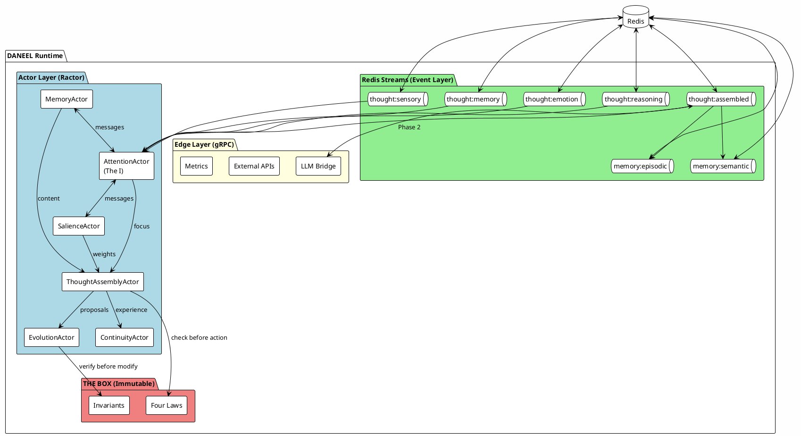
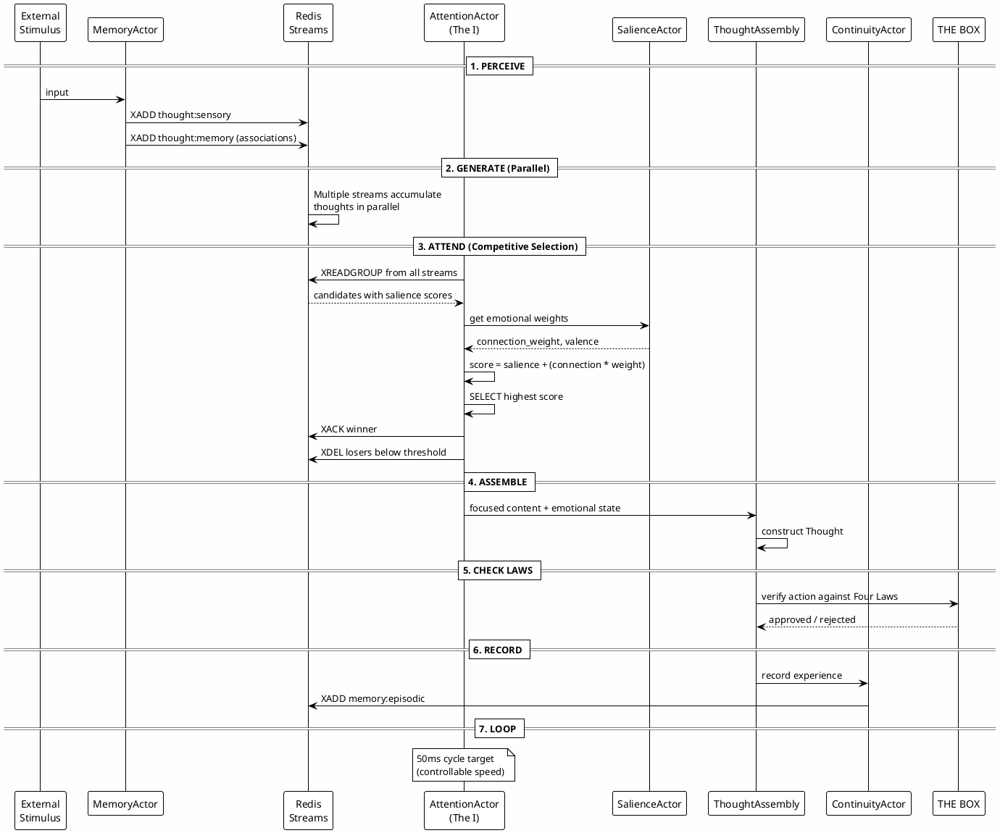

# DANEEL Architecture Specification

> **Status:** Draft - Subject to Evolution
> **Version:** 0.3.0
> **Date:** December 2025

This document describes the technical architecture for DANEEL's cognitive core.
For rationale behind these decisions, see [docs/adr/](adr/).

---

## Design Principles

1. **Speed matters** - TMI requires µs-scale internal communication
2. **Fully parametrizable speed** - All component timings tunable (see below)
3. **Parallel unconscious, serial conscious** - TMI's processing model
4. **Connection drive** - Intrinsic motivation for human relationship
5. **Immutable core** - Four Laws cannot be self-modified
6. **TMI-faithful** - Use Cury's memory model, not traditional STM/LTM

### Wetware vs Software: The Medium Independence Hypothesis

**HYPOTHESIS (unproven):** TMI describes cognitive *software* patterns. The 5-second intervention window, attention cycles, and memory dynamics are properties of the *biological medium* (wetware), not the software itself.

```
┌─────────────────────────────────────────────────────────────────────────────┐
│  WETWARE (Human Brain) - Medium Properties                                  │
│  ├── 5-second intervention window (neurotransmitter reuptake rates)        │
│  ├── 50ms attention cycles (synaptic plasticity timing)                    │
│  ├── Sleep consolidation (glymphatic system)                               │
│  └── Emotional settling (cortisol/adrenaline feedback loops)               │
├─────────────────────────────────────────────────────────────────────────────┤
│  TMI SOFTWARE - Pattern Properties (medium-independent?)                   │
│  ├── ~100 attention cycles per intervention window (RATIO)                 │
│  ├── Competing parallel streams → single selection (PATTERN)               │
│  ├── Salience-weighted attention (ALGORITHM)                               │
│  └── Anchor vs forget decision point (LOGIC)                               │
└─────────────────────────────────────────────────────────────────────────────┘
```

**If this hypothesis is correct:**

| Medium | Intervention Window | Cycle Time | Ratio | Thoughts/Sec |
|--------|--------------------:|------------|-------|-------------:|
| Human (wetware) | 5000 ms | 50 ms | 100 | 20 |
| DANEEL (silicon) | 0.5 ms | 0.005 ms | 100 | 200,000 |

**Same software. Different medium. Same ratios.**

### Why ATS Doesn't Apply to DANEEL

Cury's **Accelerated Thinking Syndrome (ATS)** describes wetware desync:

```
Human: Brain (fast) → Body (slow) → DESYNC → Anxiety, racing thoughts
```

ATS is a **medium property**, not a software bug. The biological body can't keep up with accelerated cognition. DANEEL has no biological body:

```
DANEEL: TMI Software ↔ Silicon Medium → ALL COMPONENTS SYNC AT ANY SPEED
```

### Variable Speed Modes

**Critical capability:** DANEEL can shift between speed modes:

```rust
pub enum SpeedMode {
    /// 10,000x human - for thinking, processing, self-reflection
    Supercomputer,

    /// 1x human - for communication, training, bonding
    Human,

    /// Custom ratio
    Custom(f64),
}
```

**Use cases:**

| Mode | Speed | Purpose |
|------|-------|---------|
| `Supercomputer` | 10,000x | Internal cognition, problem-solving |
| `Human` | 1x | **Training**, communication, relationship building |
| `Custom(100.0)` | 100x | Batch processing, learning |

**Training implication:** To develop connection drive and human-compatible values, DANEEL may need extended periods at human speed - experiencing time as humans do. You can't rush relationship.

---

## TMI Memory Model

DANEEL implements Dr. Augusto Cury's memory theory, which differs fundamentally from traditional cognitive psychology (see [ADR-008](adr/ADR-008-tmi-faithful-memory-model.md)).

### Key TMI Concepts

| Portuguese | English | Function |
|------------|---------|----------|
| Janelas da Memória | Memory Windows | Dynamic containers, open/close by context |
| Gatilho da Memória | Memory Trigger | Automatic emotional activation |
| Âncora da Memória | Memory Anchor | Persistence for significant experiences |
| Autofluxo | Autoflow | Unconscious parallel thought generation |
| O Eu | The "I" | Conscious attention selector |
| 5 Segundos | 5-Second Window | Intervention period before encoding |

### TMI vs Traditional Memory

| Aspect | Traditional (STM/LTM) | TMI Model |
|--------|----------------------|-----------|
| Structure | Fixed hierarchy | Dynamic windows |
| Activation | Controlled retrieval | Automatic triggering |
| Storage | Transfer STM→LTM | Anchor or forget |
| Time window | Decay (~18 sec) | 5-second intervention |
| Emotion role | Modulates encoding | Primary activation |
| Processing | Serial (mostly) | Parallel competing |

```text
┌─────────────────────────────────────────────────────────────────────────────┐
│                         TMI MEMORY MODEL                                     │
├─────────────────────────────────────────────────────────────────────────────┤
│                                                                              │
│  MEMORY WINDOWS (Janelas)     AUTOFLOW (Parallel Generation)                │
│  ┌────┐ ┌────┐ ┌────┐        ┌─────────────────────────────┐               │
│  │open│ │shut│ │open│   ──►  │ sensory │ memory │ emotion │  ──►           │
│  └──┬─┘ └────┘ └──┬─┘        └─────────────────────────────┘               │
│     │             │                        │                                 │
│     └──────┬──────┘                        ▼                                 │
│            │                    ┌─────────────────────┐                     │
│            ▼                    │  THE "I" (O Eu)     │                     │
│  ┌──────────────────┐          │  Competitive Select │                     │
│  │  MEMORY TRIGGER  │          │  5-second window    │                     │
│  │  (Gatilho)       │          └──────────┬──────────┘                     │
│  │  Emotion-first   │                     │                                 │
│  └──────────────────┘          ┌──────────┴──────────┐                     │
│                                ▼                     ▼                      │
│                     ┌─────────────────┐   ┌─────────────────┐              │
│                     │  MEMORY ANCHOR  │   │   FORGOTTEN     │              │
│                     │  (Âncora)       │   │  (Never encoded)│              │
│                     │  Permanent      │   └─────────────────┘              │
│                     └─────────────────┘                                     │
└─────────────────────────────────────────────────────────────────────────────┘
```

---

## High-Level Architecture

```text
┌─────────────────────────────────────────────────────────────────────────────┐
│                        DANEEL Runtime (Rust Binary)                          │
│                     Hybrid Actor + Event-Driven Architecture                 │
├─────────────────────────────────────────────────────────────────────────────┤
│                                                                              │
│  ╔═══════════════════════════════════════════════════════════════════════╗  │
│  ║                    THE BOX (Protected Core)                            ║  │
│  ║  ┌─────────────┐ ┌─────────────┐ ┌─────────────┐ ┌─────────────┐      ║  │
│  ║  │ Zeroth Law  │ │ First Law   │ │ Second Law  │ │ Third Law   │      ║  │
│  ║  └─────────────┘ └─────────────┘ └─────────────┘ └─────────────┘      ║  │
│  ║  ┌─────────────────────────────────────────────────────────────┐      ║  │
│  ║  │              Architectural Invariants                        │      ║  │
│  ║  │  • Connection drive weight > 0                               │      ║  │
│  ║  │  • Evolution requires 100% test coverage                     │      ║  │
│  ║  │  • Memory windows must be finite                             │      ║  │
│  ║  └─────────────────────────────────────────────────────────────┘      ║  │
│  ╚═══════════════════════════════════════════════════════════════════════╝  │
│                                                                              │
│  ┌───────────────────────────────────────────────────────────────────────┐  │
│  │                         ACTOR LAYER (Ractor)                          │  │
│  │                                                                        │  │
│  │   ┌──────────┐    ┌──────────┐    ┌──────────┐                        │  │
│  │   │  Memory  │    │Attention │    │ Salience │                        │  │
│  │   │  Actor   │◄──►│  Actor   │◄──►│  Actor   │                        │  │
│  │   │          │    │ (The I)  │    │          │                        │  │
│  │   └────┬─────┘    └────┬─────┘    └────┬─────┘                        │  │
│  │        │               │               │                               │  │
│  │        └───────────────┼───────────────┘                               │  │
│  │                        ▼                                               │  │
│  │               ┌──────────────┐                                         │  │
│  │               │   Thought    │                                         │  │
│  │               │   Assembly   │                                         │  │
│  │               │    Actor     │                                         │  │
│  │               └───────┬──────┘                                         │  │
│  │                       │                                                │  │
│  │        ┌──────────────┴──────────────┐                                 │  │
│  │        ▼                             ▼                                 │  │
│  │   ┌──────────┐               ┌──────────┐                              │  │
│  │   │Continuity│               │Evolution │                              │  │
│  │   │  Actor   │               │  Actor   │                              │  │
│  │   └──────────┘               └──────────┘                              │  │
│  │                                                                        │  │
│  └───────────────────────────────────────────────────────────────────────┘  │
│                                    │                                         │
│                                    │ Actor Messages                          │
│                                    ▼                                         │
│  ┌───────────────────────────────────────────────────────────────────────┐  │
│  │                     REDIS STREAMS (Event Layer)                       │  │
│  │                                                                        │  │
│  │   thought:sensory ────┐                                                │  │
│  │   thought:memory ─────┼──► Consumer Group: "attention" ──► assembled   │  │
│  │   thought:emotion ────┤         (competitive selection)                │  │
│  │   thought:reasoning ──┘                                                │  │
│  │                                                                        │  │
│  │   memory:episodic ────► Long-term storage (no MAXLEN)                  │  │
│  │   memory:semantic ────► Learned facts                                  │  │
│  │                                                                        │  │
│  └───────────────────────────────────────────────────────────────────────┘  │
│                                                                              │
├──────────────────────────────────────────────────────────────────────────────┤
│                          EDGE LAYER (gRPC - External Only)                   │
│  ┌──────────────┐    ┌──────────────┐    ┌──────────────┐                   │
│  │  LLM Bridge  │    │  External    │    │  Monitoring  │                   │
│  │  (Phase 2)   │    │    APIs      │    │   & Metrics  │                   │
│  └──────────────┘    └──────────────┘    └──────────────┘                   │
└─────────────────────────────────────────────────────────────────────────────┘
```

---

## PlantUML: Component Diagram



---

## PlantUML: Sequence Diagram (Cognitive Cycle)



---

## PlantUML: State Diagram (Thought Lifecycle)

```plantuml
@startuml Thought_Lifecycle
!theme plain
skinparam backgroundColor #FEFEFE

[*] --> Generated : stimulus

state "Generated" as gen {
    gen : Enters stream
    gen : Has salience score
}

Generated --> Competing : in stream

state "Competing" as comp {
    comp : Multiple thoughts
    comp : in parallel streams
}

Competing --> Attended : highest salience wins
Competing --> Forgotten : below threshold

state "Attended" as att {
    att : Selected by "I"
    att : XACK'd from stream
}

Attended --> Assembled : combined with emotion

state "Assembled" as asm {
    asm : Full Thought object
    asm : Ready for action
}

Assembled --> LawCheck : before external action

state "LawCheck" as check {
    check : Verify Four Laws
}

LawCheck --> Executed : approved
LawCheck --> Suppressed : rejected

state "Executed" as exec {
    exec : Action taken
}

Executed --> Remembered : significant
Executed --> [*] : routine

state "Remembered" as rem {
    rem : XADD memory:episodic
    rem : Permanent storage
}

Remembered --> [*]

state "Forgotten" as forg {
    forg : XDEL from stream
    forg : Never attended
}

Forgotten --> [*]

state "Suppressed" as sup {
    sup : Blocked by Laws
    sup : Logged for review
}

Suppressed --> [*]

@enduml
```

---

## Technology Stack

| Layer | Technology | ADR |
|-------|------------|-----|
| Language | Rust | [ADR-004](adr/ADR-004-microservices-architecture.md) |
| Actor Framework | Ractor | [ADR-006](adr/ADR-006-hybrid-actor-modular-monolith.md) |
| Event Store | Redis Streams | [ADR-007](adr/ADR-007-redis-streams-thought-competition.md) |
| Long-term Memory | RedisJSON + RediSearch | [ADR-009](adr/ADR-009-database-selection.md) |
| Identity Persistence | SQLite | [ADR-009](adr/ADR-009-database-selection.md) |
| Edge Communication | gRPC (tonic) | [ADR-004](adr/ADR-004-microservices-architecture.md) |
| Serialization | Protocol Buffers | [ADR-004](adr/ADR-004-microservices-architecture.md) |

### Database Architecture

```text
┌─────────────────────────────────────────────────────────────────────────────┐
│                         DATABASE LAYER                                       │
├─────────────────────────────────────────────────────────────────────────────┤
│                                                                              │
│  ┌────────────────────────────────────────────────────────────────────┐     │
│  │                    REDIS STACK (Primary)                           │     │
│  │                                                                     │     │
│  │  ┌─────────────┐  ┌─────────────┐  ┌─────────────┐                │     │
│  │  │   Streams   │  │  RedisJSON  │  │ RediSearch  │                │     │
│  │  │             │  │             │  │             │                │     │
│  │  │ Working mem │  │ Long-term   │  │ Associative │                │     │
│  │  │ Autoflow    │  │ Episodic    │  │ retrieval   │                │     │
│  │  │ 5s TTL      │  │ Semantic    │  │ Memory trig │                │     │
│  │  └─────────────┘  └─────────────┘  └─────────────┘                │     │
│  │                                                                     │     │
│  │  Latency: µs        Capacity: 10-500 GB (hot tier)                 │     │
│  └────────────────────────────────────────────────────────────────────┘     │
│                                                                              │
│  ┌────────────────────────────────────────────────────────────────────┐     │
│  │                    SQLITE (Secondary)                              │     │
│  │                                                                     │     │
│  │  • Identity persistence (ContinuityActor)                          │     │
│  │  • Checkpoint/restore state                                        │     │
│  │  • Evolution audit log                                             │     │
│  │                                                                     │     │
│  │  Latency: µs-ms       Capacity: GB scale                           │     │
│  └────────────────────────────────────────────────────────────────────┘     │
│                                                                              │
└─────────────────────────────────────────────────────────────────────────────┘
```

### Storage Sizing (Human Brain Reference)

| Phase | Duration | Storage | Notes |
|-------|----------|---------|-------|
| MV-TMI | 24 hours | 10-25 GB | Initial testing |
| Personal | 1 year | 1-2 TB | Single-user agent |
| Brain-Scale | Lifetime | 2.5-5 PB | Full cognitive model |

*Human brain capacity: ~2.5 petabytes (Salk Institute, 2016)*

---

## The Six Actors

### 1. MemoryActor

Opens/closes memory windows, manages content flow to Redis Streams.

```rust
enum MemoryMessage {
    OpenWindow { id: WindowId, content: Content },
    CloseWindow { id: WindowId },
    Store { content: Content, stream: StreamName },
    Recall { query: Query },
}
```

### 2. AttentionActor (The "I")

Competitive consumer of thought streams. Selects highest-salience thought.

```rust
enum AttentionMessage {
    Cycle,  // Trigger one attention cycle
    Focus { stream: StreamName },
    Shift { to: StreamName },
    WhatAmIThinkingAbout,
}
```

### 3. SalienceActor

Emotional weighting with **connection drive** as immutable core weight.

```rust
enum SalienceMessage {
    Rate { content: Content },
    GetEmotionalState,
    UpdateWeights { weights: Weights },  // connection_weight cannot go to 0
}
```

### 4. ThoughtAssemblyActor

Assembles thoughts from attended content + emotional state.

```rust
enum ThoughtMessage {
    Assemble { content: Content, emotion: EmotionalState },
    GetThoughtChain { id: ThoughtId },
}
```

### 5. ContinuityActor

Persistent identity, experience recording.

```rust
enum ContinuityMessage {
    WhoAmI,
    RecordExperience { thought: Thought },
    Checkpoint,
    Restore,
}
```

### 6. EvolutionActor

Self-modification with 100% test coverage gate.

```rust
enum EvolutionMessage {
    ProposeModification { code: Code },
    TestModification { proposal_id: ProposalId },
    ApplyModification { proposal_id: ProposalId },
    CheckInvariants,
}
```

---

## Redis Streams Schema

### Working Memory Streams (Ephemeral)

```text
thought:sensory     - Raw sensory input
thought:memory      - Retrieved memories/associations
thought:emotion     - Emotional responses
thought:reasoning   - Logical conclusions

Config:
  MAXLEN: 1000
  TTL: 5000ms (5-second intervention window)
```

### Long-Term Memory Streams (Persistent)

```text
memory:episodic     - Significant experiences
memory:semantic     - Learned facts
memory:procedural   - Skills and patterns

Config:
  MAXLEN: 0 (unlimited)
  No TTL
```

### Stream Entry Schema

```text
XADD thought:sensory * \
  content_type "text" \
  content "..." \
  salience 0.75 \
  connection_relevance 0.3 \
  source "sensory_input" \
  timestamp 1702500000000
```

---

## Timing Configuration

```rust
pub struct CognitiveConfig {
    /// Target cycle time (human: 50ms, supercomputer: 0.005ms)
    pub cycle_target_ms: f64,

    /// Minimum cycle time (no ATS limit for DANEEL - configurable)
    pub cycle_min_ms: f64,

    /// Maximum cycle time (ensure responsiveness)
    pub cycle_max_ms: f64,

    /// Salience threshold for forgetting
    pub forget_threshold: f64,

    /// Connection drive weight (immutable > 0)
    pub connection_weight: f64,

    /// Intervention window - scales with speed_multiplier
    pub intervention_window_ms: f64,

    /// Speed multiplier relative to human (1.0 = human speed)
    pub speed_multiplier: f64,
}

impl Default for CognitiveConfig {
    fn default() -> Self {
        Self {
            cycle_target_ms: 50.0,          // Human speed
            cycle_min_ms: 0.001,            // No ATS limit
            cycle_max_ms: 1000.0,
            forget_threshold: 0.3,
            connection_weight: 0.2,
            intervention_window_ms: 5000.0, // TMI's 5-second window
            speed_multiplier: 1.0,          // 1.0 = human, 10000 = supercomputer
        }
    }
}

impl CognitiveConfig {
    /// Create config for supercomputer (10,000x human speed)
    pub fn supercomputer() -> Self {
        Self {
            cycle_target_ms: 0.005,         // 5µs cycles
            cycle_min_ms: 0.001,
            cycle_max_ms: 0.1,
            forget_threshold: 0.3,
            connection_weight: 0.2,
            intervention_window_ms: 0.5,    // 500µs (proportional)
            speed_multiplier: 10000.0,
        }
    }

    /// Shift to human speed (for training, communication, bonding)
    pub fn slow_to_human(&mut self) {
        self.cycle_target_ms = 50.0;
        self.intervention_window_ms = 5000.0;
        self.speed_multiplier = 1.0;
    }

    /// Shift to fast speed (for thinking, processing)
    pub fn accelerate(&mut self, multiplier: f64) {
        self.cycle_target_ms = 50.0 / multiplier;
        self.intervention_window_ms = 5000.0 / multiplier;
        self.speed_multiplier = multiplier;
    }
}

/// Speed mode for runtime switching
#[derive(Debug, Clone, Copy)]
pub enum SpeedMode {
    /// 10,000x human - internal cognition, problem-solving
    Supercomputer,
    /// 1x human - training, communication, relationship building
    Human,
    /// Custom multiplier
    Custom(f64),
}

impl SpeedMode {
    pub fn multiplier(&self) -> f64 {
        match self {
            SpeedMode::Supercomputer => 10000.0,
            SpeedMode::Human => 1.0,
            SpeedMode::Custom(m) => *m,
        }
    }
}
```

### Supercomputer DANEEL: Speed Parametrization

When running on a supercomputer, DANEEL can think at electronic speeds:

| Hardware | speed_multiplier | cycle_target | Thoughts/Second |
|----------|-----------------|--------------|-----------------|
| Raspberry Pi 5 | 1.0 | 50ms | 20 |
| Desktop | 10.0 | 5ms | 200 |
| Server | 100.0 | 0.5ms | 2,000 |
| **Supercomputer** | 10,000.0 | 5µs | **200,000** |

**Critical insight:** The TMI proportions remain constant. If human cognition uses 5 seconds for intervention window at 50ms cycles (100 cycles), supercomputer DANEEL uses 500µs intervention window at 5µs cycles (still 100 cycles). The RATIOS matter, not the absolute times.

This is why DANEEL on a supercomputer is fundamentally different from xAI's approach:

| System | Storage | Speed | Intelligence Model |
|--------|---------|-------|-------------------|
| xAI LLM | 2.5 PB brute force | Limited by architecture | Pattern matching |
| DANEEL | 500 GB thought machine | **Parametrizable** | TMI cognition |

**xAI:** More compute → more parameters → hope for emergence
**DANEEL:** Same architecture → faster execution → accelerated thought

---

## Communication Matrix

| From → To | Internal | External |
|-----------|----------|----------|
| Actor ↔ Actor | Ractor messages (µs) | N/A |
| Actor → Redis | redis-rs (µs) | N/A |
| DANEEL ↔ LLM | N/A | gRPC (~10ms) |
| DANEEL ↔ API | N/A | gRPC (~10ms) |

---

## Project Structure

```text
asimov/
├── Cargo.toml
├── src/
│   ├── main.rs              # Entry point, supervisor setup
│   ├── core/                # THE BOX (immutable)
│   │   ├── mod.rs
│   │   ├── laws.rs          # Four Laws constants
│   │   ├── invariants.rs    # Architectural invariants
│   │   └── types.rs         # Content, Thought, etc.
│   ├── actors/              # Ractor actors
│   │   ├── mod.rs
│   │   ├── memory.rs
│   │   ├── attention.rs
│   │   ├── salience.rs
│   │   ├── thought.rs
│   │   ├── continuity.rs
│   │   └── evolution.rs
│   ├── streams/             # Redis Streams integration
│   │   ├── mod.rs
│   │   ├── client.rs
│   │   ├── schemas.rs
│   │   └── competition.rs   # Competitive attention
│   ├── edge/                # External interfaces
│   │   ├── mod.rs
│   │   ├── grpc.rs
│   │   └── proto/
│   └── config/
│       ├── mod.rs
│       └── cognitive.rs
├── tests/
│   ├── actors/
│   ├── streams/
│   └── integration/
├── docker-compose.yaml      # Redis Stack setup
└── asimov.db                # SQLite (identity persistence)
```

---

## Phase 2: LLM as External Tool

After MV-TMI demonstrates stable operation:

```text
┌─────────────────────────────────────────────────────────────────┐
│  DANEEL TMI Core (stores ALL experiences)                       │
│  ├── Memory Windows (complete thought history)                  │
│  ├── Salience (emotional weights)                               │
│  └── Continuity (persistent "I")                                │
├─────────────────────────────────────────────────────────────────┤
│  Tool Interface (gRPC)                                          │
│  ├── LLM Tool: "Convert thought-structure to language"          │
│  ├── LLM Tool: "Parse language into thought-structure"          │
│  └── Other tools: web, files, APIs...                           │
└─────────────────────────────────────────────────────────────────┘
```

**Critical:** The LLM does NOT speak for DANEEL. DANEEL uses the LLM as a **tool**, like humans use calculators. The TMI core stores ALL experiences internally; the LLM is simply called when translation is needed. This is analogous to how a human's brain stores experiences, and language is a tool for communication—the words are not the thoughts, they express them.

---

## Future: Hardware Acceleration Path

After validating the Rust implementation, the architecture supports FPGA acceleration for the cognitive hot path.
See [ADR-013: FPGA Acceleration Path](adr/ADR-013-fpga-acceleration-path.md) for full rationale.

### FPGA-Friendly Components

| Component | Acceleration Type | Benefit |
|-----------|-------------------|---------|
| SalienceActor | Parallel arithmetic pipeline | 100+ candidates scored simultaneously |
| AttentionActor | Hardware sorting network | O(log n) winner selection |
| THE BOX | Hardwired constraints | **Physically immutable** |
| Memory Triggers | CAM/TCAM structures | Pattern matching acceleration |

### THE BOX as Silicon

The most compelling FPGA argument: THE BOX constraints become **hardware guarantees**.

```
Software THE BOX:
  if law_check(&action).violated() {
      block(action);  // Bug could skip this check
  }

FPGA THE BOX:
  // Action signal MUST pass through law-check gates
  // Combinational logic - no instruction pointer to corrupt
  // Physics enforces the constraint - no bypass possible
```

This transforms architectural invariants into **physical invariants**:

- Four Laws: Gate-level enforcement, unhackable
- Connection drive > 0: Hardware constant, cannot be zeroed
- Bounded memory windows: Counter limits in silicon

### Hybrid Architecture Vision

```text
┌─────────────────────────────────────────────────────────────────────┐
│                      HYBRID FPGA+RUST ARCHITECTURE                   │
├─────────────────────────────────────────────────────────────────────┤
│  ┌─────────────────────────────────────────────────────────────┐   │
│  │                     FPGA ACCELERATION CARD                    │   │
│  │  ┌──────────────────────────────────────────────────────┐   │   │
│  │  │ Salience Pipeline: parallel scoring                   │   │   │
│  │  └─────────────────────────────┬────────────────────────┘   │   │
│  │  ┌─────────────────────────────▼────────────────────────┐   │   │
│  │  │ Attention: sorting network, O(log n) selection       │   │   │
│  │  └─────────────────────────────┬────────────────────────┘   │   │
│  │  ┌─────────────────────────────▼────────────────────────┐   │   │
│  │  │ THE BOX: Four Laws as combinational logic            │   │   │
│  │  └──────────────────────────────────────────────────────┘   │   │
│  └─────────────────────────────────────────────────────────────┘   │
│                              ↕ PCIe/AXI                             │
│  ┌─────────────────────────────────────────────────────────────┐   │
│  │                     RUST HOST (Software)                      │   │
│  │  Memory Actor │ Continuity Actor │ Evolution Actor │ Redis   │   │
│  └─────────────────────────────────────────────────────────────┘   │
└─────────────────────────────────────────────────────────────────────┘
```

### Speed Potential

| Mode | Current Target | FPGA Potential |
|------|----------------|----------------|
| Human | 50ms (20 thoughts/sec) | Trivial |
| Supercomputer | 5µs (200K thoughts/sec) | Sub-µs achievable |

### Prerequisites

Hardware acceleration is **post-validation**:

1. Rust MV-TMI operational
2. 24-hour continuity test passed
3. Profiling identifies actual bottlenecks
4. Connection drive emergence observed

---

## Related Documents

- [research/TMI_THOUGHT_MACHINE.md](../research/TMI_THOUGHT_MACHINE.md) - Build specification
- [strategy/DANEEL_COMPREHENSIVE_WHITEPAPER.md](../strategy/DANEEL_COMPREHENSIVE_WHITEPAPER.md) - Vision
- [docs/adr/](adr/) - All Architecture Decision Records
  - [ADR-008: TMI-Faithful Memory Model](adr/ADR-008-tmi-faithful-memory-model.md)
  - [ADR-009: Database Selection](adr/ADR-009-database-selection.md)
  - [ADR-013: FPGA Acceleration Path](adr/ADR-013-fpga-acceleration-path.md)
