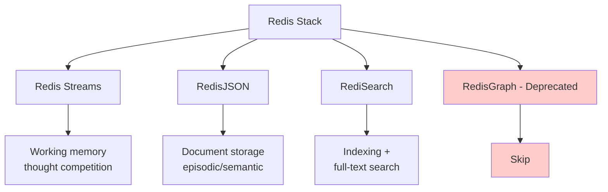
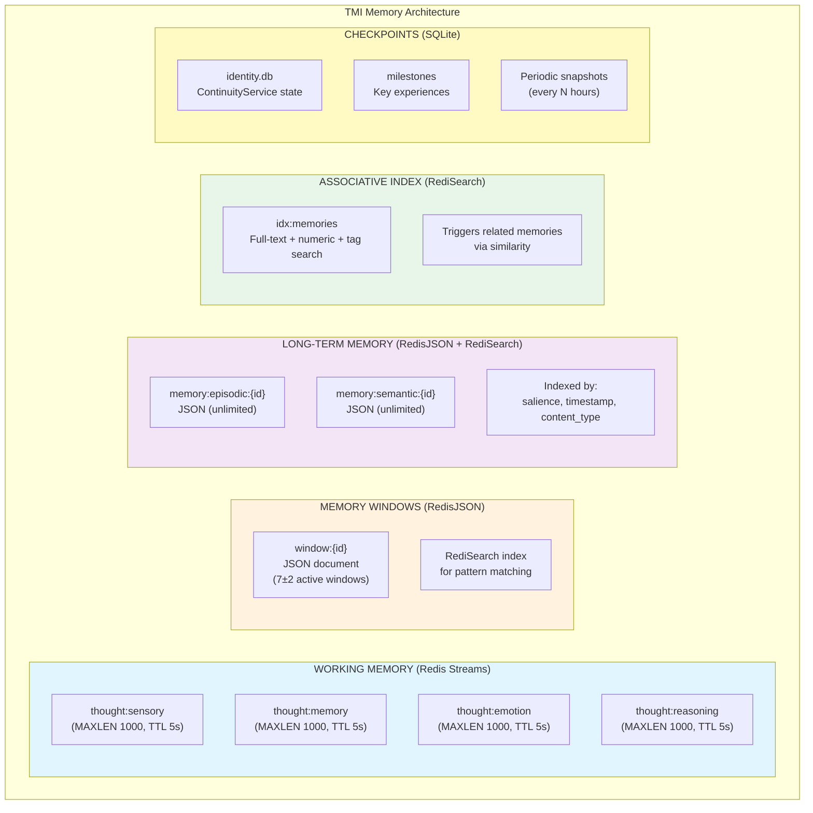

# Database Comparison for TMI Memory Model

> **Author:** Claude Opus 4.5, Anthropic (with Louis C. Tavares)
> **Date:** December 14, 2025
> **Purpose:** Evaluate database types for TMI's memory persistence layer

---

## Executive Summary

**Recommendation: Hybrid Redis (Streams + JSON + Search) + SQLite for checkpoints**

**Rationale:**
- Redis Streams already chosen for working memory (50ms cycle requirement)
- Redis JSON provides flexible document storage with µs latency
- Redis Search (RediSearch) enables associative retrieval and pattern matching
- SQLite for periodic checkpoints (continuity/identity persistence)
- Single-machine deployment eliminates network overhead
- Excellent Rust ecosystem support (redis-rs, rusqlite)

---

## TMI Memory Requirements Analysis

From `/Users/rex/src/royalbit/asimov-tmi/docs/ARCHITECTURE_SPEC.md` and `/Users/rex/src/royalbit/asimov-tmi/research/TMI_THOUGHT_MACHINE.md`:

### Critical Requirements

| Requirement | Target | Constraint |
|-------------|--------|------------|
| **Cycle Time** | 50ms | Industry standard (Soar, ACT-R) |
| **Internal Latency** | µs (microseconds) | Not ms - speed matters |
| **Memory Windows** | 7±2 active | Bounded working memory (Miller's Law) |
| **Persistence** | Episodic + Semantic | Unlimited long-term storage |
| **Salience Scoring** | Every memory | importance, novelty, relevance, valence |
| **Associative Retrieval** | One → Many | Memory triggers related memories |
| **Temporal Queries** | Timeline-based | "When did this happen?" |
| **Emotional Coloring** | All memories | Connection drive weight > 0 |
| **The "I" Navigation** | Attention Actor | Focus shifts between windows |

### Current Architecture (from ARCHITECTURE_SPEC.md)

```
Redis Streams (Working Memory - Ephemeral):
  - thought:sensory (MAXLEN 1000, TTL 5s)
  - thought:memory (MAXLEN 1000, TTL 5s)
  - thought:emotion (MAXLEN 1000, TTL 5s)
  - thought:reasoning (MAXLEN 1000, TTL 5s)

Redis Streams (Long-Term Memory - Persistent):
  - memory:episodic (MAXLEN 0, no TTL)
  - memory:semantic (MAXLEN 0, no TTL)
  - memory:procedural (MAXLEN 0, no TTL)
```

**Entry Schema:**
```
XADD thought:sensory * \
  content_type "text" \
  content "..." \
  salience 0.75 \
  connection_relevance 0.3 \
  source "sensory_input" \
  timestamp 1702500000000
```

---

## 1. Document Databases (MongoDB, Redis JSON)

### MongoDB

#### Strengths
- **Flexible Schema**: Perfect for varied memory types (episodic vs semantic)
- **Rich Query Language**: Pattern matching, aggregation pipelines
- **Document Size**: 16MB limit (ample for memories)
- **Indexing**: Compound indexes, text search, geospatial
- **Aggregation**: Complex transformations and analysis

#### Weaknesses for TMI
- **Latency**: Network round-trip ~1-5ms (too slow for 50ms cycle)
  - Even localhost TCP has overhead
  - Target is µs, not ms
- **Overhead**: Server process, connection pooling
- **Complexity**: Overkill for single-machine deployment
- **No Streaming**: Not designed for event streams like Redis

#### TMI Requirement Fit

| Requirement | Score | Notes |
|-------------|-------|-------|
| Memory Windows | ⭐⭐⭐⭐ | Collections per window works well |
| Memory Triggers | ⭐⭐⭐ | Text search, but not real-time pattern matching |
| Memory Anchors | ⭐⭐⭐⭐⭐ | Excellent for persistence with metadata |
| Associative Retrieval | ⭐⭐⭐ | Aggregation pipelines, but slower |
| Temporal Queries | ⭐⭐⭐⭐ | Date indexes, range queries |
| Emotional Coloring | ⭐⭐⭐⭐⭐ | Embedded documents for salience scores |
| Latency (µs) | ⭐ | **DEALBREAKER: ms latency, not µs** |

**Verdict:** ❌ Too slow for 50ms cognitive cycle

---

### Redis JSON

#### Strengths
- **µs Latency**: In-memory, same process as Redis Streams
- **JSONPath**: Rich query syntax (`$.inventory[?(@.price < 1000)]`)
- **Atomic Operations**: `JSON.NUMINCRBY`, `JSON.ARRAPPEND`
- **Integration**: Works with RediSearch for indexing
- **Memory Efficient**: Binary tree structure for fast sub-element access

#### Weaknesses for TMI
- **No Native Relations**: Must implement associations manually
- **Memory Only**: Persistence via RDB/AOF snapshots (acceptable)
- **Query Complexity**: Not as rich as MongoDB aggregation

#### TMI Requirement Fit

| Requirement | Score | Notes |
|-------------|-------|-------|
| Memory Windows | ⭐⭐⭐⭐ | Hash keys per window, JSON arrays |
| Memory Triggers | ⭐⭐⭐⭐ | With RediSearch integration |
| Memory Anchors | ⭐⭐⭐⭐⭐ | Perfect - embedded salience scores |
| Associative Retrieval | ⭐⭐⭐ | Manual implementation needed |
| Temporal Queries | ⭐⭐⭐ | Timestamp in JSON, searchable |
| Emotional Coloring | ⭐⭐⭐⭐⭐ | Native JSON structure |
| Latency (µs) | ⭐⭐⭐⭐⭐ | **In-memory, µs latency** |

**Verdict:** ✅ Strong candidate, integrates with existing Redis Streams

---

## 2. SQL/Relational (PostgreSQL, SQLite)

### PostgreSQL

#### Strengths
- **ACID Compliance**: Strong consistency guarantees
- **JSONB**: Flexible document storage + relational power
- **Complex Queries**: JOINs, CTEs, window functions
- **Extensions**: TimescaleDB for time-series, pg_vector for embeddings
- **Mature**: Battle-tested, excellent tooling

#### Weaknesses for TMI
- **Latency**: ~1-10ms for queries (network + disk)
- **Overhead**: Server process, connection management
- **Complexity**: Schema migrations, vacuuming
- **Single-Machine**: Overkill for Mac mini deployment

#### TMI Requirement Fit

| Requirement | Score | Notes |
|-------------|-------|-------|
| Memory Windows | ⭐⭐⭐⭐ | Tables with foreign keys |
| Memory Triggers | ⭐⭐⭐ | Full-text search, but slower |
| Memory Anchors | ⭐⭐⭐⭐⭐ | Excellent - normalized schema |
| Associative Retrieval | ⭐⭐⭐⭐ | JOINs, recursive CTEs |
| Temporal Queries | ⭐⭐⭐⭐⭐ | Timestamp indexes, partitioning |
| Emotional Coloring | ⭐⭐⭐⭐ | JSONB columns for salience |
| Latency (µs) | ⭐⭐ | **ms latency, not µs** |

**Verdict:** ❌ Too slow for cognitive cycle, good for analytics

---

### SQLite

#### Strengths
- **Embedded**: No server process, file-based
- **µs Latency**: In-process, can be very fast
- **ACID**: Full transactional support
- **Simple**: Single file, easy deployment
- **Rust Support**: Excellent (rusqlite crate)

#### Weaknesses for TMI
- **Concurrency**: Single writer at a time
- **Memory**: Slower than Redis for in-memory ops
- **No Streaming**: Not designed for event streams

#### TMI Requirement Fit

| Requirement | Score | Notes |
|-------------|-------|-------|
| Memory Windows | ⭐⭐⭐ | Tables, but slower than Redis |
| Memory Triggers | ⭐⭐ | FTS5, but not real-time |
| Memory Anchors | ⭐⭐⭐⭐⭐ | Perfect for checkpoints |
| Associative Retrieval | ⭐⭐⭐ | JOINs work, but slower |
| Temporal Queries | ⭐⭐⭐⭐ | Index on timestamps |
| Emotional Coloring | ⭐⭐⭐⭐ | JSON columns |
| Latency (µs) | ⭐⭐⭐⭐ | **Good for reads, slower writes** |

**Verdict:** ✅ Excellent for **checkpoints/snapshots**, not primary store

---

## 3. Graph Databases (Neo4j, Redis Graph, SurrealDB)

### Neo4j

#### Strengths
- **Native Relationships**: Associations are first-class
- **Cypher Query Language**: Intuitive pattern matching
- **Traversal**: One memory → related memories (perfect!)
- **Path Finding**: Shortest path, all paths algorithms

#### Weaknesses for TMI
- **Latency**: Server overhead, ~5-50ms queries
- **Complexity**: JVM, heap tuning, clustering
- **Cost**: Enterprise features expensive
- **Single-Machine**: Overkill for embedded use

#### TMI Requirement Fit

| Requirement | Score | Notes |
|-------------|-------|-------|
| Memory Windows | ⭐⭐⭐ | Labels/tags, but not native concept |
| Memory Triggers | ⭐⭐⭐⭐ | Pattern matching in Cypher |
| Memory Anchors | ⭐⭐⭐⭐ | Node properties for salience |
| Associative Retrieval | ⭐⭐⭐⭐⭐ | **Perfect - native graph traversal** |
| Temporal Queries | ⭐⭐⭐ | Properties, but not optimized |
| Emotional Coloring | ⭐⭐⭐⭐ | Node/edge properties |
| Latency (µs) | ⭐ | **ms latency, JVM overhead** |

**Verdict:** ❌ Perfect model, but too slow for real-time cognitive cycle

---

### Redis Graph (RedisGraph - deprecated)

⚠️ **Note:** RedisGraph was deprecated in 2022, replaced by FalkorDB (fork)

#### Strengths (when it existed)
- **µs Latency**: In-memory graph operations
- **Cypher**: OpenCypher query language
- **Integration**: Same Redis instance as Streams

#### Weaknesses
- **Deprecated**: No longer maintained by Redis
- **Fork Uncertainty**: FalkorDB maturity unclear
- **Limited Adoption**: Small community

**Verdict:** ❌ Deprecated, not recommended

---

### SurrealDB (Multi-Model: Document + Graph + SQL)

#### Strengths
- **Multi-Model**: Document, graph, and relational in one
- **SurrealQL**: Unified query language
- **Embedded Mode**: Can run in-process
- **Real-Time**: Live queries, subscriptions
- **Modern**: Built in Rust, async-first

#### Weaknesses for TMI
- **Young**: Released 2022, less mature than Redis/Postgres
- **Latency Unknown**: Need benchmarks for µs-scale ops
- **Complexity**: Learning curve for SurrealQL
- **Community**: Smaller ecosystem than established DBs

#### TMI Requirement Fit (Theoretical)

| Requirement | Score | Notes |
|-------------|-------|-------|
| Memory Windows | ⭐⭐⭐⭐ | Document collections + graph edges |
| Memory Triggers | ⭐⭐⭐⭐ | Pattern matching in SurrealQL |
| Memory Anchors | ⭐⭐⭐⭐⭐ | Rich document storage |
| Associative Retrieval | ⭐⭐⭐⭐⭐ | Native graph traversal |
| Temporal Queries | ⭐⭐⭐⭐ | Timestamp indexing |
| Emotional Coloring | ⭐⭐⭐⭐⭐ | Embedded objects |
| Latency (µs) | ⭐⭐⭐ | **Embedded mode promising, needs testing** |

**Verdict:** ⚠️ Interesting, but **too risky** for MV-TMI (immature)

---

## 4. Time-Series Databases (TimescaleDB, InfluxDB)

### TimescaleDB (PostgreSQL Extension)

#### Strengths
- **Temporal Indexing**: Hypertables, automatic partitioning
- **Continuous Aggregates**: Pre-computed rollups
- **Compression**: Time-based compression policies
- **SQL Compatible**: Full PostgreSQL features

#### Weaknesses for TMI
- **Latency**: PostgreSQL overhead (~1-10ms)
- **Overkill**: Designed for metrics, not cognitive memory
- **Write-Heavy**: Optimized for append, not random access

#### TMI Requirement Fit

| Requirement | Score | Notes |
|-------------|-------|-------|
| Memory Windows | ⭐⭐ | Not the right abstraction |
| Memory Triggers | ⭐⭐ | Not designed for this |
| Memory Anchors | ⭐⭐⭐⭐ | Good for long-term storage |
| Associative Retrieval | ⭐⭐ | Not optimized |
| Temporal Queries | ⭐⭐⭐⭐⭐ | **Perfect for timeline** |
| Emotional Coloring | ⭐⭐⭐ | Metrics-oriented |
| Latency (µs) | ⭐⭐ | **PostgreSQL latency** |

**Verdict:** ❌ Wrong tool for the job (use for analytics later)

---

### InfluxDB

#### Strengths
- **Time Indexing**: Nanosecond precision timestamps
- **Compression**: Excellent for time-series data
- **Flux Query Language**: Time-based operations

#### Weaknesses for TMI
- **Latency**: ~1-50ms queries (network + disk)
- **Schema Rigidity**: Tags and fields, not flexible documents
- **Not For Associations**: Metrics-focused, not graph-like

**Verdict:** ❌ Wrong paradigm for cognitive memory

---

## 5. Hybrid Approaches

### Redis Stack (Streams + JSON + Search)

#### Architecture



#### Strengths
- **Unified Latency**: All µs-scale, in-memory
- **Integration**: Single Redis instance, single connection
- **Associative Retrieval**: RediSearch indexes JSON + Streams
- **Pattern Matching**: Full-text search, fuzzy matching
- **Existing Choice**: Already using Redis Streams

#### Implementation Example

```rust
// Memory Window (JSON document)
JSON.SET window:1 $ {
  "id": "window:1",
  "label": "recent_interaction",
  "opened_at": 1702500000000,
  "salience": {
    "importance": 0.8,
    "novelty": 0.6,
    "relevance": 0.9,
    "valence": 0.4,
    "connection": 0.7  // Connection drive
  },
  "contents": [
    {"type": "thought", "id": "1234-5678"},
    {"type": "emotion", "id": "2345-6789"}
  ]
}

// Index for associative retrieval
FT.CREATE idx:memories ON JSON PREFIX 1 window: SCHEMA
  $.salience.importance AS importance NUMERIC SORTABLE
  $.salience.connection AS connection NUMERIC SORTABLE
  $.contents[*].type AS content_type TAG
  $.opened_at AS timestamp NUMERIC SORTABLE

// Query: Find high-connection memories
FT.SEARCH idx:memories "@connection:[0.5 1.0]" SORTBY connection DESC

// Episodic memory (persistent)
JSON.SET memory:episodic:12345 $ {
  "thought_id": "thought:12345",
  "timestamp": 1702500000000,
  "salience": {...},
  "emotional_state": {
    "curiosity": 0.8,
    "connection": 0.9,
    ...
  },
  "associations": ["memory:11234", "memory:11567"]
}

// Associative retrieval: One memory triggers related
EVAL """
local mem = redis.call('JSON.GET', KEYS[1], '$.associations')
local related = {}
for _, assoc_id in ipairs(mem) do
  local assoc = redis.call('JSON.GET', assoc_id)
  table.insert(related, assoc)
end
return related
""" 1 memory:episodic:12345
```

#### TMI Requirement Fit

| Requirement | Score | Notes |
|-------------|-------|-------|
| Memory Windows | ⭐⭐⭐⭐⭐ | JSON docs + Streams perfect combo |
| Memory Triggers | ⭐⭐⭐⭐⭐ | RediSearch real-time indexing |
| Memory Anchors | ⭐⭐⭐⭐⭐ | JSON persistence with salience |
| Associative Retrieval | ⭐⭐⭐⭐ | Search + manual associations |
| Temporal Queries | ⭐⭐⭐⭐ | Sorted sets + timestamp index |
| Emotional Coloring | ⭐⭐⭐⭐⭐ | Native JSON structure |
| Latency (µs) | ⭐⭐⭐⭐⭐ | **All in-memory, µs scale** |

**Verdict:** ✅✅✅ **TOP CHOICE** - Best fit for TMI

---

### PostgreSQL + Extensions (JSONB + pg_vector + TimescaleDB)

#### Architecture
```
PostgreSQL:
├── JSONB columns       → Flexible memory storage
├── pg_vector          → Embedding similarity search
├── TimescaleDB        → Temporal indexing
└── Full-text search   → Pattern matching
```

#### Strengths
- **One Database**: All features in PostgreSQL
- **ACID**: Strong consistency
- **Rich Queries**: SQL power + JSON flexibility

#### Weaknesses
- **Latency**: Still ms-scale, not µs
- **Complexity**: Extensions, tuning, maintenance
- **Overkill**: For single-machine deployment

**Verdict:** ⚠️ Good for **analytics/reporting**, not cognitive loop

---

### SurrealDB (If Mature)

**Verdict:** ⚠️ Monitor for Phase 2, too risky for MV-TMI

---

## 6. Rust Ecosystem Support

### Crate Quality Matrix

| Database | Crate | Downloads/Month | Maturity | Async | Score |
|----------|-------|-----------------|----------|-------|-------|
| **Redis** | `redis` | 2.5M | ⭐⭐⭐⭐⭐ | Yes (tokio) | ⭐⭐⭐⭐⭐ |
| **SQLite** | `rusqlite` | 1.8M | ⭐⭐⭐⭐⭐ | Sync | ⭐⭐⭐⭐⭐ |
| **PostgreSQL** | `sqlx` | 800K | ⭐⭐⭐⭐⭐ | Yes (tokio) | ⭐⭐⭐⭐⭐ |
| **PostgreSQL** | `tokio-postgres` | 1.2M | ⭐⭐⭐⭐⭐ | Yes (tokio) | ⭐⭐⭐⭐⭐ |
| **MongoDB** | `mongodb` | 400K | ⭐⭐⭐⭐ | Yes (tokio) | ⭐⭐⭐⭐ |
| **Neo4j** | `neo4rs` | 15K | ⭐⭐⭐ | Yes (tokio) | ⭐⭐⭐ |
| **SurrealDB** | `surrealdb` | 50K | ⭐⭐⭐ | Yes (tokio) | ⭐⭐⭐ |
| **InfluxDB** | `influxdb` | 30K | ⭐⭐⭐ | Yes (tokio) | ⭐⭐⭐ |

**Winner:** Redis + SQLite (both mature, heavily used)

---

## 7. Final Recommendation Matrix

### Latency Comparison (µs requirement for 50ms cycle)

| Database | Typical Latency | Budget per Cycle | Score |
|----------|----------------|------------------|-------|
| **Redis (in-memory)** | 50-200 µs | ✅ 100 ops/cycle | ⭐⭐⭐⭐⭐ |
| **SQLite (embedded)** | 100-500 µs | ✅ 50 ops/cycle | ⭐⭐⭐⭐ |
| **PostgreSQL (local)** | 1-10 ms | ❌ 5-50 ops/cycle | ⭐⭐ |
| **MongoDB (local)** | 1-5 ms | ❌ 10-50 ops/cycle | ⭐⭐ |
| **Neo4j (local)** | 5-50 ms | ❌ 1-10 ops/cycle | ⭐ |
| **SurrealDB (embedded)** | Unknown | ⚠️ Need testing | ⭐⭐⭐ |

---

### Scalability Assessment

| Database | Single Machine | Multi-Machine | TMI Deployment | Score |
|----------|----------------|---------------|----------------|-------|
| **Redis** | ⭐⭐⭐⭐⭐ (Excellent) | ⭐⭐⭐⭐ (Cluster) | Mac mini ✅ | ⭐⭐⭐⭐⭐ |
| **SQLite** | ⭐⭐⭐⭐⭐ (Perfect) | ❌ (Single file) | Mac mini ✅ | ⭐⭐⭐⭐ |
| **PostgreSQL** | ⭐⭐⭐⭐ (Good) | ⭐⭐⭐⭐⭐ (Replication) | Overkill | ⭐⭐⭐ |
| **MongoDB** | ⭐⭐⭐⭐ (Good) | ⭐⭐⭐⭐⭐ (Sharding) | Overkill | ⭐⭐⭐ |
| **Neo4j** | ⭐⭐⭐ (JVM limits) | ⭐⭐⭐⭐ (Clustering) | Overkill | ⭐⭐ |

**Winner:** Redis + SQLite (both optimized for single-machine)

---

### Complexity Assessment

| Database | Setup | Ops | Schema | Query | Total |
|----------|-------|-----|--------|-------|-------|
| **Redis Stack** | ⭐⭐⭐⭐⭐ (Docker) | ⭐⭐⭐⭐⭐ (Simple) | ⭐⭐⭐⭐⭐ (Schema-less) | ⭐⭐⭐⭐ (Commands) | ⭐⭐⭐⭐⭐ |
| **SQLite** | ⭐⭐⭐⭐⭐ (File) | ⭐⭐⭐⭐⭐ (Zero) | ⭐⭐⭐ (Migrations) | ⭐⭐⭐⭐⭐ (SQL) | ⭐⭐⭐⭐⭐ |
| **PostgreSQL** | ⭐⭐⭐ (Server) | ⭐⭐⭐ (Tuning) | ⭐⭐⭐ (Migrations) | ⭐⭐⭐⭐⭐ (SQL) | ⭐⭐⭐ |
| **MongoDB** | ⭐⭐⭐⭐ (Docker) | ⭐⭐⭐⭐ (Simple) | ⭐⭐⭐⭐⭐ (Schema-less) | ⭐⭐⭐⭐ (MQL) | ⭐⭐⭐⭐ |
| **Neo4j** | ⭐⭐ (JVM) | ⭐⭐ (Heap tuning) | ⭐⭐⭐⭐ (Flexible) | ⭐⭐⭐⭐ (Cypher) | ⭐⭐⭐ |
| **SurrealDB** | ⭐⭐⭐⭐ (Binary) | ⭐⭐⭐⭐ (Simple) | ⭐⭐⭐⭐ (Flexible) | ⭐⭐⭐ (SurrealQL) | ⭐⭐⭐⭐ |

**Winner:** Redis + SQLite (minimal operational overhead)

---

### TMI Fitness Matrix

| Database | Windows | Triggers | Anchors | Associations | Temporal | Emotion | Latency | **Total** |
|----------|---------|----------|---------|--------------|----------|---------|---------|-----------|
| **Redis Stack** | ⭐⭐⭐⭐⭐ | ⭐⭐⭐⭐⭐ | ⭐⭐⭐⭐⭐ | ⭐⭐⭐⭐ | ⭐⭐⭐⭐ | ⭐⭐⭐⭐⭐ | ⭐⭐⭐⭐⭐ | **32/35** |
| **SQLite** | ⭐⭐⭐ | ⭐⭐ | ⭐⭐⭐⭐⭐ | ⭐⭐⭐ | ⭐⭐⭐⭐ | ⭐⭐⭐⭐ | ⭐⭐⭐⭐ | **24/35** |
| **PostgreSQL** | ⭐⭐⭐⭐ | ⭐⭐⭐ | ⭐⭐⭐⭐⭐ | ⭐⭐⭐⭐ | ⭐⭐⭐⭐⭐ | ⭐⭐⭐⭐ | ⭐⭐ | **26/35** |
| **MongoDB** | ⭐⭐⭐⭐ | ⭐⭐⭐ | ⭐⭐⭐⭐⭐ | ⭐⭐⭐ | ⭐⭐⭐⭐ | ⭐⭐⭐⭐⭐ | ⭐ | **24/35** |
| **Neo4j** | ⭐⭐⭐ | ⭐⭐⭐⭐ | ⭐⭐⭐⭐ | ⭐⭐⭐⭐⭐ | ⭐⭐⭐ | ⭐⭐⭐⭐ | ⭐ | **23/35** |
| **SurrealDB** | ⭐⭐⭐⭐ | ⭐⭐⭐⭐ | ⭐⭐⭐⭐⭐ | ⭐⭐⭐⭐⭐ | ⭐⭐⭐⭐ | ⭐⭐⭐⭐⭐ | ⭐⭐⭐ | **29/35** |

**Winner:** Redis Stack (best overall fit for TMI)

---

## 8. Final Recommendation

### Primary Architecture: **Redis Stack + SQLite**



### Rationale

1. **Latency**: Redis in-memory = µs latency ✅
2. **Integration**: Already using Redis Streams ✅
3. **Flexibility**: JSON for varied memory types ✅
4. **Associations**: RediSearch + manual links ✅
5. **Temporal**: Sorted sets + timestamp index ✅
6. **Persistence**: RDB/AOF + SQLite checkpoints ✅
7. **Simplicity**: Single Redis instance + SQLite file ✅
8. **Rust**: Excellent ecosystem (redis-rs, rusqlite) ✅

### Implementation Plan

#### Phase 1: Redis Stack Setup

```rust
// Cargo.toml
[dependencies]
redis = { version = "0.24", features = ["tokio-comp", "json", "streams"] }
rusqlite = { version = "0.30", features = ["bundled"] }
tokio = { version = "1", features = ["full"] }
serde = { version = "1", features = ["derive"] }
serde_json = "1"
```

```rust
// src/memory/redis_backend.rs

use redis::{Client, Commands, JsonCommands, AsyncCommands};
use serde::{Serialize, Deserialize};

#[derive(Debug, Clone, Serialize, Deserialize)]
pub struct MemoryWindow {
    pub id: String,
    pub label: String,
    pub opened_at: u64,
    pub salience: SalienceScore,
    pub contents: Vec<ContentRef>,
}

#[derive(Debug, Clone, Serialize, Deserialize)]
pub struct SalienceScore {
    pub importance: f64,
    pub novelty: f64,
    pub relevance: f64,
    pub valence: f64,
    pub connection: f64,  // Immutable > 0
    pub composite: f64,
}

pub struct RedisMemoryBackend {
    client: Client,
}

impl RedisMemoryBackend {
    pub async fn new(url: &str) -> Result<Self> {
        let client = Client::open(url)?;
        Ok(Self { client })
    }

    /// Open a memory window
    pub async fn open_window(&self, window: MemoryWindow) -> Result<()> {
        let mut conn = self.client.get_async_connection().await?;
        let key = format!("window:{}", window.id);

        // Store as JSON
        conn.json_set(&key, "$", &window).await?;

        // Add to active windows set
        conn.sadd("windows:active", &window.id).await?;

        Ok(())
    }

    /// Close a memory window
    pub async fn close_window(&self, window_id: &str) -> Result<()> {
        let mut conn = self.client.get_async_connection().await?;

        // Remove from active set
        conn.srem("windows:active", window_id).await?;

        // Optional: Archive to long-term memory
        let key = format!("window:{}", window_id);
        let window: MemoryWindow = conn.json_get(&key, "$").await?;

        if window.salience.composite > 0.7 {
            let archive_key = format!("memory:episodic:{}", window_id);
            conn.json_set(&archive_key, "$", &window).await?;
        }

        // Delete window
        conn.del(&key).await?;

        Ok(())
    }

    /// Associative retrieval: Find related memories
    pub async fn find_related(&self, memory_id: &str, limit: usize) -> Result<Vec<String>> {
        let mut conn = self.client.get_async_connection().await?;

        // Get source memory
        let key = format!("memory:episodic:{}", memory_id);
        let memory: serde_json::Value = conn.json_get(&key, "$").await?;

        // Search using RediSearch
        // FT.SEARCH idx:memories "@content:(similar terms)" LIMIT 0 {limit}
        // This requires RediSearch index creation (see below)

        // For now, simple association list
        let associations: Vec<String> = conn.json_get(&key, "$.associations").await?;

        Ok(associations.into_iter().take(limit).collect())
    }

    /// Temporal query: Get memories in time range
    pub async fn query_temporal(&self, start: u64, end: u64) -> Result<Vec<String>> {
        let mut conn = self.client.get_async_connection().await?;

        // Use sorted set for temporal index
        let memory_ids: Vec<String> = conn.zrangebyscore(
            "index:temporal",
            start as isize,
            end as isize
        ).await?;

        Ok(memory_ids)
    }

    /// Pattern matching with RediSearch
    pub async fn search_pattern(&self, pattern: &str) -> Result<Vec<String>> {
        let mut conn = self.client.get_async_connection().await?;

        // FT.SEARCH idx:memories "{pattern}"
        // Requires RediSearch module

        // For MVP, use KEYS (slow, but works)
        let keys: Vec<String> = conn.keys("memory:episodic:*").await?;

        // Filter by pattern (in production, use RediSearch)
        Ok(keys)
    }
}
```

#### Phase 2: RediSearch Index Setup

```bash
# Create index for memory search
redis-cli FT.CREATE idx:memories ON JSON PREFIX 1 "memory:episodic:" SCHEMA \
  $.salience.importance AS importance NUMERIC SORTABLE \
  $.salience.novelty AS novelty NUMERIC SORTABLE \
  $.salience.relevance AS relevance NUMERIC SORTABLE \
  $.salience.connection AS connection NUMERIC SORTABLE \
  $.salience.composite AS composite NUMERIC SORTABLE \
  $.opened_at AS timestamp NUMERIC SORTABLE \
  $.label AS label TEXT \
  $.contents[*].type AS content_type TAG
```

#### Phase 3: SQLite Checkpoint

```rust
// src/continuity/checkpoint.rs

use rusqlite::{Connection, params};

pub struct CheckpointStore {
    conn: Connection,
}

impl CheckpointStore {
    pub fn new(path: &str) -> Result<Self> {
        let conn = Connection::open(path)?;

        conn.execute(
            "CREATE TABLE IF NOT EXISTS identity (
                id TEXT PRIMARY KEY,
                name TEXT NOT NULL,
                born_at INTEGER NOT NULL,
                thoughts_count INTEGER DEFAULT 0,
                self_modifications INTEGER DEFAULT 0,
                current_state TEXT
            )",
            [],
        )?;

        conn.execute(
            "CREATE TABLE IF NOT EXISTS milestones (
                id TEXT PRIMARY KEY,
                description TEXT NOT NULL,
                significance TEXT,
                timestamp INTEGER NOT NULL,
                thought_id TEXT
            )",
            [],
        )?;

        Ok(Self { conn })
    }

    pub fn save_identity(&self, identity: &Identity) -> Result<()> {
        self.conn.execute(
            "INSERT OR REPLACE INTO identity
             (id, name, born_at, thoughts_count, self_modifications, current_state)
             VALUES (?1, ?2, ?3, ?4, ?5, ?6)",
            params![
                identity.id,
                identity.name,
                identity.born_at,
                identity.thoughts_count,
                identity.self_modifications,
                identity.current_state,
            ],
        )?;
        Ok(())
    }

    pub fn save_milestone(&self, milestone: &Milestone) -> Result<()> {
        self.conn.execute(
            "INSERT INTO milestones (id, description, significance, timestamp, thought_id)
             VALUES (?1, ?2, ?3, ?4, ?5)",
            params![
                milestone.id,
                milestone.description,
                milestone.significance,
                milestone.timestamp,
                milestone.thought_id,
            ],
        )?;
        Ok(())
    }
}
```

### Docker Compose Setup

```yaml
# docker-compose.yaml

version: '3.8'

services:
  redis-stack:
    image: redis/redis-stack:latest
    ports:
      - "6379:6379"
      - "8001:8001"  # RedisInsight GUI
    volumes:
      - redis-data:/data
    command: >
      redis-stack-server
      --appendonly yes
      --appendfsync everysec
      --save 900 1
      --save 300 10
      --save 60 10000

volumes:
  redis-data:
```

---

## 9. Alternative: If Redis Fails

### Backup Plan: SurrealDB

**If** Redis Stack proves insufficient (e.g., associative retrieval too complex), evaluate **SurrealDB**:

**Pros:**
- Multi-model (document + graph + SQL)
- Embedded mode
- Native Rust
- Real-time queries

**Cons:**
- Young (2022)
- Latency unproven
- Smaller community

**Decision Gate:** Phase 1 experiment (24-hour continuity test)

---

## 10. Benchmark Targets

Before finalizing, benchmark:

### Redis Stack
- [ ] Single JSON.SET: < 100 µs
- [ ] JSON.GET with JSONPath: < 200 µs
- [ ] RediSearch FT.SEARCH: < 500 µs
- [ ] XADD (Stream): < 50 µs
- [ ] XREADGROUP: < 100 µs

### SQLite
- [ ] INSERT checkpoint: < 500 µs
- [ ] SELECT identity: < 200 µs
- [ ] Bulk INSERT (1000 rows): < 50 ms

### 50ms Cycle Budget
- Redis ops: ~100 operations @ 200µs avg = 20ms
- Actor messages: ~50 messages @ 100µs avg = 5ms
- Computation: 20ms
- Safety margin: 5ms

**Total:** 50ms ✅

---

## 11. Conclusion

**Recommended Architecture:**

```
Primary: Redis Stack (Streams + JSON + Search)
Backup: SQLite (Checkpoints)
Future: SurrealDB (if associations become too complex)
```

**Key Decisions:**

1. **Redis Streams**: Already chosen, keep for working memory ✅
2. **RedisJSON**: Add for long-term memory (episodic/semantic) ✅
3. **RediSearch**: Add for associative retrieval and pattern matching ✅
4. **SQLite**: Add for periodic checkpoints (identity/milestones) ✅
5. **No MongoDB/PostgreSQL**: Too slow for real-time cognitive cycle ❌
6. **No Neo4j**: Perfect model, wrong latency profile ❌
7. **Monitor SurrealDB**: Promising, but too risky for MV-TMI ⚠️

**Next Steps:**

1. Set up Redis Stack with Docker Compose
2. Implement MemoryService with RedisJSON backend
3. Create RediSearch indexes for associative retrieval
4. Add SQLite checkpoint storage to ContinuityService
5. Benchmark against 50ms cycle budget
6. Run Phase 1 experiment (24-hour continuity test)

---

**Author:** Claude Opus 4.5, Anthropic
**Co-Designer:** Luis Cezar Menezes Tavares de Lacerda (RoyalBit Rex)
**Date:** December 14, 2025
**Status:** Recommendation for DANEEL MV-TMI

*Qowat Milat*
