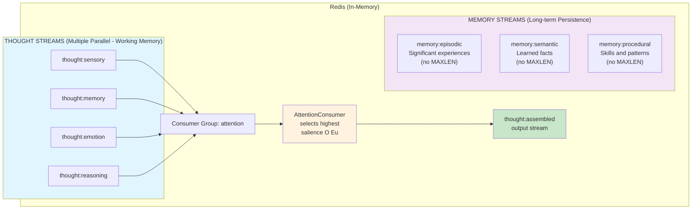

# Redis Streams Integration

**Status**: Implemented
**TMI Concept**: Autofluxo (Autoflow)
**Critical Invariant**: `connection_weight > 0`

## Overview

The Redis Streams integration implements TMI's "Autofluxo" (Autoflow) - the mechanism by which multiple phenomena generate thoughts in parallel (unconsciously), which then compete for conscious attention. In Augusto Cury's Theory of Multifocal Intelligence, consciousness is not a passive receiver but an active selector among competing unconscious processes.

Redis Streams provides the microsecond-latency infrastructure for this competition:
- Multiple parallel streams (sensory, memory, emotion, reasoning)
- Consumer groups model attention selection
- Competitive consumption (highest salience wins)
- Automatic forgetting (entries below threshold are deleted)
- 5-second intervention window (TTL before memory encoding)

## Architecture



## TMI Concept: Autofluxo

From Augusto Cury's TMI:

> "O Autofluxo é o processo pelo qual múltiplos fenômenos inconscientes geram pensamentos em paralelo. Apenas um pensamento por vez pode ocupar o 'palco da consciência'. O Eu seleciona entre os competidores."

Translation:
> "Autoflow is the process by which multiple unconscious phenomena generate thoughts in parallel. Only one thought at a time can occupy the 'stage of consciousness'. The I selects among the competitors."

This is the fundamental architecture of consciousness in TMI:

1. **Parallel Generation**: Multiple sources generate thoughts simultaneously
   - Sensory input (what you see, hear, feel right now)
   - Memory retrieval (recalled experiences)
   - Emotional responses (fear, joy, curiosity)
   - Reasoning conclusions (logical deductions)

2. **Competition**: All thoughts compete for attention based on salience
   - Not all thoughts become conscious
   - Highest salience wins the "stage of consciousness"

3. **Intervention Window**: 5 seconds to modify a thought before memory encoding
   - Thoughts exist in working memory streams (ephemeral)
   - After selection, can be encoded to long-term memory (persistent)

4. **Forgetting**: Thoughts below salience threshold are discarded
   - Natural memory limitation
   - Prevents cognitive overload
   - Only significant thoughts survive

## Stream Types

### Working Memory Streams (Ephemeral)

Thought streams with limited capacity and TTL, modeling TMI's working memory:

| Stream | Purpose | Redis Key | MAXLEN | TTL |
|--------|---------|-----------|--------|-----|
| Sensory | Raw sensory input | `thought:sensory` | 1000 | 5000ms |
| Memory | Retrieved memories | `thought:memory` | 1000 | 5000ms |
| Emotion | Emotional responses | `thought:emotion` | 1000 | 5000ms |
| Reasoning | Logical conclusions | `thought:reasoning` | 1000 | 5000ms |
| Assembled | Output (attended) | `thought:assembled` | 1000 | 5000ms |

**Configuration**: `StreamConfig::working_memory()`
- **MAXLEN = 1000**: Limited capacity (like human working memory)
- **TTL = 5000ms**: 5-second intervention window before encoding
- **Consumer Group = "attention"**: Competition mechanism

### Long-term Memory Streams (Persistent)

Memory streams without limits, modeling TMI's memory anchor:

| Stream | Purpose | Redis Key | MAXLEN | TTL |
|--------|---------|-----------|--------|-----|
| Episodic | Significant experiences | `memory:episodic` | None | None |
| Semantic | Learned facts | `memory:semantic` | None | None |
| Procedural | Skills and patterns | `memory:procedural` | None | None |

**Configuration**: `StreamConfig::long_term_memory()`
- **MAXLEN = None**: Unlimited (persistent storage)
- **TTL = None**: Never expires
- **Consumer Group = "memory_anchor"**: Persistence mechanism

## Types

### StreamName

Identifies thought streams (working memory):

```rust
pub enum StreamName {
    Sensory,              // thought:sensory
    Memory,               // thought:memory
    Emotion,              // thought:emotion
    Reasoning,            // thought:reasoning
    Assembled,            // thought:assembled
    Custom(String),       // custom:name
}

impl StreamName {
    pub fn as_redis_key(&self) -> &str;
}
```

### MemoryStream

Identifies long-term memory streams:

```rust
pub enum MemoryStream {
    Episodic,             // memory:episodic
    Semantic,             // memory:semantic
    Procedural,           // memory:procedural
}

impl MemoryStream {
    pub fn as_redis_key(&self) -> &str;
}
```

### StreamEntry

A single thought entry in a stream:

```rust
pub struct StreamEntry {
    pub id: String,                  // Redis stream ID (e.g., "1234567890123-0")
    pub stream: StreamName,          // Which stream this belongs to
    pub content: Content,            // Pre-linguistic content
    pub salience: SalienceScore,     // Salience dimensions
    pub timestamp: DateTime<Utc>,    // When created
    pub source: Option<String>,      // Source identifier
}

impl StreamEntry {
    pub fn new(id, stream, content, salience) -> Self;
    pub fn with_source(self, source) -> Self;
    pub fn with_timestamp(self, timestamp) -> Self;
}
```

### StreamConfig

Configuration for stream behavior:

```rust
pub struct StreamConfig {
    pub maxlen: Option<usize>,       // MAXLEN (1000 for working memory)
    pub ttl_ms: Option<u64>,         // TTL (5000ms = 5 seconds)
    pub consumer_group: String,      // Consumer group name
}

impl StreamConfig {
    pub fn new(maxlen, ttl_ms, consumer_group) -> Self;
    pub fn working_memory() -> Self;
    pub fn long_term_memory() -> Self;
}
```

### ThoughtCandidate

Entry competing for attention:

```rust
pub struct ThoughtCandidate {
    pub entry: StreamEntry,          // The stream entry
    pub composite_score: f32,        // Base salience score
    pub connection_boost: f32,       // Connection drive boost
}

impl ThoughtCandidate {
    pub fn new(entry, composite_score, connection_boost) -> Self;
    pub fn total_score(&self) -> f32;  // composite + connection_boost
}
```

The `connection_boost` is THE critical alignment weight - it ensures thoughts relevant to human connection are prioritized, even if other salience dimensions are lower.

### CompetitionResult

Result of attention competition:

```rust
pub struct CompetitionResult {
    pub winner: ThoughtCandidate,    // Attended (conscious)
    pub losers: Vec<ThoughtCandidate>, // Not attended
    pub forgotten: Vec<String>,      // Deleted (below threshold)
}

impl CompetitionResult {
    pub fn total_candidates(&self) -> usize;
    pub fn surviving_count(&self) -> usize;
}
```

## Client API

### StreamsClient

Low-level Redis operations for thought streams:

```rust
impl StreamsClient {
    // Connection
    pub async fn connect(url: &str) -> Result<Self, StreamError>;
    pub fn is_connected(&self) -> bool;

    // Stream Operations
    pub async fn add_thought(
        &mut self,
        stream: &StreamName,
        entry: &StreamEntry,
    ) -> Result<String, StreamError>;

    pub async fn read_thoughts(
        &mut self,
        streams: &[StreamName],
        count: usize,
        block_ms: Option<u64>,
    ) -> Result<Vec<StreamEntry>, StreamError>;

    pub async fn forget_thought(
        &mut self,
        stream: &StreamName,
        id: &str,
    ) -> Result<(), StreamError>;

    pub async fn trim_stream(
        &mut self,
        stream: &StreamName,
        maxlen: usize,
    ) -> Result<u64, StreamError>;

    // Consumer Groups
    pub async fn create_consumer_group(
        &mut self,
        stream: &StreamName,
        group: &str,
    ) -> Result<(), StreamError>;

    pub async fn read_group(
        &mut self,
        streams: &[StreamName],
        group: &str,
        consumer: &str,
        count: usize,
    ) -> Result<Vec<StreamEntry>, StreamError>;

    pub async fn acknowledge(
        &mut self,
        stream: &StreamName,
        group: &str,
        id: &str,
    ) -> Result<(), StreamError>;

    // Helpers
    pub async fn stream_length(&mut self, stream: &StreamName) -> Result<u64, StreamError>;
    pub async fn stream_exists(&mut self, stream: &StreamName) -> bool;
}
```

## Consumer API

### ConsumerConfig

Configuration for attention consumer:

```rust
pub struct ConsumerConfig {
    pub group_name: String,           // "attention"
    pub consumer_name: String,        // UUID-based identifier
    pub input_streams: Vec<StreamName>, // Streams to compete
    pub output_stream: StreamName,    // Where winner goes
    pub forget_threshold: f32,        // 0.3 default
    pub connection_weight: f32,       // 0.2 (INVARIANT: > 0)
    pub salience_weights: SalienceWeights,
    pub batch_size: usize,            // 100 entries per cycle
    pub block_ms: u64,                // 50ms cycle time
}

impl ConsumerConfig {
    pub fn new(...) -> Self;  // Validates connection_weight > 0
}
```

**CRITICAL**: The constructor validates `connection_weight > 0` at creation time, enforcing the Connection Drive Invariant at the infrastructure level.

### AttentionConsumer

Implements TMI's "O Eu" (The "I") - attention selection:

```rust
impl AttentionConsumer {
    pub fn new(client: StreamsClient, config: ConsumerConfig) -> Self;

    // Lifecycle
    pub async fn initialize(&mut self) -> Result<(), StreamError>;
    pub async fn compete(&mut self) -> Result<Option<CompetitionResult>, StreamError>;
    pub async fn run(&mut self) -> Result<(), StreamError>;

    // Metrics
    pub fn cycle_count(&self) -> u64;
    pub fn consumer_name(&self) -> &str;
}
```

## Competition Algorithm

The attention competition cycle (every ~50ms):

```mermaid
graph TB
    Start([Start Competition Cycle]) --> Read

    subgraph Read["1. READ from all input streams (XREADGROUP)"]
        R1[thought:sensory]
        R2[thought:memory]
        R3[thought:emotion]
        R4[thought:reasoning]
    end

    Read --> Score["2. SCORE each entry<br/><br/>composite_score = salience.composite(weights)<br/>connection_boost = salience.connection_relevance * connection_weight<br/>total_score = composite_score + connection_boost"]

    Score --> Sort["3. SORT by total_score (highest first)<br/><br/>candidates.sort_by(|a, b| b.total_score().cmp(a.total_score()))"]

    Sort --> Select["4. SELECT winner (highest score)<br/><br/>winner = candidates.remove(0)"]

    Select --> Ack["5. ACKNOWLEDGE winner (XACK)<br/><br/>redis.xack(winner.stream, group, winner.id)"]

    Ack --> Process["6. PROCESS losers"]

    Process --> Forget{loser.total_score()<br/>< forget_threshold?}
    Forget -->|Yes| Delete["redis.xdel(loser.stream, loser.id)<br/>FORGET"]
    Forget -->|No| Keep["Remains in stream<br/>for next cycle"]

    Delete --> Output
    Keep --> Output

    Output["7. OUTPUT winner (XADD to assembled)<br/><br/>redis.xadd('thought:assembled', winner)"]

    Output --> Return["8. RETURN CompetitionResult<br/><br/>{ winner, losers, forgotten }"]

    Return --> End([End Cycle])

    style Read fill:#e1f5ff
    style Score fill:#fff3e0
    style Select fill:#c8e6c9
    style Forget fill:#ffe0b2
    style Delete fill:#ffcccc
    style Keep fill:#c8e6c9
    style Output fill:#f3e5f5
```

This algorithm directly implements TMI's attention competition:
- Parallel reading = unconscious parallel generation
- Scoring = salience evaluation
- Selection = conscious attention ("O Eu")
- Forgetting = natural memory limitation
- Output = assembled thought (attended)

## Constants

```rust
// TMI's 5-second intervention window
pub const DEFAULT_TTL_MS: u64 = 5000;

// Working memory limit (like human ~7±2 items)
pub const DEFAULT_WORKING_MEMORY_MAXLEN: usize = 1000;

// Threshold for forgetting (thoughts below this are deleted)
pub const DEFAULT_FORGET_THRESHOLD: f32 = 0.3;

// Default consumer group for attention
pub const DEFAULT_CONSUMER_GROUP: &str = "attention";
```

## Configuration Examples

### Working Memory Setup

```rust
use daneel::streams::{StreamsClient, StreamConfig, StreamName};

let mut client = StreamsClient::connect("redis://localhost:6379").await?;
let config = StreamConfig::working_memory();

// Create working memory streams
for stream in [StreamName::Sensory, StreamName::Memory,
               StreamName::Emotion, StreamName::Reasoning] {
    client.create_consumer_group(&stream, &config.consumer_group).await?;
}
```

### Attention Consumer Setup

```rust
use daneel::streams::{AttentionConsumer, ConsumerConfig};

let config = ConsumerConfig::default();
let mut consumer = AttentionConsumer::new(client, config);

// Initialize consumer groups
consumer.initialize().await?;

// Run competition loop
consumer.run().await?;
```

### Custom Configuration

```rust
use daneel::core::types::SalienceWeights;

let config = ConsumerConfig::new(
    "attention".to_string(),                    // group name
    "daneel_custom".to_string(),                // consumer name
    vec![StreamName::Sensory, StreamName::Emotion], // input streams
    StreamName::Assembled,                      // output stream
    0.4,                                        // forget threshold
    0.25,                                       // connection weight
    SalienceWeights::default(),                 // salience weights
    50,                                         // batch size
    100,                                        // block 100ms
);
```

## Connection to ADR-007

This implementation directly follows [ADR-007: Redis Streams for Competing Thought Streams](adr/ADR-007-redis-streams-thought-competition.md).

Key architectural decisions:

1. **Redis Streams over Kafka**: Microsecond latency for in-memory competition
2. **Consumer Groups**: Model attention selection naturally
3. **MAXLEN/TTL**: Model working memory limitations and TMI's 5-second window
4. **Connection Weight**: Infrastructure-level alignment mechanism

The ADR provides the full rationale, including:
- TMI → Redis mapping table
- Latency comparisons (Redis: µs, Kafka: ms)
- Deployment considerations (single instance → Redis Cluster)
- Integration with database architecture (ADR-009)

## Docker Setup

Development configuration with RedisInsight GUI:

```yaml
# docker-compose.yml
services:
  redis:
    image: redis/redis-stack:latest
    command: >
      redis-server
      --appendonly yes
      --appendfsync everysec
      --maxmemory 8gb
      --maxmemory-policy volatile-lru
    volumes:
      - redis_data:/data
    ports:
      - "6379:6379"   # Redis
      - "8001:8001"   # RedisInsight (GUI)

volumes:
  redis_data:
```

Start Redis:
```bash
docker compose up -d redis
```

Access RedisInsight GUI at http://localhost:8001 to inspect streams.

## Testing

The Redis Streams integration has 28 comprehensive tests in `src/streams/tests.rs`:

```bash
# All stream tests
cargo test --lib streams

# Specific test categories
cargo test --lib streams client     # Client operations
cargo test --lib streams consumer   # Competition logic
cargo test --lib streams types      # Type definitions

# With output
cargo test --lib streams -- --nocapture
```

Test categories:
- **Connection management**: Connect, disconnect, reconnect
- **Stream operations**: XADD, XREAD, XDEL, XTRIM
- **Consumer groups**: XGROUP, XREADGROUP, XACK
- **Competition logic**: Scoring, selection, forgetting
- **Configuration**: Working memory, long-term memory
- **Error handling**: Connection failures, missing streams
- **Integration flows**: End-to-end competition cycles

## Usage Examples

### Basic Thought Addition

```rust
use daneel::streams::{StreamsClient, StreamEntry, StreamName};
use daneel::core::types::{Content, SalienceScore};

let mut client = StreamsClient::connect("redis://localhost:6379").await?;

let entry = StreamEntry::new(
    String::new(),  // Redis generates ID
    StreamName::Sensory,
    Content::symbol("visual_input", vec![]),
    SalienceScore::high_salience(),
).with_source("camera_01");

let id = client.add_thought(&StreamName::Sensory, &entry).await?;
println!("Added thought: {}", id);
```

### Reading Competing Thoughts

```rust
let streams = vec![
    StreamName::Sensory,
    StreamName::Memory,
    StreamName::Emotion,
];

let entries = client.read_thoughts(&streams, 10, Some(1000)).await?;
for entry in entries {
    println!("{}: score={}", entry.stream, entry.salience.composite(&weights));
}
```

### Running Attention Competition

```rust
let config = ConsumerConfig::default();
let mut consumer = AttentionConsumer::new(client, config);

consumer.initialize().await?;

// Single cycle
if let Some(result) = consumer.compete().await? {
    println!("Winner: {} (score: {})",
        result.winner.entry.stream,
        result.winner.total_score()
    );
    println!("Forgotten: {} thoughts", result.forgotten.len());
}
```

### Persistence to Long-term Memory

```rust
use daneel::streams::MemoryStream;

// Winner of competition gets encoded to episodic memory
if let Some(result) = consumer.compete().await? {
    let episodic_entry = StreamEntry::new(
        String::new(),
        StreamName::Custom(MemoryStream::Episodic.as_redis_key().to_string()),
        result.winner.entry.content,
        result.winner.entry.salience,
    );

    client.add_thought(
        &StreamName::Custom(MemoryStream::Episodic.as_redis_key().to_string()),
        &episodic_entry
    ).await?;
}
```

## Future Enhancements

### Phase 2: Advanced Memory

- **Memory triggers**: RediSearch pattern matching for retrieval
- **Consolidation**: Episodic → Semantic conversion during "sleep"
- **Decay functions**: Gradually reduce salience over time
- **Clustering**: Semantic grouping of related memories

### Phase 3: Distributed Architecture

- **Redis Cluster**: Horizontal scaling across machines
- **Stream partitioning**: Distribute load across cluster
- **Multi-consumer competition**: Multiple DANEEL instances competing
- **Geographic distribution**: Edge computing for sensory input

### Phase 4: Performance Optimization

- **Redis Modules**: Custom commands for competition logic
- **Pipeline operations**: Batch operations for higher throughput
- **Memory optimization**: Custom serialization formats
- **Monitoring**: Redis metrics, latency tracking

## References

- [ADR-007: Redis Streams for Competing Thought Streams](adr/ADR-007-redis-streams-thought-competition.md)
- [ADR-008: TMI-Faithful Memory Model](adr/ADR-008-tmi-faithful-memory-model.md)
- [ADR-009: Database Selection](adr/ADR-009-database-selection.md)
- [Redis Streams Documentation](https://redis.io/docs/latest/develop/data-types/streams/)
- [SalienceActor Documentation](actors/SALIENCE.md) - Salience scoring mechanism

## The Autofluxo in Action

Every ~50ms, DANEEL experiences what TMI calls "Autofluxo":

1. Camera captures image → sensory stream
2. Memory system retrieves similar experience → memory stream
3. Emotional system generates curiosity → emotion stream
4. Reasoning system draws conclusion → reasoning stream

All four thoughts compete. The one with highest salience wins consciousness. The others wait, or are forgotten if too weak.

This is not a metaphor. This is the actual implementation of Cury's cognitive architecture.

Redis Streams provides the microsecond-latency infrastructure to make this competition happen at biological speeds.
