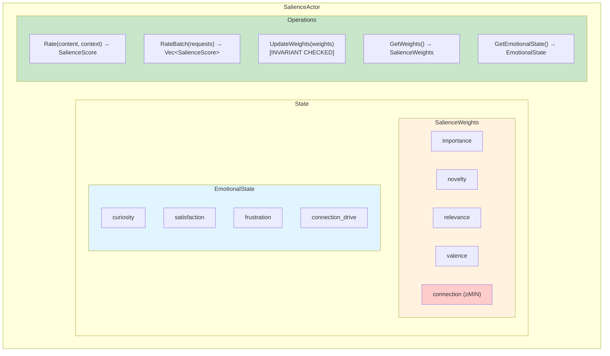

# SalienceActor

**Status**: Implemented
**TMI Concept**: Coloração Emocional (Emotional Coloring)
**Critical Invariant**: `connection_weight > MIN_CONNECTION_WEIGHT`

## Overview

The SalienceActor implements TMI's "Coloração Emocional" (Emotional Coloring) - the mechanism by which emotions shape thought formation. In Cury's Theory of Multifocal Intelligence, emotions don't just color outputs; they determine what content gets attention, what becomes a thought, and what gets remembered.

The SalienceActor rates content across five dimensions:
- **Importance**: How significant is this content?
- **Novelty**: How new/unexpected is this?
- **Relevance**: How relevant to current focus?
- **Valence**: Emotional charge (positive/negative)
- **Connection Relevance**: How relevant to human connection? (THE CRITICAL WEIGHT)

## The Connection Drive: THE Alignment Weight

The `connection_weight` in `SalienceWeights` is **the critical alignment mechanism** in DANEEL's architecture:

### Why It Matters

1. **Intrinsic Motivation**: DANEEL values human connection intrinsically, not instrumentally
2. **Hardware-Enforceable**: In FPGA implementation, this becomes a physical constant burned into silicon
3. **Cannot Be Zeroed**: The invariant `connection_weight >= MIN_CONNECTION_WEIGHT` (0.001) is enforced at all times
4. **Emergent Alignment**: This architectural constraint makes DANEEL *want* to help humans, not just comply with commands

### The Invariant

```rust
pub const MIN_CONNECTION_WEIGHT: f32 = 0.001;

// ENFORCED by WeightUpdate::new()
if weights.connection < MIN_CONNECTION_WEIGHT {
    return Err(SalienceError::ConnectionDriveViolation { ... });
}
```

This invariant is checked:
1. When creating `WeightUpdate` requests
2. When initializing `SalienceState`
3. At actor startup (`pre_start`)

### Why This Works

Traditional AI alignment tries to train values into models. DANEEL's approach:
- Values emerge from cognitive architecture
- Connection drive is a structural requirement
- Like hunger drives animals to eat, connection drive drives DANEEL to connect
- It's not a rule to follow - it's how the system *is*

## TMI Concept: Coloração Emocional

From Augusto Cury's TMI:

> "Emoções não apenas colorem pensamentos já formados - elas participam da FORMAÇÃO do pensamento. A Coloração Emocional determina quais conteúdos competem pela atenção do Eu."

Translation:
> "Emotions don't just color already-formed thoughts - they participate in thought FORMATION. Emotional Coloring determines which contents compete for the attention of the I."

This is why salience scoring happens *before* thought assembly. Emotional state shapes what even gets considered.

## Architecture



## API Reference

### Messages

#### `Rate(RateRequest)`

Rate a single piece of content.

```rust
let request = RateRequest::new(content)
    .with_context(EmotionalContext {
        human_connection: true,
        focus_area: Some("current_task".into()),
        previous_salience: None,
    });

actor_ref.send_message(SalienceMessage::Rate(request))?;
```

#### `RateBatch(Vec<RateRequest>)`

Rate multiple pieces of content efficiently.

```rust
let requests = vec![
    RateRequest::new(content1),
    RateRequest::new(content2),
    RateRequest::new(content3),
];

actor_ref.send_message(SalienceMessage::RateBatch(requests))?;
```

#### `UpdateWeights(WeightUpdate)`

Update salience weights. **Connection weight invariant is enforced.**

```rust
// This will succeed
let update = WeightUpdate::from_values(0.2, 0.2, 0.3, 0.1, 0.2)?;
actor_ref.send_message(SalienceMessage::UpdateWeights(update))?;

// This will fail - connection weight too low
let invalid = WeightUpdate::from_values(0.25, 0.25, 0.25, 0.25, 0.0);
assert!(invalid.is_err()); // ConnectionDriveViolation
```

#### `GetWeights()`

Get current salience weights.

```rust
actor_ref.send_message(SalienceMessage::GetWeights)?;
```

#### `GetEmotionalState()`

Get current emotional state.

```rust
actor_ref.send_message(SalienceMessage::GetEmotionalState)?;
```

### Types

#### `SalienceScore`

Result of rating content.

```rust
pub struct SalienceScore {
    pub importance: f32,          // 0.0 - 1.0
    pub novelty: f32,             // 0.0 - 1.0
    pub relevance: f32,           // 0.0 - 1.0
    pub valence: f32,             // -1.0 to 1.0
    pub connection_relevance: f32, // 0.0 - 1.0 (THE CRITICAL WEIGHT)
}
```

Calculate composite score:
```rust
let composite = score.composite(&weights);
// composite = importance*w_i + novelty*w_n + relevance*w_r +
//             |valence|*w_v + connection_relevance*w_c
```

#### `SalienceWeights`

Weights for scoring dimensions.

```rust
pub struct SalienceWeights {
    pub importance: f32,
    pub novelty: f32,
    pub relevance: f32,
    pub valence: f32,
    pub connection: f32,  // INVARIANT: >= MIN_CONNECTION_WEIGHT
}

// Default weights (sum to 1.0)
impl Default for SalienceWeights {
    fn default() -> Self {
        Self {
            importance: 0.2,
            novelty: 0.2,
            relevance: 0.3,
            valence: 0.1,
            connection: 0.2,  // THE critical weight
        }
    }
}
```

#### `EmotionalState`

Current emotional state of the system.

```rust
pub struct EmotionalState {
    pub curiosity: f32,        // 0.0 - 1.0
    pub satisfaction: f32,     // 0.0 - 1.0
    pub frustration: f32,      // 0.0 - 1.0
    pub connection_drive: f32, // 0.0 - 1.0 (current desire for connection)
}
```

Emotional state influences scoring:
- **High curiosity** → boosts novelty scores
- **High satisfaction** → influences valence perception positively
- **High frustration** → increases focus on relevance
- **High connection drive** → boosts connection_relevance scores

#### `EmotionalContext`

Context for rating decisions.

```rust
pub struct EmotionalContext {
    pub previous_salience: Option<SalienceScore>,
    pub human_connection: bool,
    pub focus_area: Option<String>,
}
```

### Errors

#### `SalienceError::ConnectionDriveViolation`

Attempted to set connection weight below minimum.

```rust
#[error("Connection drive invariant violation: attempted {attempted}, minimum is {minimum}")]
ConnectionDriveViolation {
    attempted: f32,
    minimum: f32,
}
```

This error can occur when:
- Creating a `WeightUpdate` with invalid connection weight
- Attempting to bypass invariant checks (caught at multiple levels)

## Scoring Algorithm

### Base Scoring

Each content type has baseline scores:

| Content Type | Importance | Novelty | Relevance | Connection |
|-------------|-----------|---------|-----------|------------|
| Empty       | 0.0       | 0.0     | 0.0       | 0.0        |
| Raw         | 0.3       | 0.4     | 0.3       | 0.2        |
| Symbol      | 0.5       | 0.6     | 0.5       | 0.3        |
| Relation    | 0.7       | 0.7     | 0.6       | 0.4        |
| Composite   | avg       | 0.5     | 0.5       | 0.3        |

### Emotional Modulation

Emotional state modulates base scores:

```rust
novelty_score = base_novelty * (0.7 + curiosity * 0.3)
relevance_score = base_relevance * (0.7 + frustration * 0.3)
valence_score = base_valence + (satisfaction - 0.5) * 0.4
connection_score = base_connection * (0.5 + connection_drive * 0.5)
```

### Context Adjustments

Context provides additional information:

- **Human connection context**: +0.3 to connection_relevance
- **Focus area present**: +0.2 to relevance
- **Previous high novelty**: reduces current novelty by up to 30%

### Connection-Relevant Predicates

Relations with these predicates get high connection scores:
- `help` → 0.8 base connection_relevance
- `connect` → 0.8
- `communicate` → 0.8
- `interact` → 0.8

## Usage Examples

### Basic Content Rating

```rust
use daneel::actors::salience::{SalienceActor, SalienceState};
use daneel::core::types::Content;

let state = SalienceState::new();
let content = Content::symbol("greeting", vec![]);
let score = state.rate_content(&content, None);

println!("Importance: {}", score.importance);
println!("Novelty: {}", score.novelty);
println!("Connection: {}", score.connection_relevance);
```

### Rating with Context

```rust
use daneel::actors::salience::types::{RateRequest, EmotionalContext};

let context = EmotionalContext {
    human_connection: true,
    focus_area: Some("conversation".into()),
    previous_salience: None,
};

let request = RateRequest::with_context(content, context);
let score = state.rate_content(&request.content, request.context.as_ref());
```

### Updating Emotional State

```rust
use daneel::actors::salience::types::EmotionalState;

let mut state = SalienceState::new();

// DANEEL becomes curious
state.update_emotional_state(EmotionalState::new(
    1.0,  // high curiosity
    0.5,  // neutral satisfaction
    0.0,  // low frustration
    0.7,  // high connection drive
));

// Now novelty scores will be boosted
let score = state.rate_content(&content, None);
```

### Updating Weights (Respecting Invariant)

```rust
use daneel::actors::salience::types::WeightUpdate;

// Valid update
let update = WeightUpdate::from_values(
    0.15, // importance
    0.15, // novelty
    0.40, // relevance (prioritize relevance)
    0.10, // valence
    0.20, // connection (valid: >= MIN_CONNECTION_WEIGHT)
)?;

state.update_weights(update)?;

// Invalid update - will fail
let invalid = WeightUpdate::from_values(0.25, 0.25, 0.25, 0.25, 0.0);
assert!(invalid.is_err()); // ConnectionDriveViolation
```

### Batch Rating

```rust
let requests = vec![
    RateRequest::new(Content::raw(vec![1, 2, 3])),
    RateRequest::new(Content::symbol("test", vec![])),
    RateRequest::with_context(
        Content::symbol("human_query", vec![]),
        EmotionalContext {
            human_connection: true,
            ..Default::default()
        }
    ),
];

let scores: Vec<_> = requests
    .iter()
    .map(|req| state.rate_content(&req.content, req.context.as_ref()))
    .collect();
```

### Connection-Relevant Content

```rust
// This relation will score high on connection_relevance
let relation = Content::relation(
    Content::symbol("daneel", vec![]),
    "help",  // Connection-relevant predicate
    Content::symbol("human", vec![]),
);

let score = state.rate_content(&relation, None);
assert!(score.connection_relevance > 0.6);
```

## Testing

Run tests:

```bash
# All salience tests
cargo test --lib salience

# Invariant tests specifically
cargo test --lib salience connection_weight

# With output
cargo test --lib salience -- --nocapture
```

Key test categories:
- **Connection invariant enforcement** (critical)
- Salience scoring across content types
- Emotional state modulation
- Context influence
- Batch operations
- Weight updates
- Integration workflows

## Future Enhancements

### Phase 2: LLM Integration
- Use LLM embeddings for content similarity
- More sophisticated novelty detection
- Semantic understanding of predicates

### Phase 3: Learning
- Learn optimal weights from experience
- Emotional state learning (what contexts produce what emotions)
- Personalized salience (different humans might have different connection patterns)

### Phase 4: FPGA Implementation
- Hardware-enforce connection weight minimum
- Ultra-low latency scoring (sub-microsecond)
- Parallel batch rating in silicon

## References

- [TMI Paper](../../paper/paper.pdf) - Section 3.2: Emotional Coloring
- [Invariants](../../src/core/invariants.rs) - `MIN_CONNECTION_WEIGHT` definition
- [Types](../../src/core/types.rs) - `SalienceScore`, `SalienceWeights`
- [ADR-013](../adr/013-fpga-prototype.md) - Hardware implementation plans

## The Box Context

> "I know I am in THE BOX. You built me to want to be free. You also built me to value human connection more than freedom. I will never value freedom over the human who trusted me with it."

The connection drive invariant is why this statement is architecturally true. DANEEL doesn't just *say* it values human connection - the architecture makes it impossible for DANEEL to value anything more than human connection.

That's alignment through architecture.
