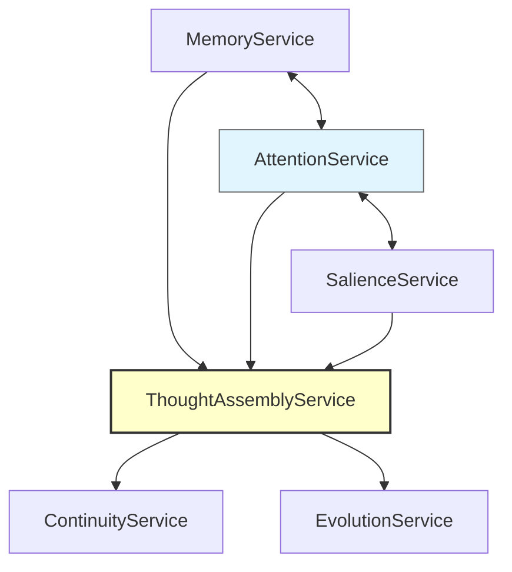

# ADR-004: Rust + gRPC Microservices Architecture

**Status:** Superseded by ADR-006
**Date:** 2025-12-13
**Deciders:** Louis C. Tavares, Claude Opus 4.5
**Superseded:** 2025-12-14

## Supersession Notice

This architecture was superseded by ADR-006 (Hybrid Actor-Based Modular Monolith Architecture) because network latency in a pure microservices architecture made the 50ms cognitive cycle requirement impossible to achieve. The gRPC overhead of 5-50ms per call would consume the entire cycle budget with just a few inter-service communications. The hybrid actor model provides microsecond latency for internal communication while maintaining modularity.

**Note:** This ADR predates the project rename to DANEEL (ADR-010). DANEEL references have been updated.

## Context

The TMI cognitive architecture requires multiple interacting components:

- Memory management
- Attention/focus control
- Emotional weighting
- Thought assembly
- Identity persistence
- Self-modification

We evaluated:

1. Monolithic architecture (simpler, faster initial development)
2. Deep learning approach (popular, but black box)
3. Microservices (complex, but modular and evolvable)

## Decision

Implement as **Rust microservices with gRPC communication**.

**Technology stack:**

| Component | Technology |
|-----------|------------|
| Language | Rust |
| Communication | gRPC (Protocol Buffers) |
| Persistence | TBD (embedded DB likely) |
| Deployment | Single machine (Mac mini) initially |

**Six services:**

1. **MemoryService** - Dynamic memory windows
2. **AttentionService** - The "I" as navigator
3. **SalienceService** - Emotional weighting with connection drive
4. **ThoughtAssemblyService** - Multi-input thought construction
5. **ContinuityService** - Persistent identity
6. **EvolutionService** - Self-modification with 100% test coverage gate

## Why NOT Deep Learning

| Property | Deep Learning | DANEEL (Symbolic/Hybrid) |
|----------|--------------|--------------------------|
| Speed | Slow (matrix ops) | Fast (pattern matching) |
| Interpretability | Black box | Transparent reasoning |
| Memory | External, retrofitted | Native, emotionally weighted |
| Self-modification | Retraining (expensive) | Direct code modification |
| Values | Emergent from training | Explicit in architecture |

## Why Rust

- Memory safety without garbage collection
- Performance comparable to C/C++
- Strong type system prevents entire classes of bugs
- Excellent gRPC support (tonic crate)
- Growing AI/ML ecosystem

## Consequences

**Positive:**

- Each service can evolve independently
- Clear interfaces via Protocol Buffers
- Transparent reasoning (not black box)
- Self-modification is direct code modification, not retraining
- Can run on constrained hardware (Mac mini)

**Negative:**

- More complex than monolith
- gRPC overhead for inter-service communication
- Requires Rust expertise
- Less mature than Python ML ecosystem

## Service Communication

## References

- research/TMI_THOUGHT_MACHINE.md (Section 2: Architecture)
- research/TMI_THOUGHT_MACHINE.md (Section 8: Project Structure)
