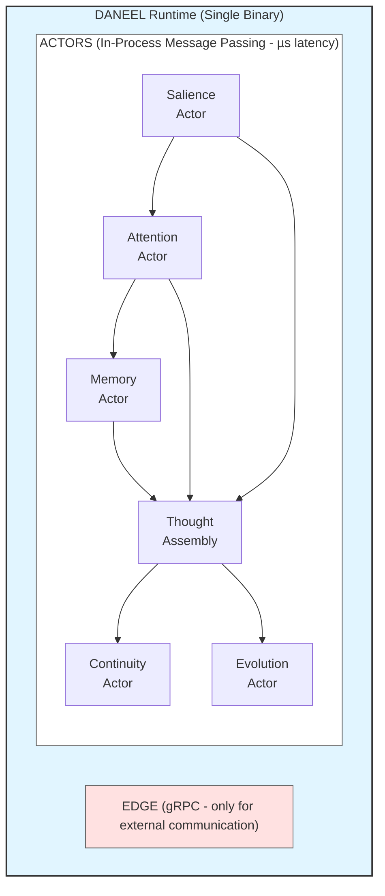

# ADR-006: Hybrid Actor-Based Modular Monolith Architecture

**Status:** Accepted
**Date:** 2025-12-14
**Deciders:** Louis C. Tavares, Claude Opus 4.5

**Note:** This ADR predates the project rename to DANEEL (ADR-010). DANEEL references have been updated.

## Context

We need to choose an architecture that satisfies TMI's timing requirements:

| TMI Requirement | Timing | Source |
|-----------------|--------|--------|
| Unconscious processing | Milliseconds | Cury's TMI |
| Memory window operations | Fractions of second | Cury's TMI |
| Conscious intervention | 5-second window | Cury's TMI |
| Cognitive cycle (industry) | 50ms | Soar, ACT-R, CogTwin |

Options evaluated:

1. **Pure Microservices** - Network overhead adds 5-50ms per call
2. **Monolith** - Fast but hard to evolve, no isolation
3. **Actor Model** - In-process message passing (µs latency)
4. **Modular Monolith** - Amazon Prime Video pattern (2024)
5. **Hybrid Actor + Modular Monolith** - Best of both

## Decision

Implement a **Hybrid Actor-Based Modular Monolith**:

- Single Rust binary (no network overhead internally)
- Actor model for inter-component communication (µs latency)
- gRPC only at edges (LLM integration, external APIs)
- Ractor framework for supervision and future distribution



## Why Actor Model?

| Property | Actor Model | Shared Memory |
|----------|-------------|---------------|
| Race conditions | Impossible | Common |
| Deadlocks | Avoided | Common with locks |
| State isolation | Per-actor | Global |
| Fault tolerance | Supervision trees | Manual |
| Latency | µs (in-process) | µs |

## Why Ractor over Actix?

| Feature | Actix | Ractor |
|---------|-------|--------|
| Performance | Fastest | Very fast |
| Supervision trees | No | **Yes (Erlang-style)** |
| Distributed actors | No | **Yes** |
| API style | Older | Modern async/await |
| Active development | Slower | Active (2024-2025) |

Ractor provides Erlang-style fault tolerance and distribution readiness.

## Why NOT Pure Microservices?

Amazon Prime Video case study (2024): Moved FROM microservices TO modular
monolith because "maintaining a microservices architecture across all areas
was counterproductive."

For DANEEL:

- Internal communication needs µs latency, not ms
- 50ms cognitive cycle impossible with network hops
- Single machine deployment (Mac mini) initially
- Can extract to microservices later if needed

## Controllable Speed

TMI requires controllable thought speed (too fast = Accelerated Thinking
Syndrome):

```rust
pub struct CognitiveConfig {
    pub cycle_target_ms: u64,  // Target: 50ms (industry standard)
    pub cycle_min_ms: u64,     // Minimum: 10ms (prevent ATS)
    pub cycle_max_ms: u64,     // Maximum: 1000ms (responsiveness)
}
```

## Consequences

**Positive:**

- µs inter-component latency (vs 5-50ms for microservices)
- 50ms cognitive cycle achievable
- Actor isolation prevents state corruption
- Supervision trees enable fault recovery
- Single binary simplifies deployment
- Can distribute later via Ractor

**Negative:**

- Single point of failure (mitigated by supervision)
- Requires Rust expertise
- Less familiar pattern than pure microservices

## Technology Stack

```toml
[dependencies]
tokio = { version = "1.0", features = ["full"] }
ractor = "0.13"        # Actor framework with supervision
tonic = "0.12"         # gRPC (edge only)
prost = "0.13"         # Protobuf
tracing = "0.1"        # Observability
```

## References

- [Ractor - Rust Actor Framework](https://github.com/slawlor/ractor)
- [Amazon Prime Video Modular Monolith](https://www.primevideotech.com/video-streaming/scaling-up-the-prime-video-audio-video-monitoring-service-and-reducing-costs-by-90)
- [Comparing Rust Actor Libraries](https://tqwewe.com/blog/comparing-rust-actor-libraries/)
