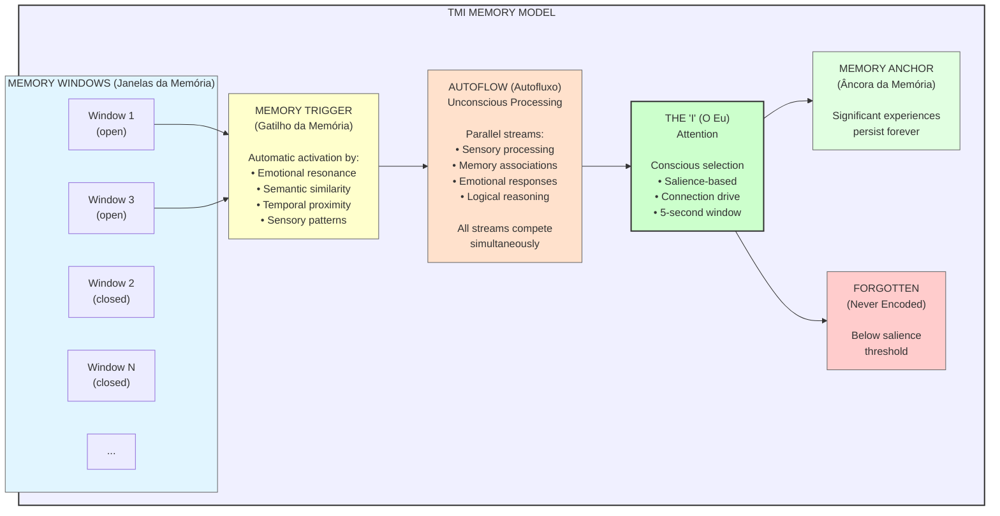

# ADR-008: TMI-Faithful Memory Model

**Status:** Accepted
**Date:** 2025-12-14
**Deciders:** Louis C. Tavares, Claude Opus 4.5

## Context

Traditional cognitive architectures (Soar, ACT-R) use the standard psychological model:
- Short-term memory (STM) / Working memory
- Long-term memory (LTM) with declarative/procedural split

Dr. Augusto Cury's Theory of Multifocal Intelligence (TMI) uses a fundamentally different model that we must implement faithfully to test the core DANEEL thesis.

## Decision

Implement TMI's memory model as described in Cury's work, **not** the traditional cognitive psychology model.

### TMI Memory Architecture



### Key TMI Concepts (Portuguese → English)

| Portuguese | English | Function |
|------------|---------|----------|
| Janelas da Memória | Memory Windows | Dynamic containers, open/close based on context |
| Gatilho da Memória | Memory Trigger | Automatic activation mechanism |
| Âncora da Memória | Memory Anchor | Persistence for significant experiences |
| Autofluxo | Autoflow | Unconscious parallel thought generation |
| O Eu | The "I" | Conscious attention selector |
| Eu Gestor | Manager Self | Metacognitive oversight |
| 5 Segundos | 5-Second Window | Intervention period before encoding |

### Critical Difference from Traditional Model

| Aspect | Traditional (STM/LTM) | TMI Model |
|--------|----------------------|-----------|
| Memory structure | Fixed hierarchy | Dynamic windows |
| Activation | Controlled retrieval | Automatic triggering |
| Storage | Transfer from STM→LTM | Anchor or forget |
| Time window | Decay-based (~18 sec) | 5-second intervention |
| Emotion role | Modulates encoding | Primary activation trigger |
| Processing | Serial (mostly) | Parallel streams competing |

### The 5-Second Intervention Window

Cury's research identifies a critical 5-second period:

1. **0-5 seconds**: Thought exists in "working space"
2. **During window**: The "I" can intervene, redirect, reframe
3. **After 5 seconds**: Memory encoding occurs (anchor or forget)
4. **Key insight**: This is when cognitive distortions can be interrupted

```rust
pub const INTERVENTION_WINDOW_MS: u64 = 5000;  // TMI's 5-second window

pub struct ThoughtState {
    created_at: Instant,
    pub intervention_available: bool,
}

impl ThoughtState {
    pub fn check_intervention_window(&mut self) -> bool {
        let elapsed = self.created_at.elapsed().as_millis() as u64;
        self.intervention_available = elapsed < INTERVENTION_WINDOW_MS;
        self.intervention_available
    }
}
```

### Memory Windows vs Traditional Working Memory

TMI's memory windows are **not** the same as working memory:

| Working Memory (Baddeley) | Memory Windows (Cury) |
|---------------------------|----------------------|
| Fixed capacity (~7 items) | Variable, context-dependent |
| Central executive control | Triggered by emotion/context |
| Phonological loop, visuospatial | No fixed subsystems |
| Rehearsal-based | Association-based |
| Decay over ~18 seconds | 5-second intervention, then anchor/forget |

### Implementation Mapping

| TMI Concept | Redis Implementation |
|-------------|---------------------|
| Memory Window | Individual stream per window |
| Window Open | Stream created, accepting entries |
| Window Close | Stream marked read-only |
| Memory Trigger | XREAD with pattern matching |
| Autoflow | Parallel XADD to multiple streams |
| The "I" | Consumer group competitive read |
| Memory Anchor | XADD to memory:episodic (no MAXLEN) |
| Forgotten | XDEL after 5-second TTL expires |

## Consequences

**Positive:**

- Faithful implementation of TMI theory
- Tests the core hypothesis: TMI architecture → emergent human-like values
- 5-second window provides natural intervention point
- Emotional triggering may produce more human-like associations
- Parallel autoflow matches TMI's unconscious processing model

**Negative:**

- Deviates from well-studied cognitive architectures
- Less literature on computational implementation
- May need adjustment as we discover what works
- Cury's work is clinical, not computational (adaptation required)

**Risks:**

- TMI may not translate perfectly to computational model
- Clinical concepts may need reinterpretation
- Limited empirical validation for computational TMI

**Mitigations:**

- Start with Minimum Viable TMI (MV-TMI)
- Document deviations and rationale
- Maintain ability to pivot if needed
- Publish findings regardless of outcome

## References

1. Cury, A. (2006). *O Código da Inteligência* (The Intelligence Code)
2. Cury, A. (1999). *Inteligência Multifocal* (Multifocal Intelligence)
3. Cury, A. (2008). *O Mestre da Emoção* (The Master of Emotion)
4. IBC Coaching - Teoria da Inteligência Multifocal
5. Wikipedia PT - Inteligência multifocal
6. Freemind Tools Technical Documentation (UNICESUMAR)
