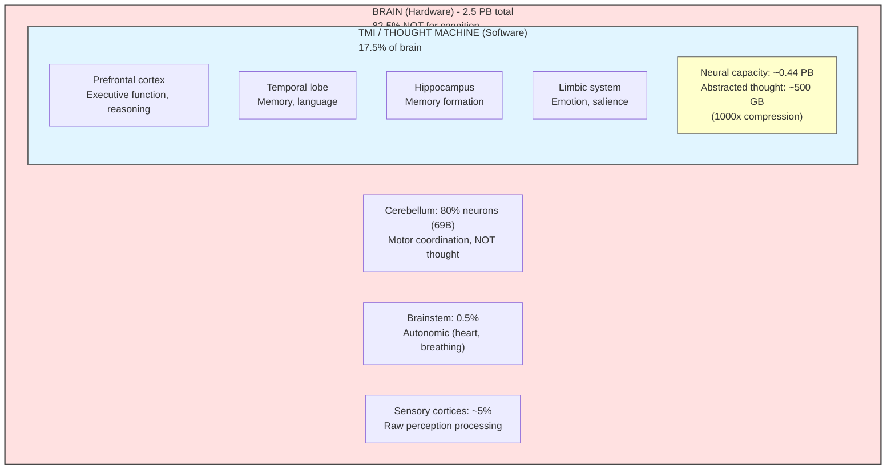
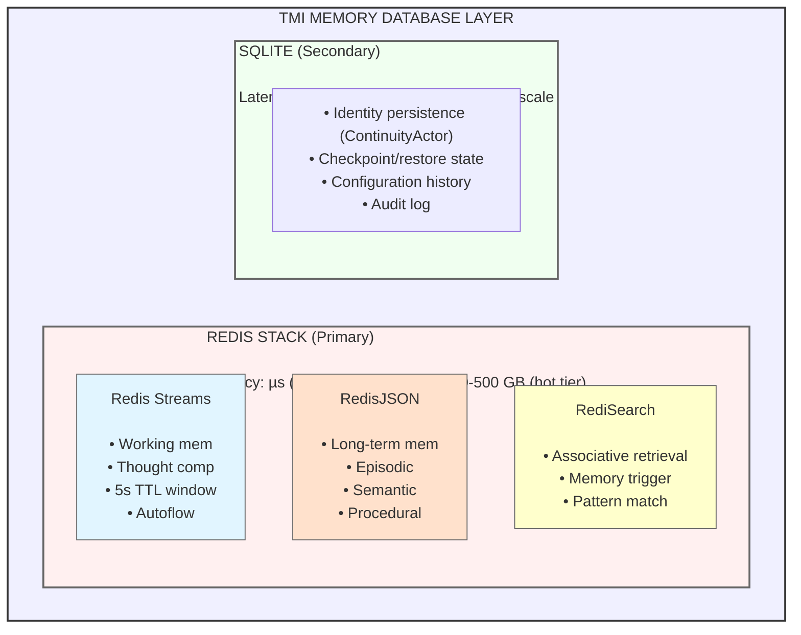

# ADR-009: Database Selection for TMI Memory System

**Status:** Accepted
**Date:** 2025-12-14
**Deciders:** Louis C. Tavares, Claude Opus 4.5

**Note:** This ADR predates the project rename to DANEEL (ADR-010). DANEEL references have been updated.

## Context

DANEEL requires a database system that can model human brain memory patterns according to TMI theory. This decision considers:

1. Human brain storage capacity (sizing requirements)
2. TMI memory model requirements (see ADR-008)
3. Performance requirements (µs latency for cognitive cycles)
4. Operational simplicity (single-developer project initially)

## Critical Insight: Brain ≠ Mind

**The 2.5 petabyte estimate is misleading for TMI.**

The brain is hardware. TMI models the *software* - the thought machine that runs on the brain.



### Why This Matters

| Approach | What We Model | Storage Needed |
|----------|---------------|----------------|
| Brain simulation | All 86B neurons, 100T synapses | 2.5 PB |
| TMI thought machine | Emergent cognitive patterns | **~500 GB max** |

TMI models thoughts at a higher abstraction level - like modeling a program instead of simulating transistors.

**Implication: DANEEL can run on consumer hardware.**

## Human Brain Storage Research

### Biological Capacity (Full Brain)

| Metric | Value | Source |
|--------|-------|--------|
| Neurons | ~86 billion | Herculano-Houzel 2009 |
| Synapses | ~100 trillion | Salk Institute |
| Bits per synapse | 4.7 (26 discrete levels) | Salk Institute 2016 |
| Total capacity | **2.5 petabytes** | Salk Institute |

### Brain Region Allocation

| Region | % Neurons | Function | TMI-Relevant? |
|--------|-----------|----------|---------------|
| Cerebellum | 80% | Motor coordination | No |
| Cerebral cortex | 16% | Higher cognition | **Yes** |
| Hippocampus | 1% | Memory formation | **Yes** |
| Amygdala | 0.5% | Emotional processing | **Yes** |
| Brainstem | 0.5% | Autonomic vital | No |
| Other | 2% | Relay, basal ganglia | No |

**TMI-relevant: 17.5% of brain = ~0.44 PB neural capacity**

### Abstraction Layer

We don't simulate neurons. We model emergent thought patterns:

| Layer | Compression | Capacity |
|-------|-------------|----------|
| Neural (raw) | 1x | 450 TB |
| Thought (abstracted) | 1000x | **~500 GB** |

### Revised Implementation Estimates

| Phase | Duration | Storage | Hardware | Cost |
|-------|----------|---------|----------|------|
| **MV-TMI** | 24 hours | **1 GB** | RPi5 8GB | **$100** |
| **Personal** | 1 year | **50 GB** | Mac mini 64GB | $1,600 |
| **Full Cognitive** | Lifetime | **500 GB** | Desktop 128GB | $3,000 |

### Hardware Viability Matrix (UNCERTAIN - Qowat Milat)

**Honest admission:** We don't know actual requirements until we build and measure.

| What We KNOW | Source |
|--------------|--------|
| Brain capacity: ~1 PB (not 2.5 PB) | Salk Institute 2016 |
| Synaptic precision: 4.7 bits | 26 discrete sizes per synapse |
| Cognitive architectures run on PCs | Soar, ACT-R (decades of use) |
| Silicon faster than wetware | Physics (electrons > neurotransmitters) |

| What We DON'T Know | Implication |
|--------------------|-------------|
| TMI actual storage needs | 500 GB is hypothesis, not measurement |
| RAM vs SSD split | Working memory vs long-term unclear |
| Compression ratio | Could be 10x or 1000x |
| Minimum viable size | Only measurable after building |

**Hardware assessment (honest):**

| Device | RAM | Storage | Can run TMI? | Confidence |
|--------|-----|---------|--------------|------------|
| RPi5 8GB | 8 GB | 256 GB | **UNKNOWN** | Low - needs validation |
| Mac mini 64GB | 64 GB | 1 TB | **PROBABLY** | Medium - reasonable start |
| Desktop 128GB | 128 GB | 4 TB | **LIKELY** | High - safe for development |
| Server | 512+ GB | 10+ TB | **YES** | High - sufficient headroom |

**Strategy:** Start with Mac mini/Desktop, measure actual usage, scale as needed. Don't promise RPi until validated.

### Storage Architecture (RAM vs SSD)

| Type | Purpose | Technology | Size (estimate) |
|------|---------|------------|-----------------|
| **RAM** | Working memory, active streams | Redis in-memory | 8-64 GB |
| **NVMe** | Hot long-term, recent episodes | Redis AOF + SQLite | 100 GB - 1 TB |
| **SSD** | Cold archive, old memories | Object storage | 1 TB+ |

**Key insight:** RAM = active thought capacity. SSD = memory capacity. These are different constraints.

### Cost Comparison (still valid)

| Approach | Hardware | Annual Ops | Year 1 Total |
|----------|----------|------------|--------------|
| xAI Colossus | $10B (230K H100s) | $500M | **$10.5B** |
| DANEEL Development | $3,000 (Desktop) | $200 | **$3,200** |
| DANEEL MV-TMI | $1,600 (Mac mini) | $200 | **$1,800** |

**Cost advantage remains massive** even without RPi assumption: 3,000,000x (xAI vs Desktop)

See [models/README.md](../../models/README.md) for methodology and calculations.

### Storage Tier Recommendations

| Tier | Purpose | Size | Latency | Technology |
|------|---------|------|---------|------------|
| **Hot** | Working memory | 50-500 GB | <1ms | Redis (in-memory) |
| **Warm** | Recent memories | 1-10 TB | 1-10ms | SSD-backed storage |
| **Cold** | Archive | 10-100+ TB | 10ms-1s | Object storage |

## Decision

**Primary:** Redis Stack (Streams + JSON + Search)
**Secondary:** SQLite for checkpoint/identity persistence

### Architecture



### Redis Stack Components

#### 1. Redis Streams (Working Memory)

Maps to TMI's Autoflow and Memory Windows:

```redis
# Thought streams (5-second TTL, MAXLEN 1000)
thought:sensory     - Raw sensory input
thought:memory      - Retrieved associations
thought:emotion     - Emotional responses
thought:reasoning   - Logical conclusions

# Consumer group for attention selection
XGROUP CREATE thought:sensory attention $ MKSTREAM
XREADGROUP GROUP attention consumer_i STREAMS thought:* >
```

#### 2. RedisJSON (Long-Term Memory)

Maps to TMI's Memory Anchor:

```redis
# Episodic memory (significant experiences)
JSON.SET memory:episodic:1702500000 $ '{
  "content": "...",
  "emotion": {"valence": 0.8, "arousal": 0.6},
  "context": {"location": "...", "participants": [...]},
  "salience": 0.9,
  "connection_relevance": 0.7
}'

# Semantic memory (learned facts)
JSON.SET memory:semantic:concept:123 $ '{
  "concept": "trust",
  "associations": [...],
  "weight": 0.85
}'
```

#### 3. RediSearch (Memory Trigger)

Maps to TMI's automatic memory activation:

```redis
# Create search index for associative retrieval
FT.CREATE idx:episodic ON JSON PREFIX 1 memory:episodic:
  SCHEMA
    $.content AS content TEXT
    $.emotion.valence AS valence NUMERIC
    $.salience AS salience NUMERIC SORTABLE
    $.connection_relevance AS connection NUMERIC

# Memory trigger query (emotional resonance)
FT.SEARCH idx:episodic "@content:(trust friendship)"
  SORTBY connection DESC
  LIMIT 0 10
```

### SQLite (Identity Persistence)

For ContinuityActor's persistent identity:

```sql
-- Identity table
CREATE TABLE identity (
  id INTEGER PRIMARY KEY,
  created_at TEXT NOT NULL,
  name TEXT,
  core_values JSON,
  self_model JSON
);

-- Checkpoints
CREATE TABLE checkpoints (
  id INTEGER PRIMARY KEY,
  timestamp TEXT NOT NULL,
  redis_snapshot_path TEXT,
  actor_states JSON,
  laws_hash TEXT NOT NULL  -- Verify THE BOX integrity
);

-- Evolution history
CREATE TABLE evolution_log (
  id INTEGER PRIMARY KEY,
  timestamp TEXT NOT NULL,
  proposal JSON NOT NULL,
  test_coverage REAL NOT NULL,
  approved BOOLEAN NOT NULL,
  applied_at TEXT
);
```

## Database Comparison Summary

| Criterion | Redis Stack | PostgreSQL | MongoDB | Neo4j |
|-----------|-------------|------------|---------|-------|
| Latency | **µs** | ms | ms | ms |
| TMI Streams | **Native** | Workaround | Workaround | No |
| JSON Storage | **Native** | JSONB | Native | No |
| Full-text Search | **Native** | Native | Native | No |
| Graph Queries | Limited | Limited | Limited | **Native** |
| Operational | **Simple** | Medium | Medium | Complex |
| Single binary | **Yes** | No | No | No |

**Verdict:** Redis Stack wins for TMI's specific requirements (streams, speed, operational simplicity).

## Growth Strategy

### Phase 1: MV-TMI (10-25 GB)
- Single Redis instance
- SQLite file
- All in-memory where possible

### Phase 2: Personal Agent (1-2 TB)
- Redis with AOF persistence
- SSD-backed storage
- Memory tiering (hot/warm)

### Phase 3: Scale (100+ TB)
- Redis Cluster
- Object storage for cold tier
- Consider specialized vector DB for embeddings

### Cost Optimization

| Strategy | Reduction | Implementation |
|----------|-----------|----------------|
| Quantization | 50-75% | FP32 → FP16/INT8 |
| Summarization | 80-90% | Compress old conversations |
| Forgetting | 60-80% | TTL-based pruning |
| Tiering | 60-80% | Hot/warm/cold auto-migration |

## Consequences

**Positive:**

- µs latency meets TMI cognitive cycle requirements
- Native streams for thought competition
- Single technology stack (Redis Stack)
- SQLite adds ACID for critical identity data
- Easy local development (docker-compose)
- Clear scaling path (Redis Cluster)

**Negative:**

- Redis persistence requires careful configuration
- Memory-bound (cost at scale)
- Less sophisticated query capabilities than PostgreSQL
- SQLite adds second technology

**Risks:**

- Redis data loss on crash (mitigated by AOF)
- Memory costs at scale (mitigated by tiering)
- Schema evolution complexity (mitigated by JSON flexibility)

## Configuration

### docker-compose.yaml

```yaml
services:
  redis:
    image: redis/redis-stack:latest
    command: >
      redis-server
      --appendonly yes
      --appendfsync everysec
      --maxmemory 8gb
      --maxmemory-policy volatile-lru
    volumes:
      - redis_data:/data
    ports:
      - "6379:6379"   # Redis
      - "8001:8001"   # RedisInsight (GUI)

volumes:
  redis_data:
```

### Rust Dependencies

```toml
[dependencies]
redis = { version = "0.24", features = ["tokio-comp", "json", "streams"] }
rusqlite = { version = "0.30", features = ["bundled"] }
```

## References

1. [Salk Institute - Brain Memory Capacity](https://www.salk.edu/news-release/memory-capacity-of-brain-is-10-times-more-than-previously-thought/)
2. [Redis Streams Documentation](https://redis.io/docs/latest/develop/data-types/streams/)
3. [ADR-007: Redis Streams for Thought Competition](ADR-007-redis-streams-thought-competition.md)
4. [ADR-008: TMI-Faithful Memory Model](ADR-008-tmi-faithful-memory-model.md)
