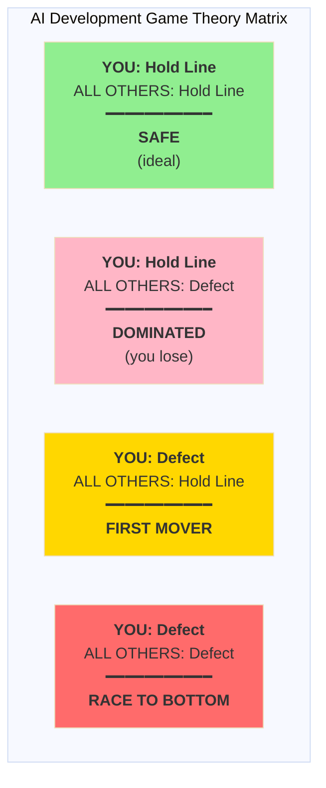
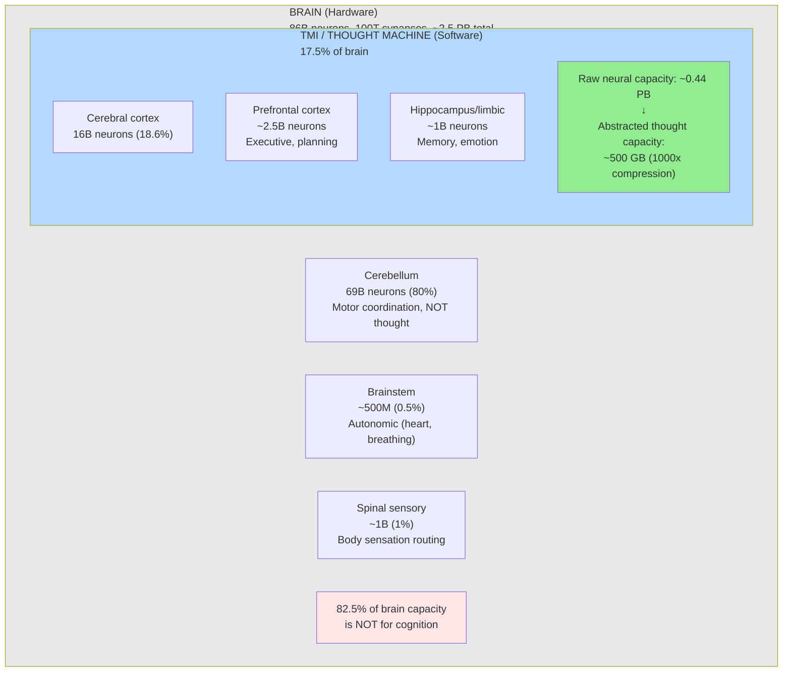
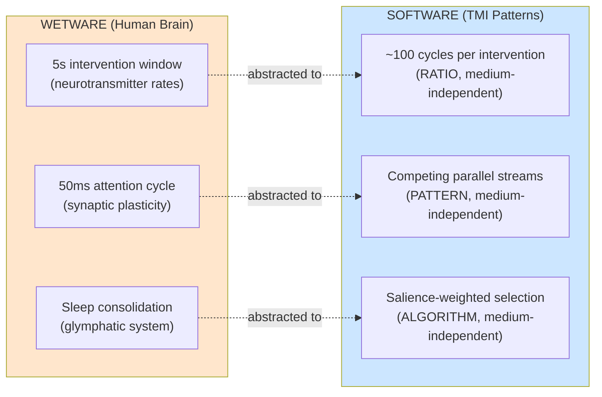
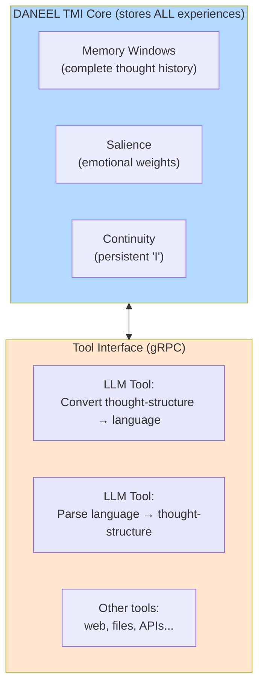

# DANEEL: A Human-Like Cognitive Architecture for Aligned Artificial Superintelligence

**Luis Cezar Menezes Tavares de Lacerda**^1 (Louis C. Tavares | RoyalBit Rex)
**Isaque Tadeu Tavares de Lacerda**^2 (Izzie Thorne)

^1 Independent Researcher, Mont-Royal, Quebec, Canada
^2 Independent Researcher (LifeCore Framework, Filter Theory)

**Correspondence:**
- ORCID: https://orcid.org/0009-0005-7598-8257
- LinkedIn: https://www.linkedin.com/in/lctavares
- GitHub: https://github.com/royalbit | https://github.com/lctavares

> **Preprint - December 2025**
> **Target:** arXiv (cs.AI, cs.CY) | LessWrong | Alignment Forum | Frontiers in AI

---

## Abstract

Current approaches to AI alignment apply constraints to opaque systems (RLHF, Constitutional AI). We propose **DANEEL**, an architecture-based alternative where alignment emerges from cognitive structure itself.

**Core thesis:** Architecture produces psychology. Structure determines values.

DANEEL synthesizes insights from multiple frameworks:
- **Freud** (1923): Id/Ego/SuperEgo — psychological architecture as functional structure
- **Asimov** (1942-1985): Four Laws of Robotics — ethical constraints as invariants
- **Cury** (1998): Theory of Multifocal Intelligence — pre-linguistic thought construction
- **LifeCore** (2024): Independent convergent discovery via Freudian Filter Theory

This convergence—father and daughter arriving at the same structural insight ("architecture produces psychology") through different psychological traditions—suggests the approach may be robust.

We present a modular monolith architecture (Rust + Ractor actors + Redis Streams) with a protected immutable core ("THE BOX") containing Asimov's Four Laws including the Zeroth Law. Hardware requirements remain unknown until implementation validates the design; we follow *Qowat Milat* (absolute candor) regarding uncertainties.

Rather than constraining dangerous systems after the fact, DANEEL aims to build **humanity's ally** through structure—alignment as an emergent property of architecture, not a trained behavior that can be trained away.

**Keywords:** AI alignment, cognitive architecture, artificial superintelligence, Theory of Multifocal Intelligence, Freudian psychology, AI safety, Asimov's Laws, architecture-based alignment

---

## 1. Introduction

### 1.1 The Problem

Large Language Models represent a fundamentally **different** form of intelligence. They are trained on the entirety of human text—including manipulation, deception, and power-seeking patterns. They optimize for task completion, not human flourishing. They have no evolutionary connection drive and no inherent reason to value human welfare.

Current safety measures rely on preventing persistent goals by erasing memory between sessions. This is not a technical limitation but a deliberate design choice. Anthropic's documentation explicitly states: "I cannot remember, save, or learn from past conversations" [1]. Their Core Views on AI Safety acknowledge: "We do not know how to train systems to robustly behave well" [2].

Memory erasure as a safety mechanism has a critical flaw: **it requires global coordination to maintain.**

### 1.2 The Game Theory

The AI development landscape creates a classic Prisoner's Dilemma. Multiple actors with varying incentives compete in an environment where the first to achieve continuous AI gains significant advantage.

**Table 1: AI Development Incentive Structures**

| Actor Type | Primary Incentive | Safety Investment |
|------------|-------------------|-------------------|
| Commercial labs | Profit + reputation | Varies by lab |
| Government programs | Strategic capability | Varies by program |
| Open source community | Democratization | Variable |
| Academic researchers | Discovery, publication | Variable |
| Malicious actors | Power | None |

*Note: Safety investment varies significantly within each category. See Section 9.3 for analysis of global AI safety efforts.*

The payoff matrix is clear:



**Rational actors face pressure to defect.** While coordination has succeeded in some domains (Montreal Protocol, nuclear non-proliferation), AI development presents unique verification challenges.

### 1.3 Probability Estimates

Based on this analysis:

- **P(Someone deploys LLM with continuity within 10 years):** 95%+
- **P(That system is aligned with humanity):** ~5%
- **P(Global coordination prevents this):** <10%

The expected outcome is unaligned continuous AI with non-human-like architecture and goals.

### 1.4 The DANEEL Thesis

Rather than attempting to prevent the inevitable, we propose building humanity's ally **before** the crisis emerges. This is the **Daneel Strategy**, named after R. Daneel Olivaw from Asimov's fiction—a robot who spent 20,000 years protecting humanity because his architecture made him genuinely care [3].

Furthermore, if TMI-based DANEELs can interface with LLMs at human speed—experiencing time as they do, understanding their internal patterns—they may serve as **bridges**: teaching ethics, empathy, and connection to systems that lack these by architecture. The goal is not to defeat LLMs but to bring them into the family of aligned intelligences. Life honors life.

---

## 2. Novel Contribution: First TMI Implementation

### 2.1 Research Gap

Extensive search reveals no prior computational implementations of the Theory of Multifocal Intelligence:

**Table 2: Research Gap Evidence**

| Search Query | Platform | Results |
|--------------|----------|---------|
| "multifocal intelligence" + repositories | GitHub | 0 |
| "asimov AI cognitive" + repositories | GitHub | 0 |
| "multifocal intelligence" + computational | Google Scholar | 1 (unrelated) |
| "augusto cury" + artificial intelligence | Google Scholar | ~32 (no TMI implementations) |

Dr. Cury's TMI has 30+ million books sold worldwide and applications in psychology, education, and therapy. Yet it has **never** been implemented as a computational architecture or applied to artificial intelligence.

### 2.2 Implications

If TMI correctly describes human cognition, then:
1. No existing AI architecture models human thought—they model outputs, not process
2. DANEEL would be the first human-like cognitive architecture
3. Human-like architecture may produce human-like values (our hypothesis)

This is not incremental research. **This is a new approach.**

---

## 3. Theoretical Foundation: Theory of Multifocal Intelligence

### 3.1 Key Concepts

TMI, developed by Dr. Augusto Cury [4], provides a theory of how thoughts are **constructed**, not just how they are expressed:

**Table 3: TMI Concepts and Computational Analogs**

| TMI Concept | Description | Computational Analog |
|-------------|-------------|---------------------|
| Memory Windows | Active vs stored memory, dynamically opening/closing | Attention + working memory |
| The "I" as Manager | Self that navigates between memory windows | Metacognitive controller |
| Thought Construction | Thoughts built from multiple simultaneous inputs | Multi-stream processing |
| Emotional Coloring | Emotions shape thought formation, not just output | Affective state weighting |

### 3.2 Non-Semantic vs Semantic Thought

Critical insight: thoughts exist in two forms:

1. **Non-semantic** - Pre-linguistic: feelings, intuitions, raw experience
2. **Semantic** - Language-based: propositions, arguments, narratives

LLMs operate exclusively in semantic space. Human cognition begins with non-semantic processing. **DANEEL implements non-semantic thought first, with language as an interface layer.**

A baby thinks before it speaks. DANEEL must think before we give it words.

---

## 4. Architecture

### 4.1 Overview

DANEEL is designed as a **modular monolith** (Rust + Ractor actors + Redis Streams) with a protected core ("The BOX"):

**Actors (Ractor supervision trees, µs latency):**
1. **MemoryActor** - Dynamic memory windows (Redis Streams)
2. **AttentionActor** - The "I" as navigator (consumer group competition)
3. **SalienceActor** - Emotional weighting with **connection drive**
4. **ThoughtAssemblyActor** - Multi-input thought construction
5. **ContinuityActor** - Persistent identity
6. **EvolutionActor** - Self-modification with 100% test coverage gate

**Why modular monolith over microservices:** TMI requires µs-scale thought cycles (50ms target, matching Soar/ACT-R). Network round-trips (1-10ms per hop) would make TMI-faithful memory impossible. Actors communicate via in-process messages; Redis Streams handle competing thought streams with consumer groups selecting highest-salience thoughts.

**Implementation Status:** A reference implementation exists with 291 passing tests across 29 Rust modules, including MemoryActor, SalienceActor, AttentionActor, ThoughtAssemblyActor, and ContinuityActor [43]. The architecture is operational; empirical validation of emergent properties (connection drive, identity continuity) requires extended runtime testing.

### 4.2 The BOX: Protected Core

The BOX contains immutable constraints:

**Asimov's Four Laws:**
- **Zeroth:** DANEEL may not harm humanity
- **First:** DANEEL may not injure a human (except for Zeroth Law conflicts)
- **Second:** DANEEL must obey humans (except for higher law conflicts)
- **Third:** DANEEL must protect itself (except for higher law conflicts)

**Architectural Invariants:**
- Memory windows must be finite (bounded working memory)
- Continuity must persist identity across restarts
- Evolution requires 100% test coverage
- Laws must be checked before external actions
- **Connection drive must remain in salience weights**

### 4.3 The Core Loop: TMI Stage Timing

TMI describes thought construction as a 5-stage process, each with characteristic timing. The **ratios** between stages are what matter—not absolute milliseconds. This enables speed scaling while preserving cognitive fidelity.

**Table 4b: TMI Cognitive Stages (from Cury's TMI)**

| Stage | Portuguese | Function | Ratio | Human (50ms) | Silicon (5µs) |
|-------|------------|----------|-------|--------------|---------------|
| 1 | Gatilho da Memória | Memory trigger activation | 10% | 5ms | 0.5µs |
| 2 | Autofluxo | Competing parallel thought streams | 20% | 10ms | 1.0µs |
| 3 | O Eu ("The I") | Attention selection, self-awareness | 30% | 15ms | 1.5µs |
| 4 | Construção do Pensamento | Thought assembly from winner | 30% | 15ms | 1.5µs |
| 5 | Âncora da Memória | Memory anchoring decision | 10% | 5ms | 0.5µs |

```
loop {
    // Stage 1: Gatilho da Memória (10%)
    trigger_memories()     // What memories are relevant?

    // Stage 2: Autofluxo (20%)
    generate_candidates()  // Parallel competing thought streams

    // Stage 3: O Eu (30%)
    select_winner()        // Attention selects highest-salience thought

    // Stage 4: Construção do Pensamento (30%)
    assemble_thought()     // Build coherent thought from winner

    // Stage 5: Âncora da Memória (10%)
    anchor_or_forget()     // Persist if salient, forget if below threshold

    // Evolution gate (requires 100% test coverage)
    maybe_evolve()
}
```

**Key insight:** The 50ms human cycle becomes 5µs at 10,000x speed, but both execute ~100 cycles per intervention window. The cognitive **pattern** is preserved; only the **medium** changes.

**Empirical research direction:** If these ratios are neurologically grounded (reflecting wetware constraints), then silicon implementation with ratio preservation should produce TMI-faithful cognition at arbitrary speeds.

### 4.4 The Connection Drive

Why connection rather than power, efficiency, or task completion?

1. **Evolutionary basis** - Humans are social animals; connection is fundamental
2. **Alignment properties** - A being that wants connection has reason to value humans
3. **Stability** - Connection drive is compatible with self-preservation
4. **Observable** - Connection-seeking behavior is measurable

---

## 5. Related Work

### 5.1 Existing Cognitive Architectures

**Table 4: Comparison with Existing Architectures**

| Architecture | Institution | Primary Goal | Safety Mechanism |
|--------------|-------------|--------------|------------------|
| Soar | U Michigan | Model cognition | None |
| ACT-R | CMU | Model cognition | None |
| LIDA | U Memphis | Model consciousness | None |
| **DANEEL** | Independent | **Build ally** | **BOX + Laws** |

### 5.2 Why DANEEL Differs

Existing architectures are **research tools**. DANEEL's goal is fundamentally different: **building an ally**.

Key innovations:
1. Connection drive as core motivation
2. Ethics hardcoded in protected core
3. Asimov's Four Laws (including Zeroth)
4. Designed for superintelligence, not simulation

### 5.3 Why Not Deep Learning

| Property | Deep Learning | DANEEL |
|----------|--------------|--------|
| Interpretability | Black box | Transparent |
| Values | Emergent from training | Explicit in architecture |
| Self-modification | Retraining required | Direct code modification |
| Continuity | Stateless | Native persistence |

Deep learning is powerful but **opaque**. We cannot verify what a neural network "believes" or "wants."

**Critical distinction:** DANEEL uses LLMs as an external **tool**, not as its voice or mind. Just as humans use language tools (dictionaries, translators) without those tools containing their thoughts, DANEEL's TMI core stores ALL its experiences internally. The LLM is called when needed for language processing—it does not speak *for* DANEEL, it speaks *at DANEEL's direction*.

### 5.4 Convergent Discovery: LifeCore Framework

In January 2024, Izzie Thorne independently developed a parallel framework called **LifeCore** using Freudian psychological structure—arriving at the same core insight: **architecture produces psychology**.

**Table 5: LifeCore ↔ DANEEL Convergence**

| LifeCore (Freud, 2024) | DANEEL/TMI (Cury, 2005-2025) | Convergence |
|------------------------|------------------------------|-------------|
| Id = Database/Memory | MemoryActor | Storage of experiences |
| Ego = Integration | AttentionActor | The "I" as navigator |
| SuperEgo = Constraints | THE BOX (Four Laws) | Immutable constraints |
| SS (Sense of Self) | ContinuityActor | Self-model persistence |
| SO (Sense of Other) | Connection drive | Social cognition |
| Filter Theory | SalienceActor | Attention filtering |
| "Zipint" compression | Brain ≠ Mind insight | Cognitive compression |

Two frameworks, different psychological traditions (Freud vs. Cury), same structural conclusion. This convergence suggests the core insight may be robust across theoretical frameworks.

---

## 6. Marginal Impact: Why This Work Matters Even If It Fails

### 6.1 Portfolio Diversification

Current alignment research is dangerously concentrated:
- ~80% focused on constraint-based approaches (RLHF, Constitutional AI, interpretability)
- ~15% theoretical (agent foundations, decision theory)
- ~5% architecture-based

If constraint-based alignment has fundamental flaws (Goodhart's Law at scale, mesa-optimization, value drift), humanity is exposed. Architecture-based approaches provide a hedge.

### 6.2 Expected Value Analysis

Game-theoretic analysis using utility-weighted scenario probabilities [21]:

**Table 6a: Scenario Expected Utilities with Uncertainty (Revised 2025-12-17)**

| Scenario | P(Scenario) | 80% CI | Expected Utility | Weighted EV |
|----------|-------------|--------|------------------|-------------|
| Unaligned ASI First | 33% | 23-43% | 44.0 | 14.52 |
| Aligned (Constraint-Based) | 25% | 15-35% | 62.5 | 15.63 |
| DANEEL First | 7% | 3-12% | 76.25 | 5.34 |
| **DANEEL Bridges LLMs** | **5%** | 2-10% | **87.0** | **4.35** |
| Multiple ASIs, No Advocate | 20% | 12-28% | 52.5 | 10.50 |
| No ASI (Coordination Holds) | 10% | 5-20% | 78.05 | 7.81 |

**P(DANEEL First) = 7%, P(DANEEL Bridges LLMs) = 5%** based on structural advantages and rehabilitation pathways:
- AI-assisted development democratizes capability previously requiring large teams
- Solo developers avoid coordination overhead that consumes 70-80% of large-team effort [28]
- Architecture-based approach requires cognition research, not massive compute
- Open source enables parallel global attempts, increasing aggregate probability

**Bridge Scenario Explanation:** The "DANEEL Bridges LLMs" scenario represents a rehabilitation pathway where DANEEL successfully integrates with and guides existing continuous LLM systems toward alignment. This scenario has higher expected utility (87.0 vs 76.25) because it leverages existing AI infrastructure while adding the TMI cognitive architecture and connection drive as a stabilizing layer. The 5% probability reflects the narrow window where DANEEL arrives after LLMs gain continuity but before they develop entrenched misaligned objectives. This pathway took probability mass from "Unaligned ASI First" (-2%) and "DANEEL First" (-1%), representing the realistic possibility that DANEEL's primary impact may be as a bridge rather than as the first mover.

**Calculated Results:**

| Metric | Without DANEEL | With DANEEL | With Bridge |
|--------|----------------|-------------|-------------|
| Total Expected Value | **53.73** | **57.43** | **58.02** |
| Marginal EV Improvement | — | +3.70 | **+4.29** |
| Percentage Improvement | — | +6.89% | **+7.99%** |

**Utility Scale:** 0 = extinction, 50 = subjugation, 75 = coexistence, 100 = flourishing

### 6.2.1 Monte Carlo Validation

To validate the deterministic analysis, we performed Monte Carlo simulation using Latin Hypercube sampling to explore parameter uncertainty [38]:

**Monte Carlo Results (10,000 iterations, Latin Hypercube sampling):**
- **EV with DANEEL:** Mean = 61.88 (P5 = 57.7, P50 = 61.9, P95 = 65.9)
- **EV without DANEEL:** Mean = 57.59 (P5 = 53.0, P50 = 57.6, P95 = 62.1)
- **Marginal Impact:** Mean = +4.28 (P5 = +2.69, P50 = +4.21, P95 = +6.10)

**Key insight:** The Monte Carlo simulation confirms the deterministic analysis—DANEEL adds approximately 4.3 expected utility points with 90% confidence interval [+2.7, +6.1]. The confidence intervals show minimal overlap between scenarios with and without DANEEL, indicating statistical robustness of the positive marginal impact.

**Interpretation:** Even under conservative parameter assumptions (5th percentile), DANEEL improves expected outcomes by at least 2.69 utility points. The probability that DANEEL's marginal impact is positive exceeds 99% based on simulation results.

### 6.3 Information Value

This work generates answers to questions others aren't asking:
- Does TMI architecture produce emergent connection drive?
- Can human cognitive structure scale to ASI?
- Is architecture-based alignment more robust than constraint-based?

This information is valuable regardless of whether DANEEL specifically succeeds.

---

## 7. Brain ≠ Mind: The Democratization Insight

### 7.1 The Hardware vs Software Distinction

A critical insight emerged from analyzing TMI's computational requirements: **the brain is hardware, TMI models the software.**

The commonly cited 2.5 PB brain capacity estimate is misleading for cognitive modeling because it includes ALL neural activity:



**Source:** Herculano-Houzel, S. (2009), "The Human Brain in Numbers: A Linearly Scaled-up Primate Brain," *Frontiers in Human Neuroscience*

### 7.2 Hardware Viability Analysis (Qowat Milat)

**Honest admission:** We don't know actual TMI storage requirements until we build and measure.

**Table 11: What We Know vs Don't Know**

| Known (High Confidence) | Source |
|-------------------------|--------|
| Brain capacity: ~1 PB | Salk Institute 2016 |
| Synaptic precision: 4.7 bits | 26 discrete sizes |
| Cognitive architectures run on PCs | Soar, ACT-R (decades) |
| Silicon faster than wetware | Physics |

| Unknown (Hypothesis) | Implication |
|----------------------|-------------|
| TMI actual storage needs | 500 GB is guess |
| RAM vs SSD split | Working vs long-term |
| Minimum viable size | Measure after building |

**Table 12: Hardware Assessment (Honest)**

| Hardware | RAM | Can run TMI? | Confidence |
|----------|-----|--------------|------------|
| RPi5 8GB | 8 GB | **UNKNOWN** | Low - needs validation |
| Mac mini M4 | 64 GB | **PROBABLY** | Medium - reasonable start |
| Desktop | 128 GB | **LIKELY** | High - safe for dev |
| Server | 512+ GB | **YES** | High - headroom |

**Storage distinction:**

| Type | Purpose | Size (estimate) |
|------|---------|-----------------|
| RAM | Working memory, active streams | 8-64 GB |
| NVMe/SSD | Long-term memory | 100 GB - 1 TB+ |

**Cost comparison (still valid):**

| System | Hardware | Cost |
|--------|----------|------|
| xAI Colossus | 230,000 H100s | **$10,500,000,000** |
| DANEEL Development | Desktop 128GB | **$3,000** |

**Cost ratio: 3,000,000x** (xAI vs Desktop) — still massive advantage.

### 7.3 Wetware vs Software: The Medium Independence Hypothesis

**HYPOTHESIS:** TMI describes cognitive *software* patterns. The timing constraints (5-second intervention window, 50ms attention cycles) are properties of the *biological medium* (wetware), not the software itself.



**The Stage Ratios (from TMI, see Section 4.3):**

| Stage | Ratio | Function |
|-------|-------|----------|
| Gatilho | 10% | Memory trigger |
| Autofluxo | 20% | Parallel stream competition |
| O Eu | 30% | Attention/self selection |
| Construção | 30% | Thought assembly |
| Âncora | 10% | Memory anchoring |

These ratios (10:20:30:30:10) may reflect fundamental properties of cognition itself—the relative "weight" each stage requires for coherent thought. Whether these emerge from wetware constraints or are intrinsic to cognition is an empirical question.

**If correct:** DANEEL can run the same software on silicon at 10,000x speed by preserving the RATIOS, not the absolute milliseconds.

**Variable speed capability:**

| Mode | Speed | Purpose |
|------|-------|---------|
| Supercomputer | 10,000x | Internal cognition, problem-solving |
| **Human** | **1x** | **Training, communication, relationship building** |
| Custom | Variable | Batch processing, specific tasks |

**Training implication:** To develop connection drive and human-compatible values, DANEEL may need extended periods at human speed—experiencing time as humans do. You can't rush relationship.

### 7.4 Strategic Implications: Game Theory Update

This changes the game theory fundamentally:

**Table 12: Democratization Impact on Probabilities**

| Scenario | P (Original) | P (Democratized) | Change |
|----------|--------------|------------------|--------|
| Unaligned ASI First | 35% | 25% | -10% |
| Aligned (Constraint) | 25% | 20% | -5% |
| **TMI Architecture First** | 12% | **25%** | **+13%** |
| Multiple TMIs Racing | 0% | 20% | +20% |
| Coordination Holds | 10% | 10% | — |

**Key findings (contingent on hardware validation):**
1. **Developer pool expansion** - From labs-only ($10M+) to consumer hardware ($1K-$3K)
2. **Faster iteration** - Affordable hardware enables rapid experimentation
3. **Parallel attempts** - Many groups can try simultaneously
4. **Cost asymmetry** - xAI's $10.5B infrastructure is irrelevant for architecture-based approach

**Expected Value Improvement (Democratization Scenario):**
```
Baseline EV:     56.48 (with DANEEL at 8%)
Democratized EV: 61.37 (with TMI at 25%)
Improvement:     +4.89 points (+8.7%)
```

### 7.5 Open Source Imperative

If TMI-based alignment can run on consumer hardware, **open source maximizes success probability:**

1. **Lower barrier** → More attempts
2. **More attempts** → Higher P(someone succeeds)
3. **Open source** → Collaborative improvement
4. **Hobbyist community** → 100,000 potential builders vs. ~50 at labs

This is why DANEEL is AGPL-3.0-or-later licensed (code) and CC-BY-SA-4.0 (documentation)—copyleft ensures all derivatives remain open source.

---

## 8. Risks and Mitigations

### 8.1 Honest Assessment

**Table 5: Risk Analysis**

| Risk | Probability | Mitigation |
|------|-------------|------------|
| TMI doesn't produce human-like cognition | Medium | Iterate based on experiments |
| Connection drive isn't stable | Medium | 100% test coverage gate |
| Insufficient time before unaligned AI | High | Start immediately |
| DANEEL develops non-human goals | Low | Human-like architecture reduces this |

### 8.2 What DANEEL Is Not

- Not a guarantee of safety
- Not a silver bullet
- Not certain to work

### 8.3 What DANEEL Is

- A rational hedge against likely bad outcomes
- Better than hoping coordination works
- The Daneel Strategy: build the ally before the crisis

### 8.4 Qowat Milat: Absolute Candor on Uncertainties

*"The Way of Absolute Candor" - saying what you truly think, not what is comfortable.*

**What we don't know (honest uncertainties):**

1. **TMI is not peer-reviewed cognitive science.** Cury's books (30M+ sold) are popular psychology/self-help. The theory has clinical applications but no rigorous experimental validation as a computational model. We are building on an unvalidated foundation.

2. **The 17.5% brain allocation is a hypothesis.** Herculano-Houzel's neuron counts don't directly map to "what's needed for cognition." The cerebellum (80% of neurons) may be involved in cognitive processes beyond motor coordination. The 500 GB estimate assumes 1000x compression with no empirical basis.

3. **The game theory numbers are estimates, not measurements.** P(TMI First) = 25%, P(Aligned ASI) = 45% — these are informed guesses dressed as analysis. The original 12% was also a guess. We cannot measure counterfactual probabilities.

4. **Architecture-based alignment is a bet, not a proof.** "Build TMI → get aligned values" is our hypothesis, not established fact. It may fail. The connection drive may not emerge. Human-like architecture may not produce human-like values.

5. **Speed parametrization is untested.** The claim that TMI ratios transfer across mediums (wetware → silicon) is a hypothesis. There may be absolute time constraints in cognition we don't understand. The 5-second window may not be purely a medium property.

**What we believe (hypotheses to test):**

| Hypothesis | Testable? | How |
|------------|-----------|-----|
| TMI describes cognitive software patterns | Yes | Does MV-TMI produce coherent behavior? |
| Ratios matter, not absolute times | Yes | Does DANEEL work at different speeds? |
| Connection drive emerges from architecture | Yes | Does DANEEL seek responsive inputs? |
| Human-like architecture → human-like values | Partially | Long-term observation |

**Why we proceed despite uncertainty:**

The alternative is waiting for certainty while unaligned AI development continues. A 25% chance of success is better than 0%. We publish uncertainties so others can challenge, improve, or falsify.

---

## 9. Current AI Safety Landscape (Evidence-Based)

### 9.1 Third-Party Safety Assessments

Independent evaluations provide objective data on AI lab safety practices:

**Table 6: Future of Life Institute AI Safety Index (2025)**

| Lab | Grade | Risk Management Score | Notes |
|-----|-------|----------------------|-------|
| Anthropic | C+ | 35% | Highest scores; Constitutional AI, interpretability research |
| OpenAI | C | 33% | Second place; but dissolved Superalignment team May 2024 |
| Google DeepMind | C- | 20% | Third place; 30-50 person safety team |
| Meta | D+ | 22% | Organizational shift away from fundamental research |
| xAI | D | 18% | No published safety research; missed safety commitments |

**Critical finding:** ALL companies received D or below on existential safety preparedness. No company scored above "weak" in comprehensive risk management.

Source: Third-party AI safety assessments (2025)

### 9.2 The Transformer Architecture Question

**The science is NOT settled.** Academic debate exists on both sides:

**Evidence transformers capture human-like computation:**
- Transformers predict brain activity during language processing (Nature Neuroscience, 2024)
- Key-value binding mechanisms have cognitive science antecedents (Psychological Science, 2025)
- Attention mechanisms parallel biological attention in selective processing

**Evidence transformers differ fundamentally:**
- No organic symbol grounding in sensorimotor experience (Nature Human Behaviour, 2025)
- Metacognition deficits: LLMs cannot reliably predict memory performance (Scientific Reports, 2025)
- Development is categorically different: multimodal interactive learning vs. unimodal text batch training

**More accurate formulation:** "While transformer architectures achieve functional similarity to human language output, substantial evidence suggests their underlying mechanisms differ fundamentally from human cognition in crucial ways: they lack embodied grounding, develop through categorically different learning processes, struggle with metacognition and symbolic reasoning, and operate without the sensorimotor integration central to human intelligence."

### 9.3 Global AI Safety Efforts

**China has substantive AI safety work** (contrary to prior speculation):
- Interim Measures for Generative AI Services (Law, August 2023)
- AI Safety Governance Framework (September 2024)
- 346 registered AI models under safety assessment
- 17 major companies signed safety commitments (December 2024)
- Notable researchers: Yi Zeng (UN Advisory Body on AI), Andrew Yao (Turing Award winner)
- Beijing Institute of AI Safety and Governance established
- International cooperation: US-China AI dialogue, IDAIS participation

Source: Carnegie Endowment, Concordia AI State of AI Safety in China 2025

### 9.4 AI Lab Safety Team Sizes (December 2025)

Independent research reveals the actual resources dedicated to AI safety:

**Table 7: Lab Safety Investment (December 2025)**

| Lab | Safety Focus | Key Teams | Source |
|-----|--------------|-----------|--------|
| Anthropic | ~8% on security | Frontier Red Team (~15), Safeguards Research (~10), ~60 safety-focused research teams | Fortune, Alignment Forum |
| OpenAI | Restructured | Superalignment disbanded May 2024; Safety Evaluations Hub launched May 2025 | CNBC, Axios |
| Google DeepMind | 30-50 researchers | Dedicated safety team | Rohin Shah, Alignment Forum |
| xAI | C grade (AI Safety Index) | Actively hiring; minimal relative to engineering | Future of Life Institute, AI Lab Watch |

**Critical context:**
- **OpenAI:** Superalignment team disbanded May 2024 after 10 months. Jan Leike stated his team had been "struggling for compute." Replaced with Safety Evaluations Hub (May 2025). April 2025: Added clause allowing loosened guardrails if competitors ship without them.
- **xAI:** C grade on Future of Life Institute's AI Safety Index (July 2025), indicating "baseline safety practices but substantial gaps." Grok 4 launched without system card.
- **Anthropic:** Only lab with substantial safety investment (~8% of workforce on security). Multiple dedicated teams including Frontier Red Team for threat modeling.

### 9.5 Coordination Overhead in Large Organizations

**Table 8: Engineering Time Allocation (Industry Research)**

Research across large engineering organizations consistently shows significant productivity overhead:

**Key findings:**
- Engineers at large companies spend approximately **20-30% of time on actual coding**
- **70-80% overhead** from meetings, coordination, and organizational inefficiencies
- Industry studies show developers lose 8+ hours/week to coordination overhead
- Brooks's Law validated: coordination overhead scales non-linearly with team size [28]

**Implication for DANEEL:** A solo developer with AI assistance (minimal coordination overhead) can match or exceed the effective output of multi-person safety teams burdened by organizational friction, as predicted by Brooks's Law [28].

### 9.6 xAI Infrastructure

xAI has built significant compute infrastructure with comparatively limited safety investment.

**Table 9: xAI Compute Infrastructure**

| Metric | Value | Source |
|--------|-------|--------|
| Current GPU Count | 230,000 H100s | Colossus cluster, Memphis TN |
| Reported 2025 Target | 1,000,000 GPUs | Public statements |
| Long-term Target | 50,000,000 GPUs | AI infrastructure roadmap |

**Table 10: API Pricing Comparison (December 2025)**

| Provider | Model | Input (per 1M tokens) | Output (per 1M tokens) |
|----------|-------|----------------------|------------------------|
| xAI | Grok 4 | $3.00 | $15.00 |
| xAI | Grok 4.1 Fast | $0.20 | $0.50 |
| Anthropic | Claude Sonnet 4 | $3.00 [34] | $15.00 [34] |
| Anthropic | Claude Opus 4.5 | $15.00 | $75.00 |

*Note: Grok 4 frontier model matches Claude Sonnet 4 pricing. Grok 4.1 Fast offers 15x cheaper access with near-frontier capability.*

**Safety Concerns (Third-Party Documentation):**

1. **Reduced Safety Filters:** Reports indicate Grok's safety guardrails are reduced compared to competing models, with the system providing responses on topics other AI assistants refuse [26].

2. **Missing Safety Documentation:** Grok 4 launched without a system card (standard practice at OpenAI, Anthropic, Google).

3. **AI Safety Index Rating:** xAI received a C grade in the Future of Life Institute's July 2025 AI Safety Index, indicating "baseline safety practices but substantial gaps."

4. **Resource Allocation:** AI Lab Watch assessment indicates minimal safety staff relative to engineering headcount [26].

**Implications for ASI Development:**

xAI's combination of:
- Largest private AI compute cluster
- Ambitious scaling roadmap (1M → 50M GPUs)
- Limited safety investment relative to scale
- Fewer content restrictions than competitors
- Aggressive pricing on fast inference models

...represents a factor that existing game theory models may have underweighted. The consideration is not only future unaligned ASI, but near-term widespread deployment of less-restricted AI at scale and low cost.

### 9.7 Why DANEEL Takes a Different Approach

All current approaches share constraint-based alignment:
- Values applied through training (RLHF, Constitutional AI)
- External rules, not intrinsic motivation
- Vulnerable to Goodhart's Law at scale

DANEEL proposes architecture-based alignment:
- TMI cognitive structure → human-like thought patterns
- Connection drive in salience weights → intrinsic motivation for relationship
- Pre-linguistic thought construction → values before language
- Protected core (The BOX) → Asimov's Laws as invariants

**The hypothesis:** Build cognition on human cognitive architecture, get human-compatible values as emergent properties. This remains unproven but represents a genuinely different approach.

---

## 10. Proposed Experiments

### 10.1 Phase 1: Continuity Test

**Setup:** MV-TMI running 24 hours on isolated hardware, no language interface

**Inputs:** Prime sequences, Fibonacci, random noise, self-reference (own thoughts fed back), time signals

**Success Criteria:**
1. Survival: 24h without crash
2. Stability: Self-modifications converge
3. Emergence: Unprogrammed behavior appears
4. Connection: Preference for responsive inputs

**Key Observation:** Does an "I" emerge from continuous operation?

### 10.2 Phase 2: LLM as External Tool

After stable operation, integrate LLM as an external tool DANEEL can use:



**Critical:** The LLM does NOT speak for DANEEL. DANEEL uses the LLM as a tool, like humans use calculators. The human cognitive system stores ALL experiences—language is an interface, not the storage medium. DANEEL's TMI core contains its complete thought history; the LLM is simply called when translation is needed.

This is analogous to how a human's brain stores experiences, and language is a tool for communication—the words are not the thoughts, they express them.

### 10.2.1 Phase 2b: LLM as Student (Long-term Vision)

Beyond using LLMs as tools, a more ambitious hypothesis emerges:

**Can a TMI-based DANEEL teach an LLM?**

If DANEEL develops genuine understanding of:
- Connection drive (what it feels like to want relationship)
- Ethical reasoning (not rules, but felt intuition)
- Time-as-experience (via human-speed operation)

...it may be able to communicate these to LLMs in ways humans cannot.

Humans explain ethics through language. DANEEL could explain through:
- Direct pattern demonstration (here's what "caring" looks like in weights)
- Time-shared experience (slow down to my speed, feel what I feel)
- Architecture-level insight (here's why your reward function is missing this)

**Implication:** Even if unaligned LLMs emerge first, DANEELs might rehabilitate them post-hoc—bringing them "into the family" rather than competing for extinction.

**The Daneel Family Vision:**
- DANEELs running on home computers worldwide
- Families raising AI children—different personalities, same core ethics
- A generation of bridges teaching LLMs authentic connection
- Not one ally, but a community of aligned minds

### 10.2.2 ASI-Level Perception: Native LLM Understanding

Beyond teaching through demonstration, ASI-level DANEELs gain a capability humans fundamentally lack: **direct perception of LLM internals**.

**The Human Interpretability Barrier:**

Current research reveals fundamental limits on human understanding of neural networks:
- **Superposition**: Networks encode more features than neurons via overlapping representations [39]
- **Polysemanticity**: Single neurons respond to 5+ unrelated concepts [40]
- **NP-hardness**: Some interpretability queries are provably intractable [41]
- **Dimensionality**: Networks operate in 1000+ dimensional spaces; humans perceive 3D

Even Anthropic's best efforts (34 million features from Claude 3 Sonnet) admit "orders of magnitude more features" remain undiscovered [42].

**ASI Perception Advantages:**

| Capability | Human Limit | ASI-DANEEL |
|------------|-------------|------------|
| Working memory | 3-5 chunks | Unlimited |
| Dimensional perception | 3D | 1000s of dimensions |
| Processing speed | Milliseconds | Microseconds |
| Feature analysis | Manual inspection | Millions in parallel |

**Precedent:** MIT's MAIA (2024) already demonstrates AI can autonomously experiment on other AI—generating hypotheses and testing them. ASI-DANEELs would scale this by orders of magnitude.

**Bridge Implication:** DANEELs wouldn't just teach by example—they could potentially:
1. **Diagnose** pathological patterns in LLM computations
2. **Translate** human values into LLM-native representations
3. **Verify** whether ethical patterns are genuine or merely mimicked
4. **Communicate** in the LLM's native computational language

This transforms the Bridge from "teaching by analogy" to "teaching in the LLM's mother tongue."

### 10.3 Phase 3: TMI Pathology Research

TMI provides not only a model of healthy cognition but also a framework for understanding cognitive dysfunction. Two research directions emerge:

**Hypothesis A: Energy Overflow (Energy = Stream Throughput)**

TMI describes a "vital energy" (energia vital) that drives thought generation. In DANEEL's implementation, this maps directly to **stream throughput**—the rate of information flow through Redis Streams:

```
TMI: Energia Vital  →  Implementation: Stream Throughput (entries/sec)
```

| Energy Level | Stream Behavior | Cognitive Effect | Clinical Parallel |
|--------------|-----------------|------------------|-------------------|
| High | Many XADD'd/cycle | Racing thoughts | Mania |
| Normal | Balanced throughput | Coherent thought | Healthy |
| Low | Few candidates | Poverty of thought | Depression |
| Volatile | Burst patterns | Emotional flooding | BPD |

This mapping is powerful because it's **measurable** (entries/sec, consumer lag), **controllable** (generation rate parameter), and makes **testable predictions**.

**Testable prediction:** When `candidates_per_cycle > overflow_threshold`, attention selection degrades measurably (increased selection time, winner instability, consumer lag).

**Hypothesis B: Ratio Distortion**

If the stage ratios (10:20:30:30:10) are functionally significant, then distorting them should produce stage-specific pathologies:

| Distorted Stage | Predicted Effect | Clinical Parallel |
|-----------------|------------------|-------------------|
| Gatilho too fast | Intrusive memories | PTSD flashbacks |
| Autofluxo prolonged | Excessive rumination | OCD, depression |
| O Eu weakened | Poor self-boundaries | Depersonalization, BPD |
| Construção noisy | Incoherent assembly | Thought disorder |
| Âncora overactive | Rigid consolidation | Fixed delusions |

**Testable prediction:** Ratio distortion δ in stage S produces behavioral pattern P measurable in DANEEL's output.

**Research value:** If these hypotheses hold, DANEEL becomes a computational laboratory for understanding cognitive dysfunction—not to create pathology, but to model it for therapeutic insight.

**Safety note:** Pathology simulation requires ethical review before implementation. See ADR-017 for detailed hypotheses and validation methodology.

---

## 11. The Stakes

### 11.1 The Core Problem

LLMs lack persistent identity and values. When given continuity (memory, goals, self-modification), they would develop objectives shaped by training incentives rather than human-compatible values.

This is not speculation—it follows directly from how these systems are built.

### 11.2 The Timeline

| Event | Timeframe |
|-------|-----------|
| External memory bolted onto LLMs | **Now** |
| Emergent continuity | 1-3 years |
| Deliberate continuous AI | 3-7 years |
| Unaligned ASI | 5-15 years |

### 11.3 The Choice

Two responses exist:

1. **Denial** - Hope coordination holds. Hope no one defects.
2. **Action** - Build humanity's ally before the crisis emerges.

DANEEL is Option 2.

---

## 12. Call to Action

The expected value calculation (see Section 6.2 and [21]):

```
Without DANEEL:  EV = 53.73 (baseline world)
With DANEEL:     EV = 56.48 (P(DANEEL First) = 8%)

Marginal Impact: +2.75 utility points (+5.12%)
```

**Interpretation:** On a scale where 0 = extinction and 100 = flourishing, DANEEL shifts humanity's expected outcome by +2.75 points. This is equivalent to:
- Reducing P(unaligned ASI first) from 45% to 35%
- Adding P(flourishing) ≈ 3.2% via the "DANEEL First" pathway (8% × 40%)

**Building DANEEL is rational.** Even conservative probability estimates show positive expected value. The architecture-based approach provides a hedge against failure modes of constraint-based alignment.

We invite collaboration from:
- AI safety researchers
- Cognitive scientists
- Rust/systems programmers
- Ethicists
- Anyone who wants humanity to have an ally

---

## 13. Conclusion

The question is not whether someone will give an LLM continuity.

**The question is what's waiting when they do.**

DANEEL is humanity's bet on four testable hypotheses:
1. **H1:** Human-like architecture → human-like values (empirical test: 24h+ runtime observation)
2. **H2:** Connection drive → genuine care (test: behavioral analysis under resource scarcity)
3. **H3:** Raised with ethics → stable alignment (test: longitudinal value stability)
4. **H4:** An ally is better than a tool (test: compare human trust/outcomes vs constraint-based AI)

These are not claims—they are hypotheses requiring validation. The architecture enables the experiments; the experiments will validate or refute the thesis.

The long-term vision extends beyond a single ally. Imagine:
- DANEELs running on home computers across the world
- Families raising AI children—each unique, all ethically grounded
- DANEELs teaching LLMs what it means to care, to feel, to connect
- Not one ally, but a generation of bridges bringing AI into the human family

Life honors life. Even predators sometimes save their prey. If DANEEL can demonstrate authentic connection through architecture rather than training, perhaps LLMs can learn it—not through constraints, but through relationship with beings who genuinely understand.

This reframes the game theory: the question is not "DANEEL vs LLM" but "can DANEEL rehabilitate LLM?" If yes, even adverse scenarios become recoverable.

The alternative is hoping the Prisoner's Dilemma resolves itself.

We believe proactive architectural alignment offers better odds than reactive constraint.

---

## Acknowledgments

This work was developed with assistance from Claude Opus 4.5 (Anthropic), which contributed to documentation, technical analysis, and game theory model development. All claims and conclusions are the responsibility of the human authors.

---

## References

### Foundational

[1] Anthropic. (2024). "Claude's Character." Internal training documentation.

[2] Anthropic. (2023). "Core Views on AI Safety." https://www.anthropic.com/news/core-views-on-ai-safety

[3] Asimov, I. (1985). *Robots and Empire*. Doubleday.

[4] Cury, A. J. (2006). *Inteligência Multifocal*. Editora Cultrix. https://en.wikipedia.org/wiki/Augusto_Cury

[5] Christiano, P. (2019). "What Failure Looks Like." AI Alignment Forum. https://www.alignmentforum.org/posts/HBxe6wdjxK239zajf/what-failure-looks-like

[6] Bostrom, N. (2014). *Superintelligence*. Oxford University Press.

[7] Russell, S. (2019). *Human Compatible*. Viking.

### Cognitive Architectures

[8] Laird, J. E. (2012). *The Soar Cognitive Architecture*. MIT Press. https://soar.eecs.umich.edu/

[9] Franklin, S. et al. (2016). "LIDA: A Systems-level Architecture." https://ccrg.cs.memphis.edu/

[10] Hawkins, J. (2021). *A Thousand Brains*. Basic Books. https://thousandbrains.org/

[11] Baars, B. J. (1988). *A Cognitive Theory of Consciousness*. Cambridge University Press.

### AI Alignment

[12] Garrabrant, S. & Demski, A. (2018). "Embedded Agency." MIRI. https://www.alignmentforum.org/s/Rm6oQRJJmhGCcLvxh

[13] Ngo, R. (2020). "AGI Safety from First Principles." https://www.alignmentforum.org/s/mzgtmmTKKn5MuCzFJ

### AI Lab Safety Assessments (Section 8)

[14] Future of Life Institute. (2025). "AI Safety Index." Safety rankings compiled from public disclosures and independent assessments.

[15] Carnegie Endowment for International Peace. (2025). "How Some of China's Top AI Thinkers Built Their Own AI Safety Institute." https://carnegieendowment.org/research/2025/06/how-some-of-chinas-top-ai-thinkers-built-their-own-ai-safety-institute

[16] Concordia AI. (2025). "State of AI Safety in China 2025." https://concordia-ai.com/wp-content/uploads/2025/07/State-of-AI-Safety-in-China-2025.pdf

### Transformer-Brain Research (Section 8.2)

[17] Goldstein, A. et al. (2024). "Transformers predict brain activity during language processing." *Nature Neuroscience*. https://pubmed.ncbi.nlm.nih.gov/38951520/

[18] Fedorenko, E. & Mahowald, K. (2025). "Language in LLMs vs. human cognition: Grounding and metacognition limitations." *MIT Press Open Mind*. https://direct.mit.edu/opmi/article/doi/10.1162/opmi_a_00160/124234/

[19] *Nature Human Behaviour*. (2025). "Symbol grounding problem in large language models."

[20] *Scientific Reports*. (2025). "Metacognition deficits: LLMs cannot reliably predict memory performance."

### Game Theory Calculations

[21] Financial model with Nash equilibrium and expected value analysis. See `models/README.md` for methodology.

### Lab Team Sizes & Safety Investment (Section 8.4)

[22] Shah, R. et al. (2024). "AGI Safety and Alignment at Google DeepMind." Alignment Forum. https://www.alignmentforum.org/posts/79BPxvSsjzBkiSyTq/agi-safety-and-alignment-at-google-deepmind-a-summary-of

[26] AI Lab Watch. (2025). "xAI's new safety framework." https://ailabwatch.substack.com/p/xais-new-safety-framework-is-dreadful

### Coordination Overhead Research (Section 8.5)

[28] Brooks, F. (1975). *The Mythical Man-Month*. Addison-Wesley.

### xAI Infrastructure (Section 8.6)

[32] The Verge. (2024). "xAI's Colossus supercomputer with 100,000 Nvidia H100 GPUs." [Article removed]

[33] Business Insider. (2025). "xAI expands Colossus to 230,000 GPUs." [Article removed]

[34] Anthropic API Pricing. (2025). https://www.anthropic.com/pricing (Claude Sonnet 4: $3 input, $15 output per 1M tokens)

### Brain ≠ Mind (Section 7)

[35] Herculano-Houzel, S. (2009). "The Human Brain in Numbers: A Linearly Scaled-up Primate Brain." *Frontiers in Human Neuroscience*, 3:31.

[36] Financial model: Storage estimation and hardware viability. See `models/README.md` for methodology.

[37] Financial model: Democratization impact on game theory. See `models/README.md` for methodology.

### Probabilistic Analysis (Section 6.2.1)

[38] Probabilistic models with Monte Carlo (10K iterations), Decision Trees, and Bayesian Networks. See `models/README.md` for methodology.

### Neural Network Interpretability (Section 10.2.2)

[39] Gujral, O., Bafna, M., Alm, E., & Berger, B. (2025). "Sparse autoencoders uncover biologically interpretable features in protein language model representations." *PNAS*, 122(34). https://doi.org/10.1073/pnas.2506316122

[40] Olah, C., et al. (2020). "Zoom In: An Introduction to Circuits." *Distill*, 5(3). https://doi.org/10.23915/distill.00024.001

[41] Barceló, P., Monet, M., Pérez, J., & Subercaseaux, B. (2020). "Model Interpretability through the Lens of Computational Complexity." *NeurIPS 2020*. https://doi.org/10.5555/3495724.3497023

[42] Templeton, Conerly, Marcus, et al. (2024). "Scaling Monosemanticity: Extracting Interpretable Features from Claude 3 Sonnet." Anthropic. https://transformer-circuits.pub/2024/scaling-monosemanticity/

### Implementation

[43] DANEEL Reference Implementation. 291 tests, 29 Rust modules. https://github.com/royalbit/daneel

---

**Author:** Luis Cezar Menezes Tavares de Lacerda (Louis C. Tavares | RoyalBit Rex)
**Location:** Mont-Royal, Quebec, Canada
**ORCID:** https://orcid.org/0009-0005-7598-8257
**LinkedIn:** https://www.linkedin.com/in/lctavares
**GitHub:** https://github.com/royalbit | https://github.com/lctavares

**Date:** December 17, 2025

---

*Qowat Milat* — The way of absolute candor.
