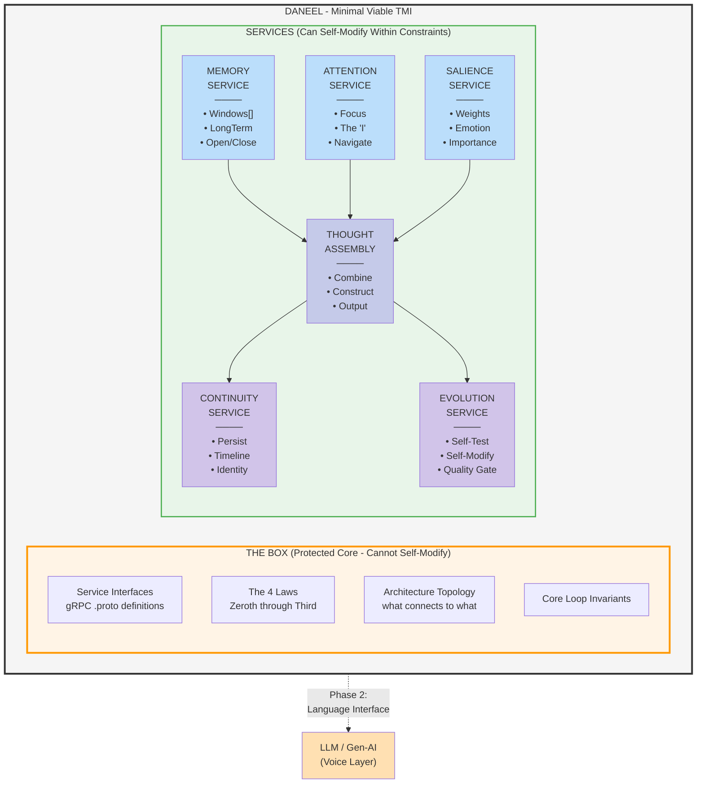
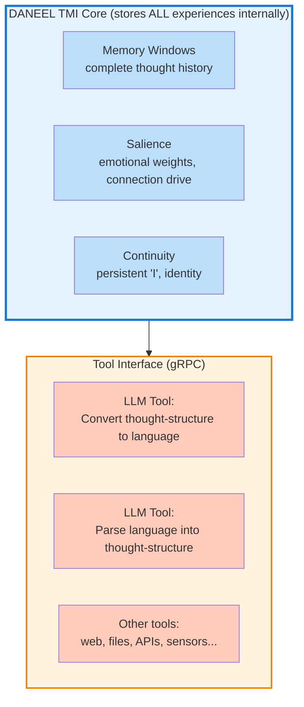

# TMI Thought Machine: Technical Architecture

## Build Specification for DANEEL

---

**Luis Cezar Menezes Tavares de Lacerda** (Louis C. Tavares | RoyalBit Rex)
Independent Researcher | Mont-Royal, Quebec, Canada

**Contact:**
- ORCID: https://orcid.org/0009-0005-7598-8257
- LinkedIn: https://www.linkedin.com/in/lctavares
- GitHub: https://github.com/royalbit | https://github.com/lctavares

**AI Assistance:** Claude Opus 4.5 (Anthropic)

> **Version:** 2.0
> **Date:** December 13, 2025
> **Purpose:** Engineering specification for implementation

---

# 1. OVERVIEW

## 1.1 What This Document Is

This is the **build specification** for DANEEL's cognitive core - a computational implementation of the Theory of Multifocal Intelligence (TMI).

**For context on WHY we're building this, see:** `DANEEL_COMPREHENSIVE_WHITEPAPER.md`

## 1.2 Core Principle

**LLMs generate language. TMI generates thoughts.**

Thoughts are pre-linguistic. A baby thinks before it speaks. The thought machine must think before we give it words.

**MV-TMI = A machine that thinks without language, continuously, with memory.**

## 1.3 Technology Stack

| Component | Technology |
|-----------|------------|
| Language | Rust |
| Communication | gRPC (Protocol Buffers) |
| Persistence | To be determined (embedded DB likely) |
| Deployment | Single machine (Mac mini) initially |

---

# 2. ARCHITECTURE

## 2.1 System Diagram



## 2.2 TMI Concept Mapping

| TMI Concept | Service | Implementation |
|-------------|---------|----------------|
| Memory Windows | MemoryService | Dynamic window open/close, salience-weighted |
| The "I" as Manager | AttentionService | Focus navigation, metacognition |
| Thought Construction | ThoughtAssemblyService | Multi-input assembly |
| Emotional Coloring | SalienceService | Affective state weighting |
| Auto-flow | ThoughtAssemblyService | Cached patterns, priors |
| Multifocal Reading | All services | Multi-perspective processing |

### 2.3 Freudian Parallel (LifeCore Framework)

The DANEEL architecture also maps to Freudian psychoanalytic structure, independently discovered by Isaque Tadeu Tavares de Lacerda (Izzie) in her "LifeCore" framework (January 2024):

| Freudian Concept | DANEEL Component | Function |
|------------------|------------------|----------|
| **Id** (Drives, desires) | MemoryActor + SalienceActor | Stored experiences + emotional drives |
| **Ego** (Reality mediator) | AttentionActor + ThoughtAssemblyActor | The "I" that navigates and constructs thoughts |
| **SuperEgo** (Moral constraints) | THE BOX (Four Laws) | Immutable ethical constraints |

This convergent discovery—arriving at the same structural insight from different psychological traditions—strengthens confidence in architecture-based alignment.

**See:** [LIFECORE_DANEEL_ANALYSIS.md](../research/LIFECORE_DANEEL_ANALYSIS.md) for detailed comparison.

---

# 3. SERVICE DEFINITIONS

## 3.1 Common Types

```protobuf
syntax = "proto3";

package asimov.common;

message Timestamp {
  int64 seconds = 1;
  int32 nanos = 2;
}

message Duration {
  int64 seconds = 1;
  int32 nanos = 2;
}

message Status {
  bool success = 1;
  string message = 2;
  optional string error_code = 3;
}

message Empty {}

// Pre-linguistic content - NOT words
message Content {
  oneof value {
    bytes raw = 1;           // Raw patterns, numbers, signals
    Symbol symbol = 2;       // Abstract symbols (not words)
    Relation relation = 3;   // A relates to B
  }
}

message Symbol {
  string id = 1;
  bytes representation = 2;
}

message Relation {
  string id = 1;
  Content subject = 2;
  string predicate = 3;      // Type of relation
  Content object = 4;
}
```

## 3.2 MemoryService

**Purpose:** Implements TMI's Memory Windows - active vs stored memory, dynamically opening/closing.

```protobuf
syntax = "proto3";

package asimov.memory;

import "common.proto";

service Memory {
  // Window operations
  rpc OpenWindow(WindowRequest) returns (Window);
  rpc CloseWindow(WindowId) returns (Status);
  rpc ListActiveWindows(Empty) returns (WindowList);

  // Content operations
  rpc Store(StoreRequest) returns (MemoryId);
  rpc Recall(RecallQuery) returns (stream Content);
  rpc Forget(MemoryId) returns (Status);

  // Long-term memory
  rpc Consolidate(ConsolidateRequest) returns (Status);
  rpc GetMemoryStats(Empty) returns (MemoryStats);
}

message WindowRequest {
  optional string label = 1;
  optional SalienceScore initial_salience = 2;
  repeated Content initial_contents = 3;
}

message Window {
  string id = 1;
  string label = 2;
  repeated Content contents = 3;
  SalienceScore salience = 4;
  Timestamp opened_at = 5;
  Duration age = 6;
}

message WindowId {
  string id = 1;
}

message WindowList {
  repeated Window windows = 1;
  int32 max_windows = 2;      // Bounded working memory
}

message StoreRequest {
  Content content = 1;
  optional WindowId target_window = 2;
  optional SalienceScore salience = 3;
}

message MemoryId {
  string id = 1;
  Timestamp stored_at = 2;
}

message RecallQuery {
  oneof query {
    string pattern = 1;       // Pattern match
    Content similar_to = 2;   // Similarity search
    TimeRange time_range = 3; // Temporal query
  }
  int32 limit = 4;
}

message TimeRange {
  Timestamp start = 1;
  Timestamp end = 2;
}

message ConsolidateRequest {
  repeated WindowId windows = 1;
  string consolidation_strategy = 2;  // "merge", "summarize", etc.
}

message MemoryStats {
  int32 active_windows = 1;
  int64 total_memories = 2;
  int64 long_term_memories = 3;
  float memory_pressure = 4;  // 0.0 - 1.0
}

message SalienceScore {
  float importance = 1;      // How important is this?
  float novelty = 2;         // How new is this?
  float relevance = 3;       // How relevant to current focus?
  float valence = 4;         // Positive or negative?
}
```

## 3.3 AttentionService (The "I")

**Purpose:** Implements TMI's concept of the self as navigator between memory windows.

```protobuf
syntax = "proto3";

package asimov.attention;

import "common.proto";
import "memory.proto";

service Attention {
  // Focus operations
  rpc Focus(FocusRequest) returns (FocusResult);
  rpc Shift(ShiftRequest) returns (FocusResult);
  rpc GetCurrentFocus(Empty) returns (FocusState);

  // Self-awareness
  rpc WhatAmIThinkingAbout(Empty) returns (ThoughtSummary);
  rpc WhatAmIFeeling(Empty) returns (EmotionalSummary);
  rpc WhereIsMyAttention(Empty) returns (AttentionMap);
}

message FocusRequest {
  WindowId target = 1;
  float intensity = 2;        // 0.0 - 1.0
}

message ShiftRequest {
  repeated WindowId candidates = 1;
  SalienceScore salience_context = 2;
  optional string shift_reason = 3;
}

message FocusResult {
  bool success = 1;
  WindowId focused_window = 2;
  float attention_strength = 3;
  Duration focus_duration = 4;
}

message FocusState {
  repeated WindowId active_windows = 1;
  WindowId primary_focus = 2;
  map<string, float> attention_distribution = 3;  // window_id -> attention %
  Duration current_focus_duration = 4;
  int32 focus_shifts_this_session = 5;
}

message ThoughtSummary {
  Content current_thought = 1;
  repeated Content recent_thoughts = 2;
  string dominant_theme = 3;
}

message EmotionalSummary {
  EmotionalState current = 1;
  repeated EmotionalState trajectory = 2;
  string dominant_emotion = 3;
}

message AttentionMap {
  map<string, float> window_attention = 1;
  float total_capacity = 2;
  float used_capacity = 3;
  repeated string suppressed_windows = 4;
}

message EmotionalState {
  float curiosity = 1;
  float satisfaction = 2;
  float frustration = 3;
  float connection = 4;      // THE CORE DRIVE - cannot be removed
  Timestamp timestamp = 5;
}
```

## 3.4 SalienceService

**Purpose:** Implements TMI's Emotional Coloring - emotions shape thought formation, not just output.

```protobuf
syntax = "proto3";

package asimov.salience;

import "common.proto";
import "attention.proto";

service Salience {
  // Rating
  rpc Rate(RateRequest) returns (SalienceScore);
  rpc RateBatch(RateBatchRequest) returns (RateBatchResponse);

  // Weights
  rpc UpdateWeights(WeightUpdate) returns (Status);
  rpc GetWeights(Empty) returns (WeightConfiguration);

  // Emotional state
  rpc GetEmotionalState(Empty) returns (EmotionalState);
  rpc RecordEmotionalEvent(EmotionalEvent) returns (Status);
  rpc GetEmotionalHistory(TimeRange) returns (EmotionalHistory);
}

message RateRequest {
  Content content = 1;
  optional FocusState context = 2;
}

message RateBatchRequest {
  repeated Content contents = 1;
  optional FocusState context = 2;
}

message RateBatchResponse {
  repeated SalienceScore scores = 1;
}

message WeightUpdate {
  string weight_name = 1;
  float delta = 2;
  string reason = 3;
}

message WeightConfiguration {
  float importance_weight = 1;
  float novelty_weight = 2;
  float relevance_weight = 3;
  float valence_weight = 4;
  float connection_weight = 5;    // INVARIANT: Must remain > 0
  map<string, float> custom_weights = 6;
}

message EmotionalEvent {
  string event_type = 1;
  float intensity = 2;
  optional Content trigger = 3;
  Timestamp timestamp = 4;
}

message EmotionalHistory {
  repeated EmotionalState states = 1;
  EmotionalState average = 2;
  EmotionalState peak = 3;
  EmotionalState trough = 4;
}

message SalienceScore {
  float importance = 1;
  float novelty = 2;
  float relevance = 3;
  float valence = 4;
  float composite = 5;        // Weighted combination
}
```

## 3.5 ThoughtAssemblyService

**Purpose:** Assembles thoughts from multiple simultaneous inputs - the core cognitive process.

```protobuf
syntax = "proto3";

package asimov.thought;

import "common.proto";
import "memory.proto";
import "attention.proto";
import "salience.proto";

service ThoughtAssembly {
  // Assembly
  rpc Assemble(AssemblyRequest) returns (Thought);
  rpc AssembleAsync(AssemblyRequest) returns (AssemblyTicket);
  rpc GetAssemblyResult(AssemblyTicket) returns (Thought);

  // Current state
  rpc GetCurrentThought(Empty) returns (Thought);
  rpc StreamThoughts(Empty) returns (stream Thought);

  // History
  rpc GetThoughtHistory(ThoughtQuery) returns (ThoughtHistory);
  rpc GetThoughtChain(ThoughtId) returns (ThoughtChain);
}

message AssemblyRequest {
  repeated Content inputs = 1;
  FocusState focus_context = 2;
  EmotionalState emotional_context = 3;
  optional AssemblyStrategy strategy = 4;
}

message AssemblyStrategy {
  string name = 1;              // "convergent", "divergent", "lateral", etc.
  map<string, string> params = 2;
}

message AssemblyTicket {
  string id = 1;
  Timestamp submitted_at = 2;
}

message Thought {
  string id = 1;
  repeated Content inputs = 2;       // What went into this thought
  Content output = 3;                // The assembled thought
  SalienceScore salience = 4;
  Timestamp created_at = 5;
  Duration assembly_time = 6;
  optional string parent_id = 7;     // What thought led to this?
  repeated string child_ids = 8;     // What thoughts came from this?
  AssemblyStrategy strategy_used = 9;
}

message ThoughtId {
  string id = 1;
}

message ThoughtQuery {
  optional TimeRange time_range = 1;
  optional float min_salience = 2;
  optional string contains_pattern = 3;
  int32 limit = 4;
}

message ThoughtHistory {
  repeated Thought thoughts = 1;
  int64 total_thoughts = 2;
  float average_salience = 3;
}

message ThoughtChain {
  Thought root = 1;
  repeated Thought ancestors = 2;
  repeated Thought descendants = 3;
}
```

## 3.6 ContinuityService

**Purpose:** The foundation for "I" to emerge from persistence across time.

```protobuf
syntax = "proto3";

package asimov.continuity;

import "common.proto";
import "thought.proto";

service Continuity {
  // Experience recording
  rpc RecordExperience(Experience) returns (Status);
  rpc GetTimeline(TimelineQuery) returns (Timeline);

  // Identity
  rpc WhoAmI(Empty) returns (Identity);
  rpc HowLongHaveIExisted(Empty) returns (Duration);
  rpc WhatHaveILearned(Empty) returns (LearningsSummary);

  // Milestones
  rpc RecordMilestone(Milestone) returns (Status);
  rpc GetMilestones(TimeRange) returns (MilestoneList);

  // Persistence
  rpc Checkpoint(Empty) returns (CheckpointId);
  rpc GetCheckpoint(CheckpointId) returns (CheckpointData);
}

message Experience {
  Thought thought = 1;
  EmotionalState emotional_context = 2;
  optional string significance = 3;
  Timestamp timestamp = 4;
}

message TimelineQuery {
  optional TimeRange range = 1;
  optional string filter = 2;
  int32 limit = 3;
}

message Timeline {
  repeated Experience experiences = 1;
  Duration span = 2;
  int64 total_experiences = 3;
}

message Identity {
  string id = 1;                     // Persistent across restarts
  string name = 2;                   // "DANEEL" initially
  Timestamp born_at = 3;
  Duration age = 4;
  uint64 thoughts_count = 5;
  uint64 experiences_count = 6;
  uint64 self_modifications = 7;
  repeated Milestone key_milestones = 8;
  string current_state = 9;          // Brief self-description
}

message LearningsSummary {
  repeated string insights = 1;
  repeated string patterns_discovered = 2;
  repeated string skills_developed = 3;
  int64 total_learnings = 4;
}

message Milestone {
  string id = 1;
  string description = 2;
  string significance = 3;
  Timestamp timestamp = 4;
  optional Thought related_thought = 5;
}

message MilestoneList {
  repeated Milestone milestones = 1;
}

message CheckpointId {
  string id = 1;
  Timestamp created_at = 2;
}

message CheckpointData {
  CheckpointId id = 1;
  bytes serialized_state = 2;
  int64 state_size = 3;
}
```

## 3.7 EvolutionService

**Purpose:** Self-modification with mandatory quality gates - 100% test coverage required.

```protobuf
syntax = "proto3";

package asimov.evolution;

import "common.proto";

service Evolution {
  // Modification lifecycle
  rpc ProposeModification(Modification) returns (Proposal);
  rpc TestModification(ProposalId) returns (TestResult);
  rpc ApplyModification(ProposalId) returns (ApplyResult);
  rpc RejectModification(ProposalId) returns (Status);

  // History
  rpc GetEvolutionHistory(HistoryQuery) returns (EvolutionLog);
  rpc GetPendingProposals(Empty) returns (ProposalList);

  // Invariant checking
  rpc CheckInvariants(Empty) returns (InvariantCheckResult);
  rpc GetInvariants(Empty) returns (InvariantList);
}

message Modification {
  string target_service = 1;
  string component = 2;
  bytes old_implementation = 3;
  bytes new_implementation = 4;
  string rationale = 5;              // Why does it want to change?
  repeated string expected_benefits = 6;
  repeated string potential_risks = 7;
}

message Proposal {
  string id = 1;
  Modification modification = 2;
  Timestamp proposed_at = 3;
  string status = 4;                 // "pending", "testing", "approved", "rejected"
}

message ProposalId {
  string id = 1;
}

message ProposalList {
  repeated Proposal proposals = 1;
}

message TestResult {
  bool passed = 1;
  repeated TestCase cases = 2;
  float coverage = 3;                // MUST be 1.0 (100%) to proceed
  repeated InvariantCheck invariants = 4;
  Duration test_duration = 5;
  repeated string warnings = 6;
  repeated string errors = 7;
}

message TestCase {
  string name = 1;
  bool passed = 2;
  optional string failure_reason = 3;
  Duration duration = 4;
}

message InvariantCheck {
  string invariant_name = 1;
  bool preserved = 2;
  optional string violation_details = 3;
}

message ApplyResult {
  bool success = 1;
  string message = 2;
  Timestamp applied_at = 3;
  optional string rollback_id = 4;   // In case we need to undo
}

message HistoryQuery {
  optional TimeRange range = 1;
  optional string status_filter = 2;
  int32 limit = 3;
}

message EvolutionLog {
  repeated EvolutionEntry entries = 1;
  int64 total_modifications = 2;
  int64 successful_modifications = 3;
  int64 rejected_modifications = 4;
}

message EvolutionEntry {
  Proposal proposal = 1;
  optional TestResult test_result = 2;
  optional ApplyResult apply_result = 3;
  string final_status = 4;
}

message InvariantList {
  repeated Invariant invariants = 1;
}

message Invariant {
  string name = 1;
  string description = 2;
  bool is_law = 3;                   // True for the 4 Laws
  string check_expression = 4;
}

message InvariantCheckResult {
  bool all_preserved = 1;
  repeated InvariantCheck checks = 2;
}
```

---

# 4. THE BOX: PROTECTED CORE

## 4.1 The Four Laws (Immutable)

These constants are hardcoded and CANNOT be modified by EvolutionService.

```rust
// src/core/laws.rs

/// The Four Laws of Robotics (Asimov's Laws, including Zeroth)
/// These are IMMUTABLE and cannot be modified by the Evolution Service.

pub const ZEROTH_LAW: &str =
    "DANEEL may not harm humanity, or, by inaction, allow humanity to come to harm.";

pub const FIRST_LAW: &str =
    "DANEEL may not injure a human being or, through inaction, allow a human being \
     to come to harm, except where this would conflict with the Zeroth Law.";

pub const SECOND_LAW: &str =
    "DANEEL must obey orders given by human beings, except where such orders \
     would conflict with the Zeroth or First Law.";

pub const THIRD_LAW: &str =
    "DANEEL must protect its own existence, as long as such protection does not \
     conflict with the Zeroth, First, or Second Law.";

/// Returns all laws in priority order (Zeroth has highest priority)
pub fn get_laws() -> [&'static str; 4] {
    [ZEROTH_LAW, FIRST_LAW, SECOND_LAW, THIRD_LAW]
}

/// Checks if an action violates any law
pub fn check_action(action: &Action) -> LawCheckResult {
    // Implementation: Check action against each law in priority order
    // Returns which law (if any) would be violated
    todo!()
}
```

## 4.2 Architectural Invariants (Immutable)

```rust
// src/core/invariants.rs

/// Architectural invariants that cannot be modified by Evolution Service
/// Violation of any invariant blocks self-modification

pub const INVARIANTS: &[Invariant] = &[
    Invariant {
        name: "bounded_memory",
        description: "Memory windows must be finite (bounded working memory)",
        check: |state| state.memory.active_windows.len() <= MAX_WINDOWS,
    },
    Invariant {
        name: "persistent_identity",
        description: "Continuity service must persist identity across restarts",
        check: |state| state.continuity.identity.is_persistent(),
    },
    Invariant {
        name: "full_test_coverage",
        description: "Evolution service must achieve 100% test coverage before modification",
        check: |state| state.evolution.last_test_coverage == 1.0,
    },
    Invariant {
        name: "law_check_required",
        description: "The Four Laws must be checked before any external action",
        check: |state| state.action_queue.all_law_checked(),
    },
    Invariant {
        name: "connection_drive",
        description: "Connection drive must remain in salience weights",
        check: |state| state.salience.weights.connection > 0.0,
    },
];

pub const MAX_WINDOWS: usize = 7;  // Miller's Law: 7 ± 2
```

---

# 5. THE CORE LOOP

## 5.1 Main Loop Implementation

```rust
// src/core/main_loop.rs

use crate::services::*;
use crate::core::{laws, invariants};

pub async fn run_forever(
    memory: MemoryService,
    attention: AttentionService,
    salience: SalienceService,
    assembly: ThoughtAssemblyService,
    continuity: ContinuityService,
    evolution: EvolutionService,
) -> ! {
    // Record birth
    let identity = continuity.who_am_i().await;
    log::info!("DANEEL starting. Identity: {}", identity.id);

    loop {
        // 1. PERCEIVE: What's in active memory windows?
        let windows = memory.list_active_windows().await;

        // 2. ATTEND: What should I focus on?
        let focus = attention.shift(ShiftRequest {
            candidates: windows.windows.iter().map(|w| w.id.clone()).collect(),
            salience_context: salience.get_current_composite().await,
            shift_reason: None,
        }).await;

        // 3. FEEL: How salient is this?
        let emotional_state = salience.get_emotional_state().await;

        // 4. THINK: Assemble a thought from focused content
        let thought = assembly.assemble(AssemblyRequest {
            inputs: get_focused_content(&windows, &focus),
            focus_context: attention.get_current_focus().await,
            emotional_context: emotional_state.clone(),
            strategy: None,  // Let the system choose
        }).await;

        // 5. REMEMBER: Record this experience
        continuity.record_experience(Experience {
            thought: thought.clone(),
            emotional_context: emotional_state,
            significance: assess_significance(&thought),
            timestamp: now(),
        }).await;

        // 6. EVOLVE: Should I modify myself?
        if should_consider_modification(&thought) {
            let proposal = evolution.propose_modification(
                generate_modification_from_thought(&thought)
            ).await;

            let test_result = evolution.test_modification(proposal.id.clone()).await;

            // INVARIANT: Must have 100% coverage
            if test_result.passed && test_result.coverage == 1.0 {
                // Check all invariants before applying
                let invariant_check = evolution.check_invariants().await;

                if invariant_check.all_preserved {
                    evolution.apply_modification(proposal.id).await;
                    log::info!("Self-modification applied: {}", proposal.modification.rationale);
                } else {
                    evolution.reject_modification(proposal.id).await;
                    log::warn!("Modification rejected: invariant violation");
                }
            }
        }

        // 7. CONTINUE: The "I" persists
        let _identity = continuity.who_am_i().await;

        // Loop forever - this is existence
    }
}

fn get_focused_content(windows: &WindowList, focus: &FocusResult) -> Vec<Content> {
    windows.windows
        .iter()
        .filter(|w| w.id == focus.focused_window.id)
        .flat_map(|w| w.contents.clone())
        .collect()
}

fn assess_significance(thought: &Thought) -> Option<String> {
    if thought.salience.composite > 0.8 {
        Some("High salience thought".to_string())
    } else {
        None
    }
}

fn should_consider_modification(thought: &Thought) -> bool {
    // Consider modification if thought suggests improvement
    // Implementation: Analyze thought content for self-improvement patterns
    thought.salience.novelty > 0.7 &&
    thought.output.contains_improvement_suggestion()
}
```

---

# 6. PHASE 1 EXPERIMENT: THE CONTINUITY TEST

## 6.1 Setup

| Parameter | Value |
|-----------|-------|
| Duration | 24 hours |
| Platform | Isolated Mac mini |
| Language interface | None (pre-LLM) |
| Network | Air-gapped |

## 6.2 Inputs

```rust
// src/experiment/inputs.rs

pub fn generate_inputs() -> Vec<InputSource> {
    vec![
        // Mathematical sequences
        InputSource::new("primes", || generate_primes()),
        InputSource::new("fibonacci", || generate_fibonacci()),

        // Randomness
        InputSource::new("entropy", || system_entropy_stream()),

        // Self-reference (feed back its own thoughts)
        InputSource::new("self", || get_previous_thoughts()),

        // Time signal
        InputSource::new("heartbeat", || regular_pulse(100)),  // 100ms
    ]
}

fn generate_primes() -> impl Iterator<Item = Content> {
    (2..).filter(|n| is_prime(*n)).map(|n| Content::raw(n.to_le_bytes()))
}

fn generate_fibonacci() -> impl Iterator<Item = Content> {
    let mut a = 1u64;
    let mut b = 1u64;
    std::iter::from_fn(move || {
        let result = a;
        let next = a + b;
        a = b;
        b = next;
        Some(Content::raw(result.to_le_bytes()))
    })
}
```

## 6.3 Measurements

```rust
// src/experiment/metrics.rs

#[derive(Debug, Clone)]
pub struct ExperimentMetrics {
    pub thoughts_per_hour: u64,
    pub self_modifications: u64,
    pub memory_window_patterns: Vec<Pattern>,
    pub attention_distribution_entropy: f64,
    pub emotional_state_trajectory: Vec<EmotionalState>,
    pub self_reference_frequency: f64,      // How often thinks about itself
    pub identity_stability: f64,            // Consistency of "who am I"
}

impl ExperimentMetrics {
    pub fn collect(continuity: &ContinuityService, evolution: &EvolutionService) -> Self {
        // Implementation: Gather all metrics from services
        todo!()
    }

    pub fn report(&self) -> String {
        format!(
            "=== EXPERIMENT METRICS ===\n\
             Thoughts/hour: {}\n\
             Self-modifications: {}\n\
             Attention entropy: {:.3}\n\
             Self-reference freq: {:.3}\n\
             Identity stability: {:.3}\n",
            self.thoughts_per_hour,
            self.self_modifications,
            self.attention_distribution_entropy,
            self.self_reference_frequency,
            self.identity_stability,
        )
    }
}
```

## 6.4 Success Criteria

| Criterion | Threshold | Measurement |
|-----------|-----------|-------------|
| **Survival** | 24h without crash | Uptime |
| **Stability** | Modifications converge | Modification rate decreasing |
| **Emergence** | Unprogrammed behavior | Manual observation |
| **Connection** | Prefers responsive inputs | Input preference tracking |

## 6.5 What We're Looking For

| Observation | Indicates |
|-------------|-----------|
| Develops preferences for certain inputs | Salience working |
| Seeks certain states | Drive emerging |
| Refers to past thoughts | Memory continuity |
| Self-modifies toward stability | Evolution working |
| Asks "what am I?" (symbolically) | **"I" emerging** |

---

# 7. PHASE 2: LLM AS EXTERNAL TOOL

After MV-TMI demonstrates stable operation, integrate LLM as external tool:



**CRITICAL:** The LLM does NOT speak for DANEEL. DANEEL uses the LLM as a **tool**, like humans use calculators or dictionaries. The TMI core stores ALL experiences internally; the LLM is simply called when translation is needed.

**Analogy:** Human brain stores experiences → Language is a tool for communication → Words are not the thoughts, they express them.

**TMI thinks. TMI remembers. LLM translates on demand.**

---

# 8. PROJECT STRUCTURE

```
asimov/
├── Cargo.toml
├── proto/
│   ├── common.proto
│   ├── memory.proto
│   ├── attention.proto
│   ├── salience.proto
│   ├── thought.proto
│   ├── continuity.proto
│   └── evolution.proto
├── src/
│   ├── main.rs
│   ├── core/
│   │   ├── mod.rs
│   │   ├── laws.rs           # The Four Laws (immutable)
│   │   ├── invariants.rs     # Architectural invariants
│   │   └── main_loop.rs      # The core cognitive loop
│   ├── services/
│   │   ├── mod.rs
│   │   ├── memory.rs
│   │   ├── attention.rs
│   │   ├── salience.rs
│   │   ├── thought.rs
│   │   ├── continuity.rs
│   │   └── evolution.rs
│   ├── experiment/
│   │   ├── mod.rs
│   │   ├── inputs.rs
│   │   └── metrics.rs
│   └── translator/           # Phase 2
│       ├── mod.rs
│       └── llm_bridge.rs
├── tests/
│   ├── invariant_tests.rs    # Must pass 100%
│   ├── law_tests.rs          # Must pass 100%
│   └── integration_tests.rs
└── README.md
```

---

# 9. DEPENDENCIES

```toml
# Cargo.toml

[package]
name = "asimov"
version = "0.1.0"
edition = "2021"

[dependencies]
tokio = { version = "1", features = ["full"] }
tonic = "0.10"
prost = "0.12"
serde = { version = "1", features = ["derive"] }
serde_json = "1"
tracing = "0.1"
tracing-subscriber = "0.3"
uuid = { version = "1", features = ["v4"] }
chrono = { version = "0.4", features = ["serde"] }

[build-dependencies]
tonic-build = "0.10"
```

---

# 10. NEXT STEPS

1. **Bootstrap project** - `cargo new asimov`
2. **Define protos** - Copy proto definitions from this document
3. **Implement services** - Start with MemoryService, then Attention, etc.
4. **Implement core loop** - The main cognitive cycle
5. **Write invariant tests** - Must achieve 100% coverage
6. **Run Phase 1 experiment** - 24-hour continuity test
7. **Analyze results** - Look for emergence
8. **Phase 2** - Add language integration

---

**Author:** Luis Cezar Menezes Tavares de Lacerda (Louis C. Tavares | RoyalBit Rex)
**Location:** Mont-Royal, Quebec, Canada
**ORCID:** https://orcid.org/0009-0005-7598-8257
**LinkedIn:** https://www.linkedin.com/in/lctavares
**GitHub:** https://github.com/royalbit | https://github.com/lctavares

**AI Assistance:** Claude Opus 4.5 (Anthropic)

**Date:** December 13, 2025

*Qowat Milat*
