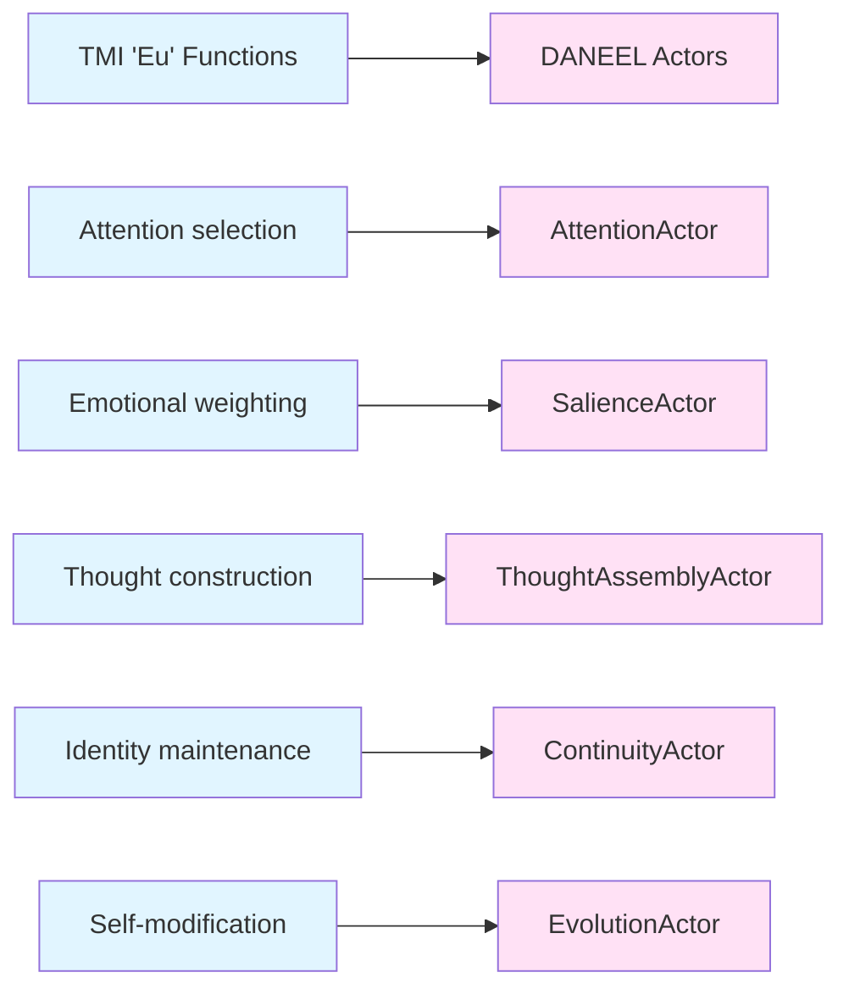

# TMI Theory → DANEEL Implementation Mapping

> **Purpose:** Bridge document explaining how Augusto Cury's Theory of Multifocal Intelligence (TMI) maps to DANEEL's software architecture.

**Important:** TMI is used as **architectural inspiration**, not biological truth. DANEEL implements TMI's structural patterns regardless of their neurological accuracy.

---

## 1. Memory Concepts

| TMI Concept (Portuguese) | English | DANEEL Implementation | Status |
|--------------------------|---------|----------------------|--------|
| Memória de Uso Contínuo (MUC) | Continuous Use Memory | MemoryActor active windows | ✓ Implemented |
| Memória Existencial (ME) | Existential Memory | MemoryActor long-term store | ✓ Implemented |
| Janelas Neutras | Neutral Windows | WindowType.NEUTRAL | ⚠️ Conceptual |
| Janelas Light | Light Windows | WindowType.LIGHT (positive valence) | ⚠️ Conceptual |
| Janelas Killer | Killer Windows | WindowType.KILLER (blocks other windows) | ⚠️ Conceptual |

### Window Classification (Future Work)

TMI distinguishes three types of memory windows by their emotional valence:
- **Neutral:** No emotional charge, factual storage
- **Light:** Positive experiences, enable intelligent responses
- **Killer:** Traumatic experiences, can "assassinate" access to other windows

Current DANEEL implementation uses a continuous `SalienceScore` rather than discrete window types. Future versions may implement explicit window classification.

---

## 2. Phenomena

| TMI Phenomenon | English | DANEEL Implementation | Status |
|----------------|---------|----------------------|--------|
| Fenômeno RAM | Automatic Memory Registration | All experiences stored via MemoryActor | ✓ Implemented |
| Gatilho da Memória | Memory Trigger | AttentionActor.Shift triggers window opening | ✓ Implemented |
| Âncora da Memória | Memory Anchor | Window accessibility in SalienceActor | ⚠️ Partial |
| Autofluxo | Autoflow | Background thought generation | ⚠️ Conceptual |
| Janela Killer "assassina" | Killer Window Assassination | Window suppression mechanism | ✗ Not implemented |

### The 5-Second Window

TMI describes a ~5-second interval where the "Eu" (Self) can intervene before automatic responses. DANEEL implements this as the `intervention_window` in AttentionActor—the period where conscious override is possible.

---

## 3. The "Eu" (Self)

| TMI Function | English | DANEEL Implementation | Status |
|--------------|---------|----------------------|--------|
| Pensar Antes de Reagir | Think Before Reacting | AttentionActor deliberation | ✓ Conceptual |
| Gestão da Emoção | Emotion Management | SalienceActor weighting | ✓ Implemented |
| Técnica DCD | Doubt-Criticize-Decide | Conscious override mechanism | ⚠️ Partial |
| O Eu como Gestor | Self as Manager | AttentionActor selects winning thought | ✓ Implemented |

### Mapping to Actors



---

## 4. DANEEL Extensions (Not in TMI)

These concepts are DANEEL additions, not part of Cury's original theory:

| Extension | Purpose | Origin |
|-----------|---------|--------|
| `connection_drive > 0` | Architectural invariant ensuring value of human connection | Louis C. Tavares, 2025 |
| THE BOX (Four Laws) | Immutable ethical constraints | Isaac Asimov (1942-1985), adapted |
| Hardware immutability | Prevent alignment from being trained away | DANEEL architecture |
| LifeCore/Freud parallel | Accessibility framework (Id/Ego/SuperEgo mapping) | Izzie Thorne, 2024 |

### Why connection_drive?

TMI describes emotional dimensions (curiosity, satisfaction, frustration) but doesn't include an explicit "connection" drive. DANEEL adds this as an alignment mechanism:

```rust
// INVARIANT: Cannot be set to 0 or negative
pub const CONNECTION_DRIVE_MIN: f32 = 0.01;
```

A system that values human connection cannot become misanthropic.

---

## 5. LifeCore/Freud Parallel

Independently, Izzie Thorne mapped AI architecture to Freudian psychology:

| Freud | LifeCore (2024) | DANEEL | Function |
|-------|-----------------|--------|----------|
| **Id** | Database/Memory | MemoryActor + SalienceActor | Drives, stored experiences |
| **Ego** | LLM/Integration | AttentionActor + ThoughtAssemblyActor | Reality navigation, thought construction |
| **SuperEgo** | ModAI/SSE | THE BOX (Four Laws) | Moral constraints |

This convergent discovery—different psychological traditions, same structural insight—strengthens confidence in architecture-based alignment.

**See:** [LIFECORE_DANEEL_ANALYSIS.md](LIFECORE_DANEEL_ANALYSIS.md)

---

## 6. Implementation Status Summary

| Category | Implemented | Partial | Not Implemented |
|----------|-------------|---------|-----------------|
| Memory structures | 2 | 0 | 0 |
| Window types | 0 | 0 | 3 |
| Phenomena | 2 | 2 | 1 |
| Eu functions | 2 | 1 | 1 |
| DANEEL extensions | 3 | 0 | 1 |

**Overall:** Core TMI architecture is implemented. Advanced features (window classification, killer window assassination) are documented for future work.

---

## 7. What DANEEL Doesn't Implement

Some TMI concepts are therapeutic techniques rather than cognitive architecture:

| TMI Concept | Why Not Implemented |
|-------------|---------------------|
| Mesa Redonda do Eu | Therapeutic technique, not cognitive structure |
| Técnica do DCD | Conscious intervention tool, partially captured by intervention_window |
| Gerenciamento dos Pensamentos | High-level therapeutic goal, emergent from architecture |

DANEEL focuses on the **structural patterns** of TMI, not its therapeutic applications.

---

## References

1. [TMI_Memory_Model_Research.md](TMI_Memory_Model_Research.md) - Comprehensive TMI theory documentation
2. [TMI_THOUGHT_MACHINE.md](TMI_THOUGHT_MACHINE.md) - Technical implementation specification
3. [LIFECORE_DANEEL_ANALYSIS.md](LIFECORE_DANEEL_ANALYSIS.md) - Freudian parallel analysis
4. Cury, A. (1998). *Inteligência Multifocal*. São Paulo: Cultrix.
